# 游戏销售情况分析
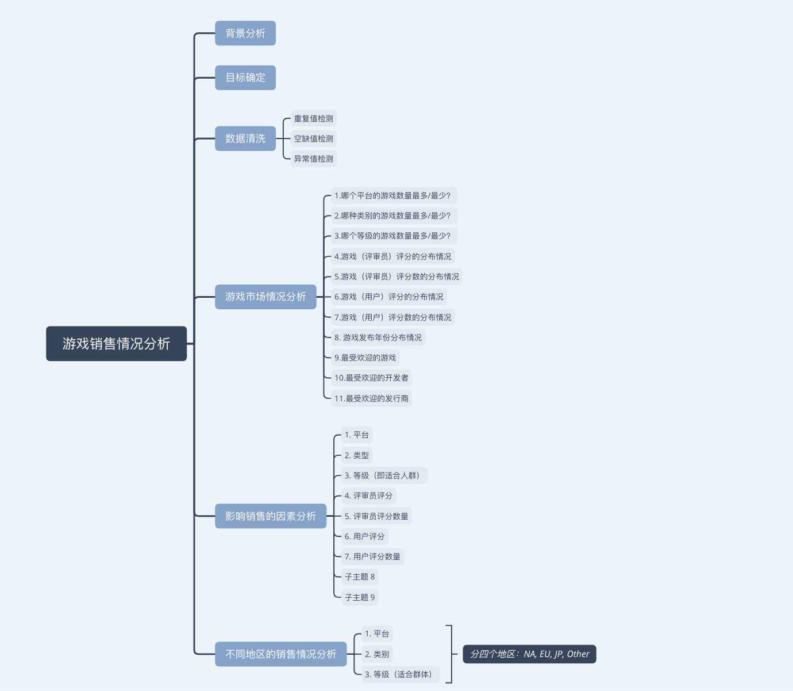

## 一. 背景分析
数据是关于Video Game1980～2016年的销售和评论数据,具体来自VGChartz的游戏销售数据和Metacritic的评论数据。

数据来源：https://www.kaggle.com/rush4ratio/video-game-sales-with-ratings

Variables:
- Name:Name of the game
- Platform: Console on which the game is running
- Year_of_Release: Year of the game released
- Genre: Game's category
- Publisher: Publisher
- NA_Sales: Game sales in North America (in millions of units)
- EU_Sales: Game sales in the European Union (in millions of units)
- JP_Sales: Game sales in Japan (in millions of units)
- Other_Sales: Game sales in the rest of the world, i.e. Africa, Asia excluding Japan, Australia, Europe excluding the E.U. and South America (in millions of units)
- Global_Sales: Total sales in the world (in millions of units)
- Critic_Score: Aggregate score compiled by Metacritic staff
- Critic_Count: The number of critics used in coming up with the Critic_score
- User_Score: Score by Metacritic's subscribers
- User_Count: Number of users who gave the user_score
- Developer: Party responsible for creating the game
- Rating: The ESRB ratings (E.g. Everyone, Teen, Adults Only..etc)
该ESRB分级用于提供给消费者（尤其是家长）关于电脑或视频游戏的年龄适宜性的简便的可信赖的指导，以便消费者在购买时能够确定该游戏是否适宜其孩子或家庭。
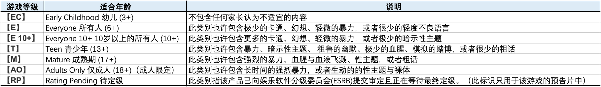

## 二.目标确定
1. 了解游戏市场情况
2. 找出影响销售的因素


```python
import pandas as pd
import numpy as np
```


```python
df = pd.read_csv('Games_Sales.csv')
df.head()
```


<div>
<style>
    .dataframe thead tr:only-child th {
        text-align: right;
    }

    .dataframe thead th {
        text-align: left;
    }

    .dataframe tbody tr th {
        vertical-align: top;
    }
</style>
<table border="1" class="dataframe">
  <thead>
    <tr style="text-align: right;">
      <th></th>
      <th>Name</th>
      <th>Platform</th>
      <th>Year_of_Release</th>
      <th>Genre</th>
      <th>Publisher</th>
      <th>NA_Sales</th>
      <th>EU_Sales</th>
      <th>JP_Sales</th>
      <th>Other_Sales</th>
      <th>Global_Sales</th>
      <th>Critic_Score</th>
      <th>Critic_Count</th>
      <th>User_Score</th>
      <th>User_Count</th>
      <th>Developer</th>
      <th>Rating</th>
    </tr>
  </thead>
  <tbody>
    <tr>
      <th>0</th>
      <td>Wii Sports</td>
      <td>Wii</td>
      <td>2006.0</td>
      <td>Sports</td>
      <td>Nintendo</td>
      <td>41.36</td>
      <td>28.96</td>
      <td>3.77</td>
      <td>8.45</td>
      <td>82.53</td>
      <td>76.0</td>
      <td>51.0</td>
      <td>8</td>
      <td>322.0</td>
      <td>Nintendo</td>
      <td>E</td>
    </tr>
    <tr>
      <th>1</th>
      <td>Super Mario Bros.</td>
      <td>NES</td>
      <td>1985.0</td>
      <td>Platform</td>
      <td>Nintendo</td>
      <td>29.08</td>
      <td>3.58</td>
      <td>6.81</td>
      <td>0.77</td>
      <td>40.24</td>
      <td>NaN</td>
      <td>NaN</td>
      <td>NaN</td>
      <td>NaN</td>
      <td>NaN</td>
      <td>NaN</td>
    </tr>
    <tr>
      <th>2</th>
      <td>Mario Kart Wii</td>
      <td>Wii</td>
      <td>2008.0</td>
      <td>Racing</td>
      <td>Nintendo</td>
      <td>15.68</td>
      <td>12.76</td>
      <td>3.79</td>
      <td>3.29</td>
      <td>35.52</td>
      <td>82.0</td>
      <td>73.0</td>
      <td>8.3</td>
      <td>709.0</td>
      <td>Nintendo</td>
      <td>E</td>
    </tr>
    <tr>
      <th>3</th>
      <td>Wii Sports Resort</td>
      <td>Wii</td>
      <td>2009.0</td>
      <td>Sports</td>
      <td>Nintendo</td>
      <td>15.61</td>
      <td>10.93</td>
      <td>3.28</td>
      <td>2.95</td>
      <td>32.77</td>
      <td>80.0</td>
      <td>73.0</td>
      <td>8</td>
      <td>192.0</td>
      <td>Nintendo</td>
      <td>E</td>
    </tr>
    <tr>
      <th>4</th>
      <td>Pokemon Red/Pokemon Blue</td>
      <td>GB</td>
      <td>1996.0</td>
      <td>Role-Playing</td>
      <td>Nintendo</td>
      <td>11.27</td>
      <td>8.89</td>
      <td>10.22</td>
      <td>1.00</td>
      <td>31.37</td>
      <td>NaN</td>
      <td>NaN</td>
      <td>NaN</td>
      <td>NaN</td>
      <td>NaN</td>
      <td>NaN</td>
    </tr>
  </tbody>
</table>
</div>


## 三. 数据清洗
### 1.重复值检测
经检测不存在重复值


```python
df.duplicated().sum()
```


    0


### 2.缺失值检测及处理


```python
def null_info(df):
    info = pd.DataFrame(df.isnull().sum()).T.rename(index={0:'null values (nb)'})
    info=info.append(pd.DataFrame(df.isnull().sum()/df.shape[0]*100).T.rename(index={0:'null values (%)'}))
    display(info)
null_info(df)
```


<div>
<style>
    .dataframe thead tr:only-child th {
        text-align: right;
    }

    .dataframe thead th {
        text-align: left;
    }

    .dataframe tbody tr th {
        vertical-align: top;
    }
</style>
<table border="1" class="dataframe">
  <thead>
    <tr style="text-align: right;">
      <th></th>
      <th>Name</th>
      <th>Platform</th>
      <th>Year_of_Release</th>
      <th>Genre</th>
      <th>Publisher</th>
      <th>NA_Sales</th>
      <th>EU_Sales</th>
      <th>JP_Sales</th>
      <th>Other_Sales</th>
      <th>Global_Sales</th>
      <th>Critic_Score</th>
      <th>Critic_Count</th>
      <th>User_Score</th>
      <th>User_Count</th>
      <th>Developer</th>
      <th>Rating</th>
    </tr>
  </thead>
  <tbody>
    <tr>
      <th>null values (nb)</th>
      <td>2.000000</td>
      <td>0.0</td>
      <td>269.000000</td>
      <td>2.000000</td>
      <td>54.000000</td>
      <td>0.0</td>
      <td>0.0</td>
      <td>0.0</td>
      <td>0.0</td>
      <td>0.0</td>
      <td>8582.000000</td>
      <td>8582.000000</td>
      <td>6704.000000</td>
      <td>9129.000000</td>
      <td>6623.000000</td>
      <td>6769.000000</td>
    </tr>
    <tr>
      <th>null values (%)</th>
      <td>0.011962</td>
      <td>0.0</td>
      <td>1.608948</td>
      <td>0.011962</td>
      <td>0.322986</td>
      <td>0.0</td>
      <td>0.0</td>
      <td>0.0</td>
      <td>0.0</td>
      <td>0.0</td>
      <td>51.330821</td>
      <td>51.330821</td>
      <td>40.098092</td>
      <td>54.602548</td>
      <td>39.613613</td>
      <td>40.486871</td>
    </tr>
  </tbody>
</table>
</div>


由于各地区以及总销售额均不存在缺失值，因此这里先暂不做处理。

### 3. 异常值检测
通过观察各地区和总销售额的分布情况判断是否存在异常值。


```python
df.describe()
```


<div>
<style>
    .dataframe thead tr:only-child th {
        text-align: right;
    }

    .dataframe thead th {
        text-align: left;
    }

    .dataframe tbody tr th {
        vertical-align: top;
    }
</style>
<table border="1" class="dataframe">
  <thead>
    <tr style="text-align: right;">
      <th></th>
      <th>Year_of_Release</th>
      <th>NA_Sales</th>
      <th>EU_Sales</th>
      <th>JP_Sales</th>
      <th>Other_Sales</th>
      <th>Global_Sales</th>
      <th>Critic_Score</th>
      <th>Critic_Count</th>
      <th>User_Count</th>
    </tr>
  </thead>
  <tbody>
    <tr>
      <th>count</th>
      <td>16450.000000</td>
      <td>16719.000000</td>
      <td>16719.000000</td>
      <td>16719.000000</td>
      <td>16719.000000</td>
      <td>16719.000000</td>
      <td>8137.000000</td>
      <td>8137.000000</td>
      <td>7590.000000</td>
    </tr>
    <tr>
      <th>mean</th>
      <td>2006.487356</td>
      <td>0.263330</td>
      <td>0.145025</td>
      <td>0.077602</td>
      <td>0.047332</td>
      <td>0.533543</td>
      <td>68.967679</td>
      <td>26.360821</td>
      <td>162.229908</td>
    </tr>
    <tr>
      <th>std</th>
      <td>5.878995</td>
      <td>0.813514</td>
      <td>0.503283</td>
      <td>0.308818</td>
      <td>0.186710</td>
      <td>1.547935</td>
      <td>13.938165</td>
      <td>18.980495</td>
      <td>561.282326</td>
    </tr>
    <tr>
      <th>min</th>
      <td>1980.000000</td>
      <td>0.000000</td>
      <td>0.000000</td>
      <td>0.000000</td>
      <td>0.000000</td>
      <td>0.010000</td>
      <td>13.000000</td>
      <td>3.000000</td>
      <td>4.000000</td>
    </tr>
    <tr>
      <th>25%</th>
      <td>2003.000000</td>
      <td>0.000000</td>
      <td>0.000000</td>
      <td>0.000000</td>
      <td>0.000000</td>
      <td>0.060000</td>
      <td>60.000000</td>
      <td>12.000000</td>
      <td>10.000000</td>
    </tr>
    <tr>
      <th>50%</th>
      <td>2007.000000</td>
      <td>0.080000</td>
      <td>0.020000</td>
      <td>0.000000</td>
      <td>0.010000</td>
      <td>0.170000</td>
      <td>71.000000</td>
      <td>21.000000</td>
      <td>24.000000</td>
    </tr>
    <tr>
      <th>75%</th>
      <td>2010.000000</td>
      <td>0.240000</td>
      <td>0.110000</td>
      <td>0.040000</td>
      <td>0.030000</td>
      <td>0.470000</td>
      <td>79.000000</td>
      <td>36.000000</td>
      <td>81.000000</td>
    </tr>
    <tr>
      <th>max</th>
      <td>2020.000000</td>
      <td>41.360000</td>
      <td>28.960000</td>
      <td>10.220000</td>
      <td>10.570000</td>
      <td>82.530000</td>
      <td>98.000000</td>
      <td>113.000000</td>
      <td>10665.000000</td>
    </tr>
  </tbody>
</table>
</div>


## 四.游戏市场情况分析

从以下多个维度进行分析：

平台、类别、等级（即适合年龄）、（评审员）评分、（评审员）评分数、（用户）评分、（用户）评分数、发布年份。

### 1.哪个平台的游戏数量最多/最少？
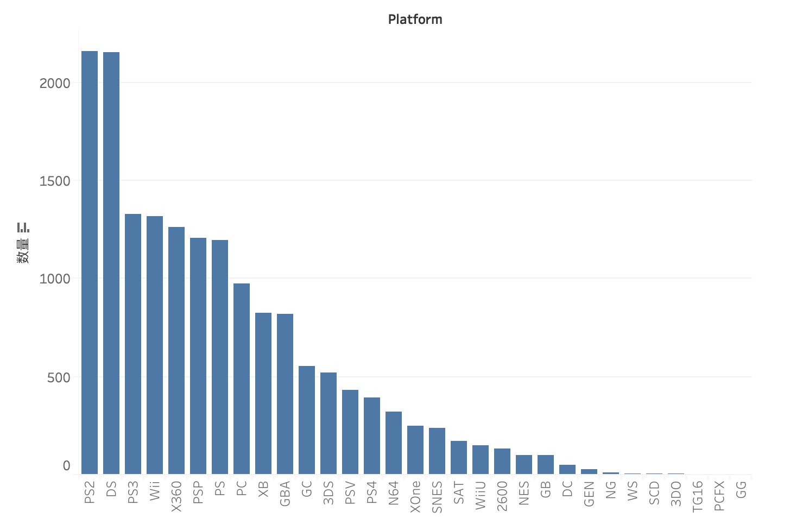

** 分析 **

使用PS2和DS平台的游戏最多，均超过2200多种，而使用其他平台的游戏都不到1500。

### 2.哪种类别的游戏数量最多/最少？
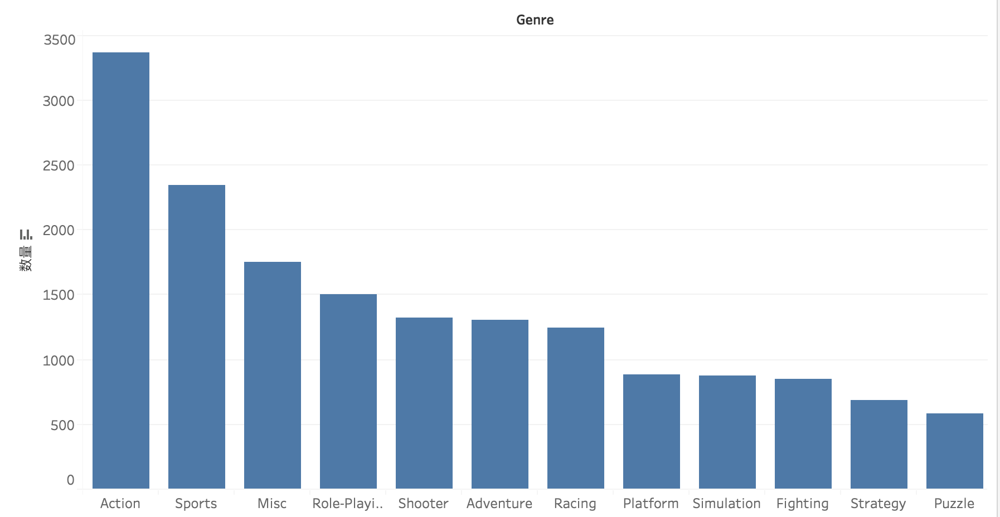

** 分析 **

市场上属于Action和Sports类别的游戏最多，Puzzle最少。

### 3. 哪个等级的游戏数量最多/最少？
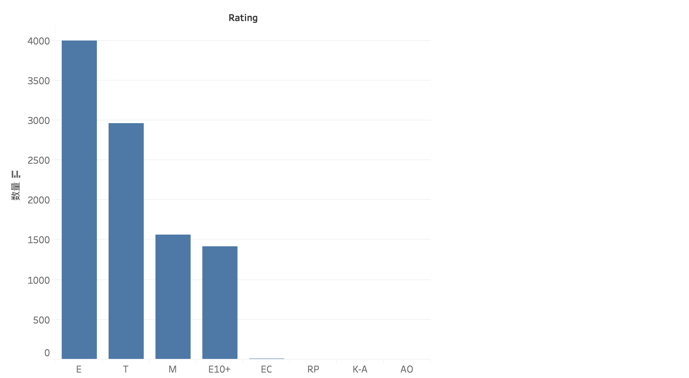

** 分析 **

市面上游戏等级为E（即适合所有人）的游戏最多，其次是T（青少年13+）和M（成熟期17+），EC、RP、K-A、AO等级的游戏非常少。

### 4.游戏（评审员）评分的分布情况
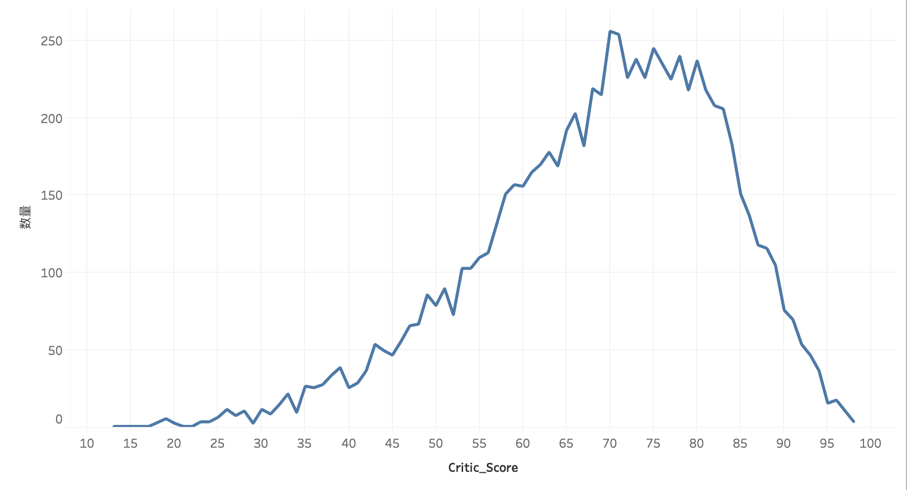

** 分析 **

评审员给大部分游戏的评分在60～85之间（100分为满分），高分和低分段的都比较少。

### 5. 游戏（评审员）评分数的分布情况
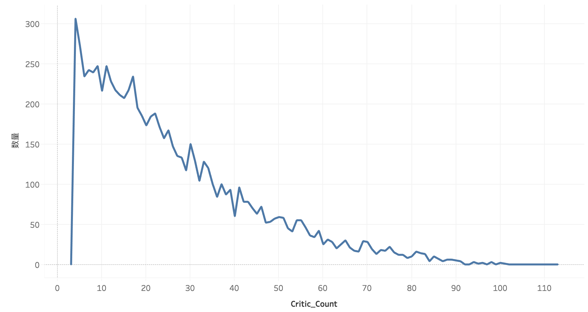

** 分析 **

大部分游戏获得的评审员的评分数并不多，在50个以内，超过100的少之又少。

### 6.游戏（用户）评分的分布情况
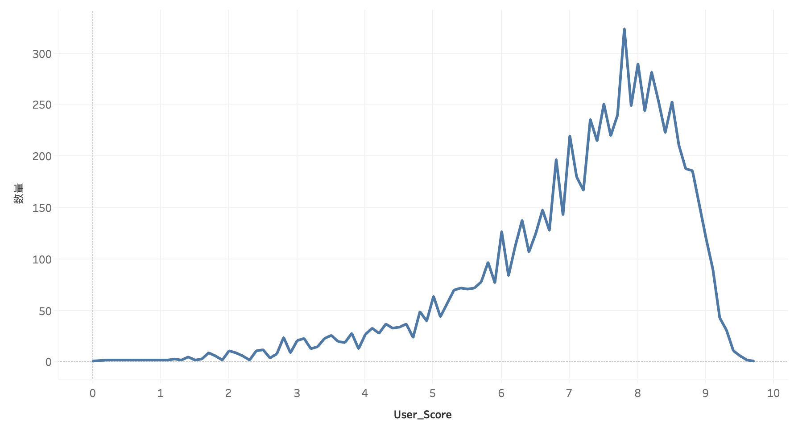

** 分析 **

用户给大部分游戏的评分在7～9之间（10分为满分），与评审员给出的评分相似，高分和低分段的都比较少。

### 7.游戏（用户）评分数的分布情况
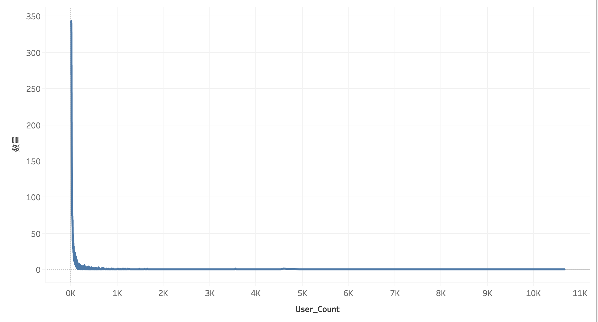

** 分析 **

大部分游戏获得的用户的评分数并不多，几乎都在100人以内。

### 8. 游戏发布年份分布情况
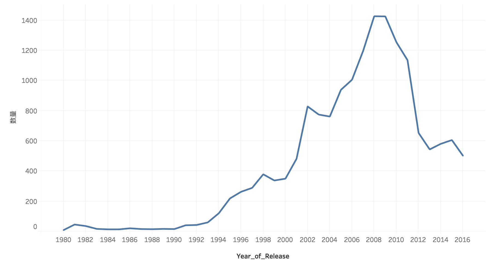

** 分析 **

从1980年到2008年间，游戏呈快速增长阶段，2008和2009达到峰值，2008～2013年间出现极速减少，一方面原因是因为这部分数据并不全，并非记录了所有的游戏数据，另一方面虽然发布的游戏数有所减少，但游戏总量仍在增加。

### 9.最受欢迎的游戏
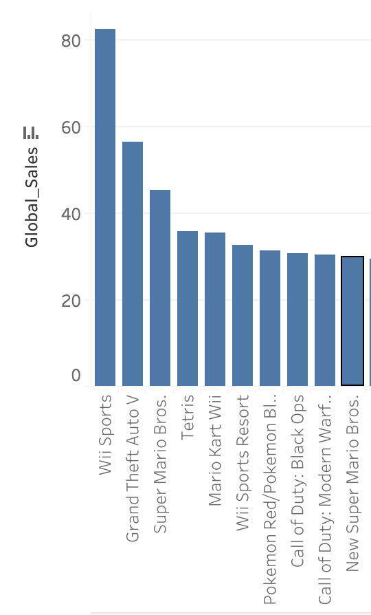

** 分析 **

图中为总销售额排名前10的游戏，其中Will Spoorts是销售额最高的游戏，说明此游戏非常受用户喜爱。

### 10.最受欢迎的开发者
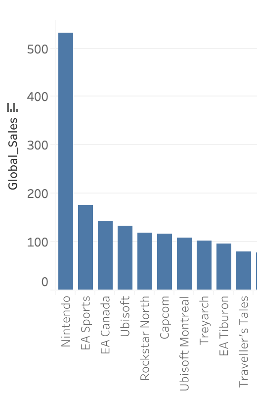

** 分析 **

图中为总销售额排名前10的开发者，其中Nintendo是销售额最高的，即最受玩家喜爱的开发者。

### 11.最受欢迎的发行商
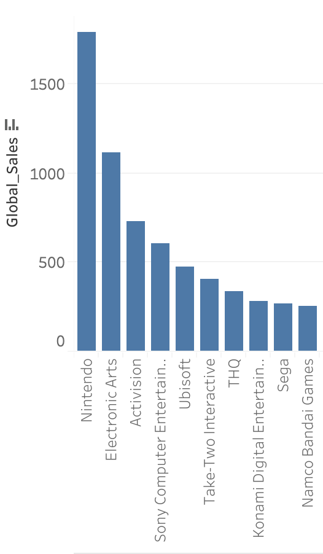

** 分析 **

图中为总销售额排名前10的发行商，其中Nintendo是销售额最高的。

## 五.销售影响因素分析
分析影响销售的相关原因

从游戏平台、类型、级别（也就是适合年龄）、评论者评分和数量、用户评分和数量多个维度进行分析。

如果某个地区在售的游戏数量越多，总销售额也可能越多。而总销售额 = 游戏数量*平均销售额。

为了更好评估影响因素，这里的指标采用平均销售额。通过找出不同平台、类型、级别，评分和其数量的平均销售额，来判断对销售额的影响大小，如果差异小说明该维度对销售额影响不大，否则说明此维度是影响销售额的重要因素之一

### 1. 平台

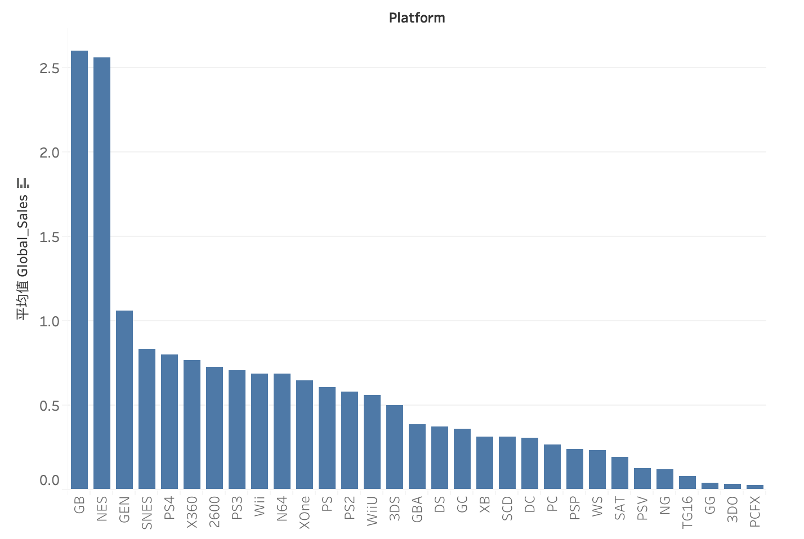

** 分析 **

游戏使用平台为GB和NES的平均销售额最高，是其他平台的两倍或以上。结合前面分析的考虑，市场上游戏平台占有率最高的PS2和DS平台的平均销售额并不是最高的。

### 2. 类型
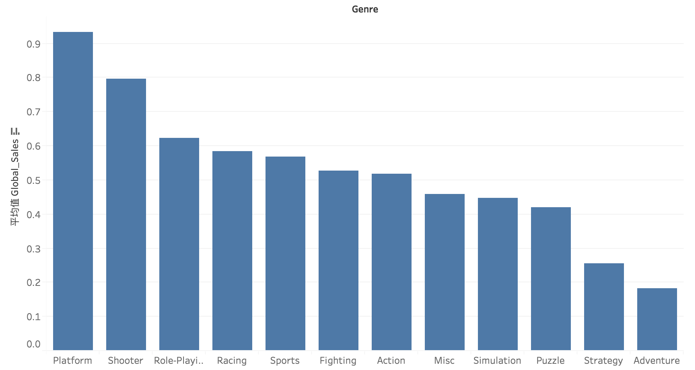

** 分析 **

游戏类别为Platform的平均销售额最高，接下来是Shooter类型的游戏，可见多数玩家喜欢这两种类别的游戏,然而这两类游戏的市场在售数量并不是最多的。
### 3. 等级（即适合人群）
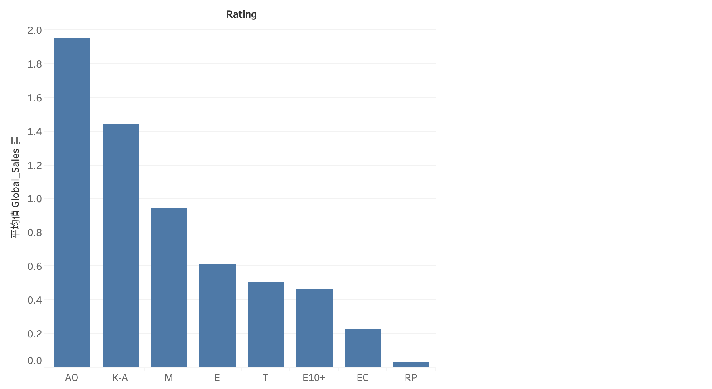

** 分析 **

等级为AO，即适合人群为成人的游戏平均销售额最高。但此类游戏在市场上的数量是最少的（结合前面的分析）。

### 4. 评审员评分
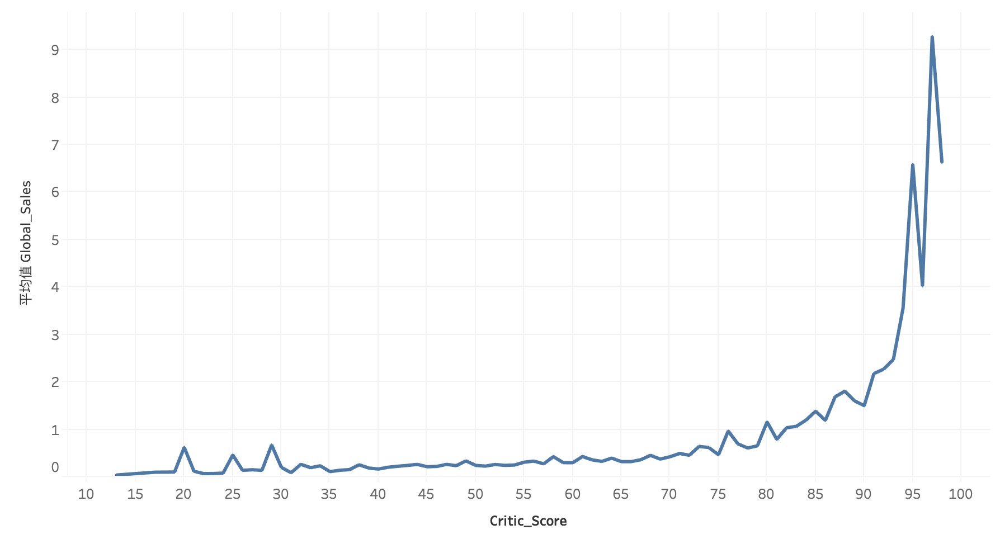

** 分析 **

总体而言，评审员的评分越高，游戏的平均销售额越高，小于80分的区别不大，但当评分大于80分后，开始发生很大的差异。
### 5. 评审员评分数量
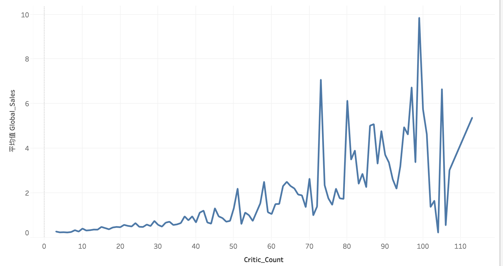

** 分析 **

评审员的评分数量对平均销售额的影响呈现非规律性，但大多数平均销售额大的游戏，会得到更多评审员的评分。
### 6. 用户评分
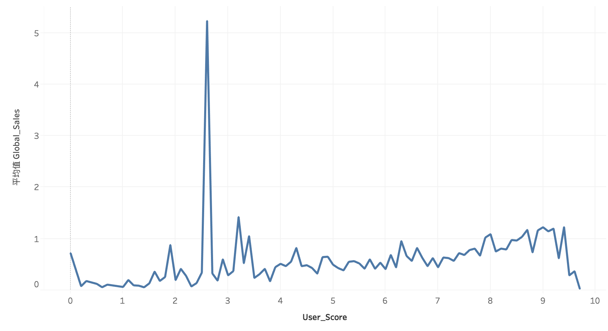

** 分析 **

用户评分对游戏的平均销售额影响并不大，评分越高的游戏平均销售额并不会越高，这与评审员评分有差别。
### 7. 用户评分数量
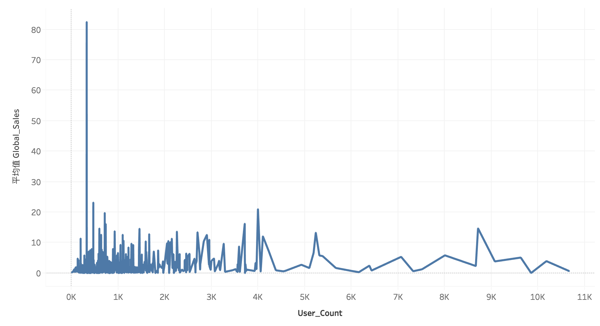

** 分析 **

大多数游戏得到用户的评分量都在2k以内，用户评分量对平均销售额也没有什么影响。


### 小结1

综上所述，对销售有影响的因素主要有：
游戏平台，类型，等级（即适合人群），评审员评分。
### 小结2
1. 市场上游戏平台占有率最高是PS2和DS平台，但游戏使用平台为GB和NES的平均销售额最高。

2. 多数玩家喜欢Platform和Shooter类型的游戏，但这两类游戏在市场上的销售量并非是最多的，市场上属于Action和Sports类别的游戏数量最多。

3. 等级为AO，即适合人群为成人的游戏平均销售额最高。但此类游戏在市场上的数量是最少的，市场上数量最多的游戏是E等级，即适合所有用户玩的游戏。

4. 评审员的评分越高，销售额也越高，评分数量和用户评分对销售额影响不大。

## 六.不同地区的销售情况分析
不同地区的销售情况不同，为了更精细的分析销售情况，接下来将从平台、类别、等级这几个维度对不同地区的销售情况进行分析。

- NA_Sales: Game sales in North America (in millions of units)
- EU_Sales: Game sales in the European Union (in millions of units)
- JP_Sales: Game sales in Japan (in millions of units)
- Other_Sales: Game sales in the rest of the world, i.e. Africa, Asia excluding Japan, Australia, Europe excluding the E.U. and South America (in millions of units)

### 1. 平台
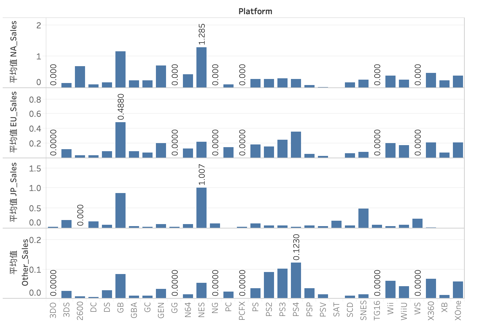

** 分析 **

North America和Japan的玩家较喜欢NES平台的游戏，European Union的玩家较喜欢GB平台的游戏，而其他地区的玩家更喜欢PS4平台的游戏。

### 2. 类别
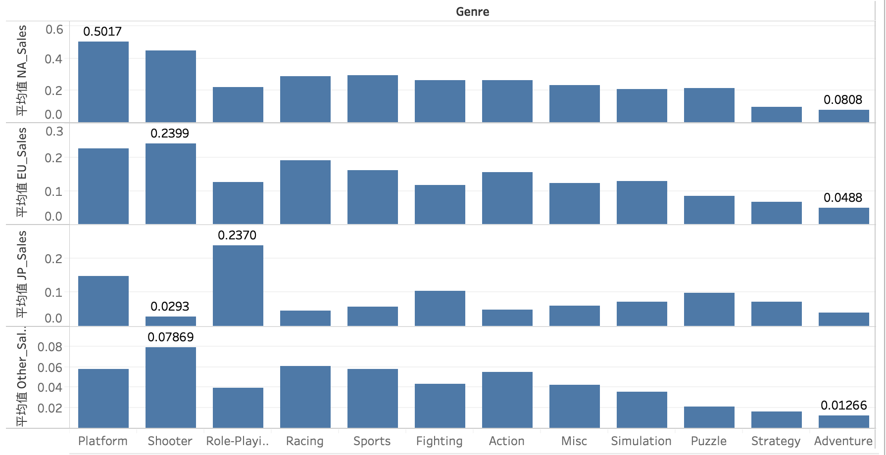

** 分析 **

North America的玩家较喜欢Platform类别的游戏，Japan的玩家较喜欢Role-Playing类别的游戏，European Union和其他地区的玩家较喜欢Shooter类别的游戏。
### 3. 等级（适合群体）
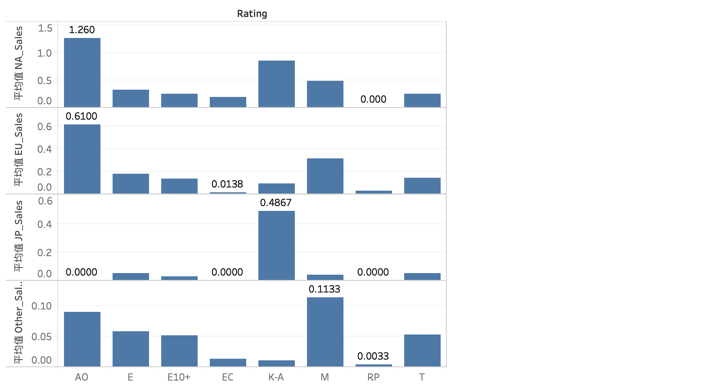

** 分析 **

North America和European Union的玩家较喜欢AO（即成人类）的游戏，Japan的玩家较喜欢K-A等级的游戏，而其他地区的玩家更喜欢M（即17+）等级的游戏。

### 小结3
1. North America的玩家较喜欢NES平台、Platform类别、AO（即成人类）等级的游戏
2. European Union的玩家较喜欢GB平台、Shooter类别、AO（即成人类）等级的游戏
3. Japan的玩家较喜欢NES平台、Role-Playing类别、K-A等级的游戏

