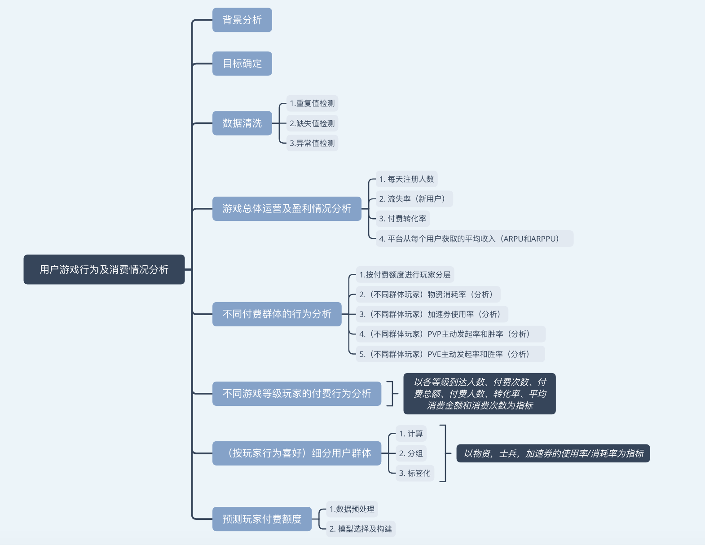
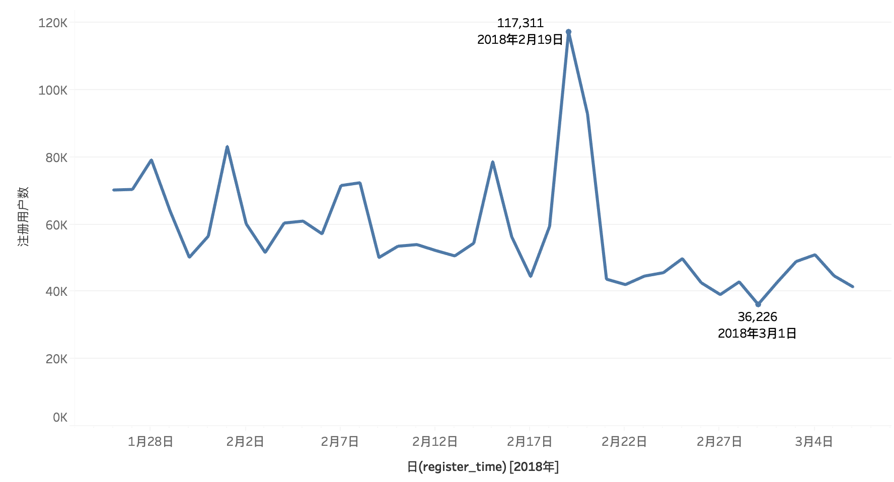
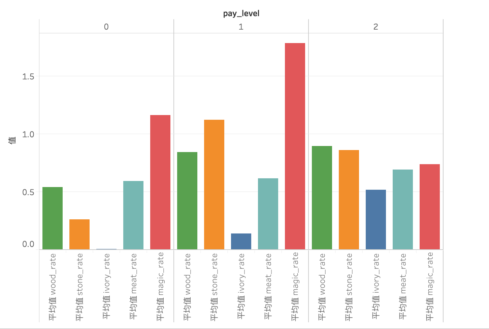
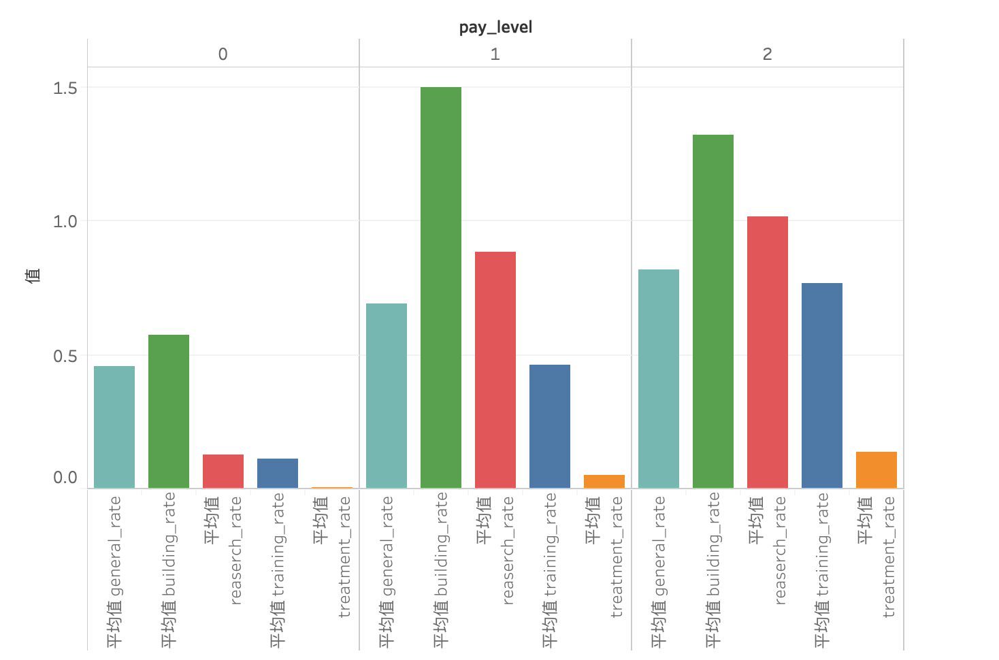
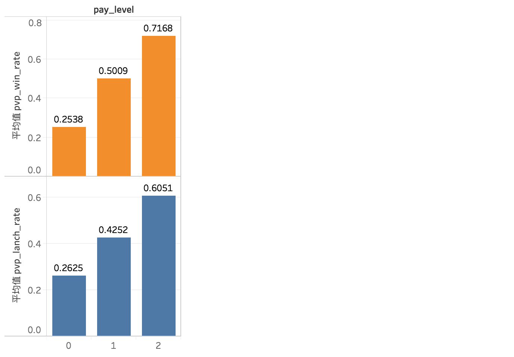
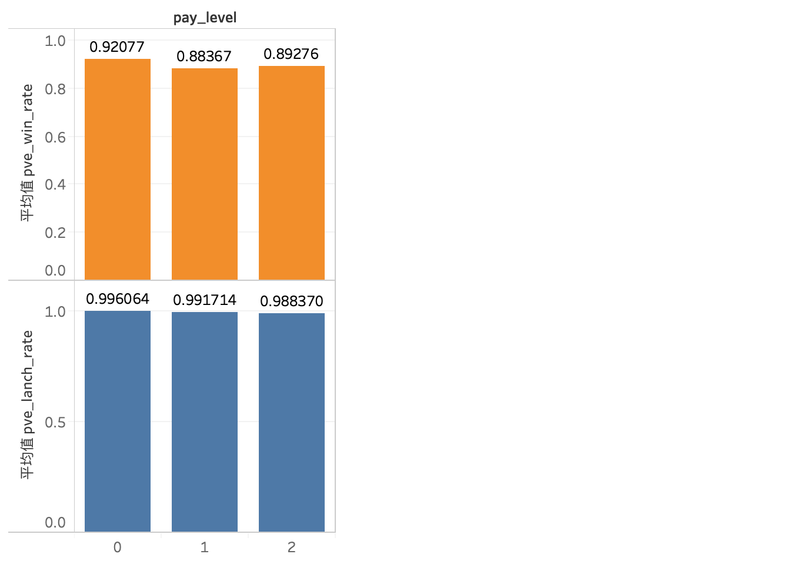
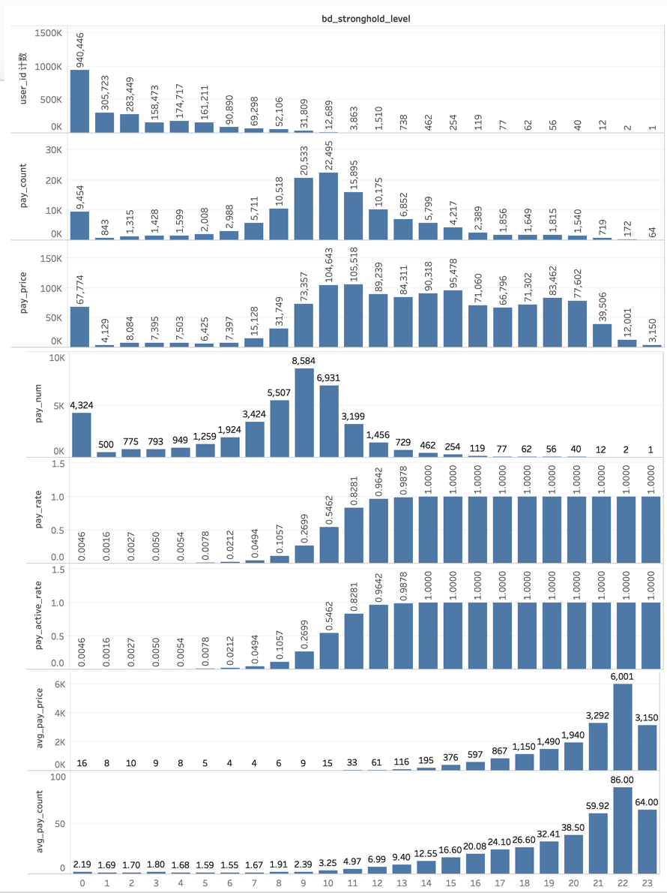

# 用户游戏行为及消费情况分析


## 一. 背景分析
准确了解每个玩家的背后行为和价值，对游戏的产品改进，广告投放和高效的运营活动（如精准的促销活动和礼包推荐）都具有重要意义，有助于给玩家带来更个性化的体验。此数据来自《野蛮时代》（Brutal Age）这款游戏，这是一款风靡全球的SLG类型手机游戏。数据包含了玩家在游戏内前7日的行为数据。

数据来源：
http://www.dcjingsai.com/common/cmpt/游戏玩家付费金额预测大赛_竞赛信息.html

主要字段解释：
- user_id	玩家唯一ID
- register_time	玩家注册时间
- pvp_battle_count	PVP次数
- pvp_lanch_count	主动发起PVP次数
- pvp_win_count	PVP胜利次数
- pve_battle_count	PVE次数
- pve_lanch_count	主动发起PVE次数
- pve_win_count	PVE胜利次数
- avg_online_minutes	在线时长
- pay_price	付费金额
- pay_count	付费次数
- 以及游戏中相关的各类数据（包括物资、军队、加速、要塞等级等，详见附加文件）

## 二. 目标确定
1. 监控游戏运营情况
2. 提高付费转化率
3. 提高付费金额

从注册人数、流失率、付费转化率、每用户/付费用户平均收入角度对游戏运营情况进行监控。

分析不同付费群体的行为，分析不同等级玩家的付费行为，针对不同付费群体采取不同营销措施，在游戏不同等级进行设置。

对玩家进行分群，同时对付费额度进行预测，以采取相关措施。


```python
import pandas as pd
import numpy as np
from time import time
```


```python
df = pd.read_csv('tap_fun_train.csv')
pd.set_option("display.max_columns", len(df.columns))
df.head()
```


<div>
<style>
    .dataframe thead tr:only-child th {
        text-align: right;
    }

    .dataframe thead th {
        text-align: left;
    }

    .dataframe tbody tr th {
        vertical-align: top;
    }
</style>
<table border="1" class="dataframe">
  <thead>
    <tr style="text-align: right;">
      <th></th>
      <th>user_id</th>
      <th>register_time</th>
      <th>wood_add_value</th>
      <th>wood_reduce_value</th>
      <th>stone_add_value</th>
      <th>stone_reduce_value</th>
      <th>ivory_add_value</th>
      <th>ivory_reduce_value</th>
      <th>meat_add_value</th>
      <th>meat_reduce_value</th>
      <th>magic_add_value</th>
      <th>magic_reduce_value</th>
      <th>infantry_add_value</th>
      <th>infantry_reduce_value</th>
      <th>cavalry_add_value</th>
      <th>cavalry_reduce_value</th>
      <th>shaman_add_value</th>
      <th>shaman_reduce_value</th>
      <th>wound_infantry_add_value</th>
      <th>wound_infantry_reduce_value</th>
      <th>wound_cavalry_add_value</th>
      <th>wound_cavalry_reduce_value</th>
      <th>wound_shaman_add_value</th>
      <th>wound_shaman_reduce_value</th>
      <th>general_acceleration_add_value</th>
      <th>general_acceleration_reduce_value</th>
      <th>building_acceleration_add_value</th>
      <th>building_acceleration_reduce_value</th>
      <th>reaserch_acceleration_add_value</th>
      <th>reaserch_acceleration_reduce_value</th>
      <th>training_acceleration_add_value</th>
      <th>training_acceleration_reduce_value</th>
      <th>treatment_acceleraion_add_value</th>
      <th>treatment_acceleration_reduce_value</th>
      <th>bd_training_hut_level</th>
      <th>bd_healing_lodge_level</th>
      <th>bd_stronghold_level</th>
      <th>bd_outpost_portal_level</th>
      <th>bd_barrack_level</th>
      <th>bd_healing_spring_level</th>
      <th>bd_dolmen_level</th>
      <th>bd_guest_cavern_level</th>
      <th>bd_warehouse_level</th>
      <th>bd_watchtower_level</th>
      <th>bd_magic_coin_tree_level</th>
      <th>bd_hall_of_war_level</th>
      <th>bd_market_level</th>
      <th>bd_hero_gacha_level</th>
      <th>bd_hero_strengthen_level</th>
      <th>bd_hero_pve_level</th>
      <th>sr_scout_level</th>
      <th>sr_training_speed_level</th>
      <th>sr_infantry_tier_2_level</th>
      <th>sr_cavalry_tier_2_level</th>
      <th>sr_shaman_tier_2_level</th>
      <th>sr_infantry_atk_level</th>
      <th>sr_cavalry_atk_level</th>
      <th>sr_shaman_atk_level</th>
      <th>sr_infantry_tier_3_level</th>
      <th>sr_cavalry_tier_3_level</th>
      <th>sr_shaman_tier_3_level</th>
      <th>sr_troop_defense_level</th>
      <th>sr_infantry_def_level</th>
      <th>sr_cavalry_def_level</th>
      <th>sr_shaman_def_level</th>
      <th>sr_infantry_hp_level</th>
      <th>sr_cavalry_hp_level</th>
      <th>sr_shaman_hp_level</th>
      <th>sr_infantry_tier_4_level</th>
      <th>sr_cavalry_tier_4_level</th>
      <th>sr_shaman_tier_4_level</th>
      <th>sr_troop_attack_level</th>
      <th>sr_construction_speed_level</th>
      <th>sr_hide_storage_level</th>
      <th>sr_troop_consumption_level</th>
      <th>sr_rss_a_prod_levell</th>
      <th>sr_rss_b_prod_level</th>
      <th>sr_rss_c_prod_level</th>
      <th>sr_rss_d_prod_level</th>
      <th>sr_rss_a_gather_level</th>
      <th>sr_rss_b_gather_level</th>
      <th>sr_rss_c_gather_level</th>
      <th>sr_rss_d_gather_level</th>
      <th>sr_troop_load_level</th>
      <th>sr_rss_e_gather_level</th>
      <th>sr_rss_e_prod_level</th>
      <th>sr_outpost_durability_level</th>
      <th>sr_outpost_tier_2_level</th>
      <th>sr_healing_space_level</th>
      <th>sr_gathering_hunter_buff_level</th>
      <th>sr_healing_speed_level</th>
      <th>sr_outpost_tier_3_level</th>
      <th>sr_alliance_march_speed_level</th>
      <th>sr_pvp_march_speed_level</th>
      <th>sr_gathering_march_speed_level</th>
      <th>sr_outpost_tier_4_level</th>
      <th>sr_guest_troop_capacity_level</th>
      <th>sr_march_size_level</th>
      <th>sr_rss_help_bonus_level</th>
      <th>pvp_battle_count</th>
      <th>pvp_lanch_count</th>
      <th>pvp_win_count</th>
      <th>pve_battle_count</th>
      <th>pve_lanch_count</th>
      <th>pve_win_count</th>
      <th>avg_online_minutes</th>
      <th>pay_price</th>
      <th>pay_count</th>
      <th>prediction_pay_price</th>
    </tr>
  </thead>
  <tbody>
    <tr>
      <th>0</th>
      <td>1</td>
      <td>2018-02-02 19:47:15</td>
      <td>20125.0</td>
      <td>3700.0</td>
      <td>0.0</td>
      <td>0.0</td>
      <td>0.0</td>
      <td>0.0</td>
      <td>16375.0</td>
      <td>2000.0</td>
      <td>0.0</td>
      <td>0.0</td>
      <td>0</td>
      <td>0</td>
      <td>0</td>
      <td>0</td>
      <td>0</td>
      <td>0</td>
      <td>0</td>
      <td>0</td>
      <td>0</td>
      <td>0</td>
      <td>0</td>
      <td>0</td>
      <td>0</td>
      <td>0</td>
      <td>0</td>
      <td>0</td>
      <td>50</td>
      <td>0</td>
      <td>50</td>
      <td>0</td>
      <td>0</td>
      <td>0</td>
      <td>0</td>
      <td>0</td>
      <td>1</td>
      <td>0</td>
      <td>1</td>
      <td>0</td>
      <td>0</td>
      <td>0</td>
      <td>0</td>
      <td>0</td>
      <td>0</td>
      <td>0</td>
      <td>0</td>
      <td>0</td>
      <td>0</td>
      <td>0</td>
      <td>0</td>
      <td>0</td>
      <td>0</td>
      <td>0</td>
      <td>0</td>
      <td>0</td>
      <td>0</td>
      <td>0</td>
      <td>0</td>
      <td>0</td>
      <td>0</td>
      <td>0</td>
      <td>0</td>
      <td>0</td>
      <td>0</td>
      <td>0</td>
      <td>0</td>
      <td>0</td>
      <td>0</td>
      <td>0</td>
      <td>0</td>
      <td>0</td>
      <td>0</td>
      <td>0</td>
      <td>0</td>
      <td>0</td>
      <td>0</td>
      <td>0</td>
      <td>0</td>
      <td>0</td>
      <td>0</td>
      <td>0</td>
      <td>0</td>
      <td>0</td>
      <td>0</td>
      <td>0</td>
      <td>0</td>
      <td>0</td>
      <td>0</td>
      <td>0</td>
      <td>0</td>
      <td>0</td>
      <td>0</td>
      <td>0</td>
      <td>0</td>
      <td>0</td>
      <td>0</td>
      <td>0</td>
      <td>0</td>
      <td>0</td>
      <td>0</td>
      <td>0</td>
      <td>0</td>
      <td>0</td>
      <td>0</td>
      <td>0.333333</td>
      <td>0.0</td>
      <td>0</td>
      <td>0.0</td>
    </tr>
    <tr>
      <th>1</th>
      <td>1593</td>
      <td>2018-01-26 00:01:05</td>
      <td>0.0</td>
      <td>0.0</td>
      <td>0.0</td>
      <td>0.0</td>
      <td>0.0</td>
      <td>0.0</td>
      <td>0.0</td>
      <td>0.0</td>
      <td>0.0</td>
      <td>0.0</td>
      <td>0</td>
      <td>0</td>
      <td>0</td>
      <td>0</td>
      <td>0</td>
      <td>0</td>
      <td>0</td>
      <td>0</td>
      <td>0</td>
      <td>0</td>
      <td>0</td>
      <td>0</td>
      <td>0</td>
      <td>0</td>
      <td>0</td>
      <td>0</td>
      <td>0</td>
      <td>0</td>
      <td>0</td>
      <td>0</td>
      <td>0</td>
      <td>0</td>
      <td>0</td>
      <td>0</td>
      <td>0</td>
      <td>0</td>
      <td>0</td>
      <td>0</td>
      <td>0</td>
      <td>0</td>
      <td>0</td>
      <td>0</td>
      <td>0</td>
      <td>0</td>
      <td>0</td>
      <td>0</td>
      <td>0</td>
      <td>0</td>
      <td>0</td>
      <td>0</td>
      <td>0</td>
      <td>0</td>
      <td>0</td>
      <td>0</td>
      <td>0</td>
      <td>0</td>
      <td>0</td>
      <td>0</td>
      <td>0</td>
      <td>0</td>
      <td>0</td>
      <td>0</td>
      <td>0</td>
      <td>0</td>
      <td>0</td>
      <td>0</td>
      <td>0</td>
      <td>0</td>
      <td>0</td>
      <td>0</td>
      <td>0</td>
      <td>0</td>
      <td>0</td>
      <td>0</td>
      <td>0</td>
      <td>0</td>
      <td>0</td>
      <td>0</td>
      <td>0</td>
      <td>0</td>
      <td>0</td>
      <td>0</td>
      <td>0</td>
      <td>0</td>
      <td>0</td>
      <td>0</td>
      <td>0</td>
      <td>0</td>
      <td>0</td>
      <td>0</td>
      <td>0</td>
      <td>0</td>
      <td>0</td>
      <td>0</td>
      <td>0</td>
      <td>0</td>
      <td>0</td>
      <td>0</td>
      <td>0</td>
      <td>0</td>
      <td>0</td>
      <td>0</td>
      <td>0</td>
      <td>0.333333</td>
      <td>0.0</td>
      <td>0</td>
      <td>0.0</td>
    </tr>
    <tr>
      <th>2</th>
      <td>1594</td>
      <td>2018-01-26 00:01:58</td>
      <td>0.0</td>
      <td>0.0</td>
      <td>0.0</td>
      <td>0.0</td>
      <td>0.0</td>
      <td>0.0</td>
      <td>0.0</td>
      <td>0.0</td>
      <td>0.0</td>
      <td>0.0</td>
      <td>0</td>
      <td>0</td>
      <td>0</td>
      <td>0</td>
      <td>0</td>
      <td>0</td>
      <td>0</td>
      <td>0</td>
      <td>0</td>
      <td>0</td>
      <td>0</td>
      <td>0</td>
      <td>0</td>
      <td>0</td>
      <td>0</td>
      <td>0</td>
      <td>0</td>
      <td>0</td>
      <td>0</td>
      <td>0</td>
      <td>0</td>
      <td>0</td>
      <td>0</td>
      <td>0</td>
      <td>0</td>
      <td>0</td>
      <td>0</td>
      <td>0</td>
      <td>0</td>
      <td>0</td>
      <td>0</td>
      <td>0</td>
      <td>0</td>
      <td>0</td>
      <td>0</td>
      <td>0</td>
      <td>0</td>
      <td>0</td>
      <td>0</td>
      <td>0</td>
      <td>0</td>
      <td>0</td>
      <td>0</td>
      <td>0</td>
      <td>0</td>
      <td>0</td>
      <td>0</td>
      <td>0</td>
      <td>0</td>
      <td>0</td>
      <td>0</td>
      <td>0</td>
      <td>0</td>
      <td>0</td>
      <td>0</td>
      <td>0</td>
      <td>0</td>
      <td>0</td>
      <td>0</td>
      <td>0</td>
      <td>0</td>
      <td>0</td>
      <td>0</td>
      <td>0</td>
      <td>0</td>
      <td>0</td>
      <td>0</td>
      <td>0</td>
      <td>0</td>
      <td>0</td>
      <td>0</td>
      <td>0</td>
      <td>0</td>
      <td>0</td>
      <td>0</td>
      <td>0</td>
      <td>0</td>
      <td>0</td>
      <td>0</td>
      <td>0</td>
      <td>0</td>
      <td>0</td>
      <td>0</td>
      <td>0</td>
      <td>0</td>
      <td>0</td>
      <td>0</td>
      <td>0</td>
      <td>0</td>
      <td>0</td>
      <td>0</td>
      <td>0</td>
      <td>0</td>
      <td>1.166667</td>
      <td>0.0</td>
      <td>0</td>
      <td>0.0</td>
    </tr>
    <tr>
      <th>3</th>
      <td>1595</td>
      <td>2018-01-26 00:02:13</td>
      <td>0.0</td>
      <td>0.0</td>
      <td>0.0</td>
      <td>0.0</td>
      <td>0.0</td>
      <td>0.0</td>
      <td>0.0</td>
      <td>0.0</td>
      <td>0.0</td>
      <td>0.0</td>
      <td>0</td>
      <td>0</td>
      <td>0</td>
      <td>0</td>
      <td>0</td>
      <td>0</td>
      <td>0</td>
      <td>0</td>
      <td>0</td>
      <td>0</td>
      <td>0</td>
      <td>0</td>
      <td>0</td>
      <td>0</td>
      <td>0</td>
      <td>0</td>
      <td>0</td>
      <td>0</td>
      <td>0</td>
      <td>0</td>
      <td>0</td>
      <td>0</td>
      <td>0</td>
      <td>0</td>
      <td>0</td>
      <td>0</td>
      <td>0</td>
      <td>0</td>
      <td>0</td>
      <td>0</td>
      <td>0</td>
      <td>0</td>
      <td>0</td>
      <td>0</td>
      <td>0</td>
      <td>0</td>
      <td>0</td>
      <td>0</td>
      <td>0</td>
      <td>0</td>
      <td>0</td>
      <td>0</td>
      <td>0</td>
      <td>0</td>
      <td>0</td>
      <td>0</td>
      <td>0</td>
      <td>0</td>
      <td>0</td>
      <td>0</td>
      <td>0</td>
      <td>0</td>
      <td>0</td>
      <td>0</td>
      <td>0</td>
      <td>0</td>
      <td>0</td>
      <td>0</td>
      <td>0</td>
      <td>0</td>
      <td>0</td>
      <td>0</td>
      <td>0</td>
      <td>0</td>
      <td>0</td>
      <td>0</td>
      <td>0</td>
      <td>0</td>
      <td>0</td>
      <td>0</td>
      <td>0</td>
      <td>0</td>
      <td>0</td>
      <td>0</td>
      <td>0</td>
      <td>0</td>
      <td>0</td>
      <td>0</td>
      <td>0</td>
      <td>0</td>
      <td>0</td>
      <td>0</td>
      <td>0</td>
      <td>0</td>
      <td>0</td>
      <td>0</td>
      <td>0</td>
      <td>0</td>
      <td>0</td>
      <td>0</td>
      <td>0</td>
      <td>0</td>
      <td>0</td>
      <td>3.166667</td>
      <td>0.0</td>
      <td>0</td>
      <td>0.0</td>
    </tr>
    <tr>
      <th>4</th>
      <td>1596</td>
      <td>2018-01-26 00:02:46</td>
      <td>0.0</td>
      <td>0.0</td>
      <td>0.0</td>
      <td>0.0</td>
      <td>0.0</td>
      <td>0.0</td>
      <td>0.0</td>
      <td>0.0</td>
      <td>0.0</td>
      <td>0.0</td>
      <td>0</td>
      <td>0</td>
      <td>0</td>
      <td>0</td>
      <td>0</td>
      <td>0</td>
      <td>0</td>
      <td>0</td>
      <td>0</td>
      <td>0</td>
      <td>0</td>
      <td>0</td>
      <td>0</td>
      <td>0</td>
      <td>0</td>
      <td>0</td>
      <td>0</td>
      <td>0</td>
      <td>0</td>
      <td>0</td>
      <td>0</td>
      <td>0</td>
      <td>0</td>
      <td>0</td>
      <td>0</td>
      <td>0</td>
      <td>0</td>
      <td>0</td>
      <td>0</td>
      <td>0</td>
      <td>0</td>
      <td>0</td>
      <td>0</td>
      <td>0</td>
      <td>0</td>
      <td>0</td>
      <td>0</td>
      <td>0</td>
      <td>0</td>
      <td>0</td>
      <td>0</td>
      <td>0</td>
      <td>0</td>
      <td>0</td>
      <td>0</td>
      <td>0</td>
      <td>0</td>
      <td>0</td>
      <td>0</td>
      <td>0</td>
      <td>0</td>
      <td>0</td>
      <td>0</td>
      <td>0</td>
      <td>0</td>
      <td>0</td>
      <td>0</td>
      <td>0</td>
      <td>0</td>
      <td>0</td>
      <td>0</td>
      <td>0</td>
      <td>0</td>
      <td>0</td>
      <td>0</td>
      <td>0</td>
      <td>0</td>
      <td>0</td>
      <td>0</td>
      <td>0</td>
      <td>0</td>
      <td>0</td>
      <td>0</td>
      <td>0</td>
      <td>0</td>
      <td>0</td>
      <td>0</td>
      <td>0</td>
      <td>0</td>
      <td>0</td>
      <td>0</td>
      <td>0</td>
      <td>0</td>
      <td>0</td>
      <td>0</td>
      <td>0</td>
      <td>0</td>
      <td>0</td>
      <td>0</td>
      <td>0</td>
      <td>0</td>
      <td>0</td>
      <td>0</td>
      <td>2.333333</td>
      <td>0.0</td>
      <td>0</td>
      <td>0.0</td>
    </tr>
  </tbody>
</table>
</div>


## 三. 数据清洗
### 1.重复值检测


```python
df.duplicated('user_id').sum()
```


    0


```python
df.shape
```


    (2288007, 109)


### 2.缺失值检测


```python
def null_info(df):
    info = pd.DataFrame(df.isnull().sum()).T.rename(index={0:'null values (nb)'})
    info=info.append(pd.DataFrame(df.isnull().sum()/df.shape[0]*100).T.rename(index={0:'null values (%)'}))
    display(info)
null_info(df)
```


<div>
<style>
    .dataframe thead tr:only-child th {
        text-align: right;
    }

    .dataframe thead th {
        text-align: left;
    }

    .dataframe tbody tr th {
        vertical-align: top;
    }
</style>
<table border="1" class="dataframe">
  <thead>
    <tr style="text-align: right;">
      <th></th>
      <th>user_id</th>
      <th>register_time</th>
      <th>wood_add_value</th>
      <th>wood_reduce_value</th>
      <th>stone_add_value</th>
      <th>stone_reduce_value</th>
      <th>ivory_add_value</th>
      <th>ivory_reduce_value</th>
      <th>meat_add_value</th>
      <th>meat_reduce_value</th>
      <th>magic_add_value</th>
      <th>magic_reduce_value</th>
      <th>infantry_add_value</th>
      <th>infantry_reduce_value</th>
      <th>cavalry_add_value</th>
      <th>cavalry_reduce_value</th>
      <th>shaman_add_value</th>
      <th>shaman_reduce_value</th>
      <th>wound_infantry_add_value</th>
      <th>wound_infantry_reduce_value</th>
      <th>wound_cavalry_add_value</th>
      <th>wound_cavalry_reduce_value</th>
      <th>wound_shaman_add_value</th>
      <th>wound_shaman_reduce_value</th>
      <th>general_acceleration_add_value</th>
      <th>general_acceleration_reduce_value</th>
      <th>building_acceleration_add_value</th>
      <th>building_acceleration_reduce_value</th>
      <th>reaserch_acceleration_add_value</th>
      <th>reaserch_acceleration_reduce_value</th>
      <th>training_acceleration_add_value</th>
      <th>training_acceleration_reduce_value</th>
      <th>treatment_acceleraion_add_value</th>
      <th>treatment_acceleration_reduce_value</th>
      <th>bd_training_hut_level</th>
      <th>bd_healing_lodge_level</th>
      <th>bd_stronghold_level</th>
      <th>bd_outpost_portal_level</th>
      <th>bd_barrack_level</th>
      <th>bd_healing_spring_level</th>
      <th>bd_dolmen_level</th>
      <th>bd_guest_cavern_level</th>
      <th>bd_warehouse_level</th>
      <th>bd_watchtower_level</th>
      <th>bd_magic_coin_tree_level</th>
      <th>bd_hall_of_war_level</th>
      <th>bd_market_level</th>
      <th>bd_hero_gacha_level</th>
      <th>bd_hero_strengthen_level</th>
      <th>bd_hero_pve_level</th>
      <th>sr_scout_level</th>
      <th>sr_training_speed_level</th>
      <th>sr_infantry_tier_2_level</th>
      <th>sr_cavalry_tier_2_level</th>
      <th>sr_shaman_tier_2_level</th>
      <th>sr_infantry_atk_level</th>
      <th>sr_cavalry_atk_level</th>
      <th>sr_shaman_atk_level</th>
      <th>sr_infantry_tier_3_level</th>
      <th>sr_cavalry_tier_3_level</th>
      <th>sr_shaman_tier_3_level</th>
      <th>sr_troop_defense_level</th>
      <th>sr_infantry_def_level</th>
      <th>sr_cavalry_def_level</th>
      <th>sr_shaman_def_level</th>
      <th>sr_infantry_hp_level</th>
      <th>sr_cavalry_hp_level</th>
      <th>sr_shaman_hp_level</th>
      <th>sr_infantry_tier_4_level</th>
      <th>sr_cavalry_tier_4_level</th>
      <th>sr_shaman_tier_4_level</th>
      <th>sr_troop_attack_level</th>
      <th>sr_construction_speed_level</th>
      <th>sr_hide_storage_level</th>
      <th>sr_troop_consumption_level</th>
      <th>sr_rss_a_prod_levell</th>
      <th>sr_rss_b_prod_level</th>
      <th>sr_rss_c_prod_level</th>
      <th>sr_rss_d_prod_level</th>
      <th>sr_rss_a_gather_level</th>
      <th>sr_rss_b_gather_level</th>
      <th>sr_rss_c_gather_level</th>
      <th>sr_rss_d_gather_level</th>
      <th>sr_troop_load_level</th>
      <th>sr_rss_e_gather_level</th>
      <th>sr_rss_e_prod_level</th>
      <th>sr_outpost_durability_level</th>
      <th>sr_outpost_tier_2_level</th>
      <th>sr_healing_space_level</th>
      <th>sr_gathering_hunter_buff_level</th>
      <th>sr_healing_speed_level</th>
      <th>sr_outpost_tier_3_level</th>
      <th>sr_alliance_march_speed_level</th>
      <th>sr_pvp_march_speed_level</th>
      <th>sr_gathering_march_speed_level</th>
      <th>sr_outpost_tier_4_level</th>
      <th>sr_guest_troop_capacity_level</th>
      <th>sr_march_size_level</th>
      <th>sr_rss_help_bonus_level</th>
      <th>pvp_battle_count</th>
      <th>pvp_lanch_count</th>
      <th>pvp_win_count</th>
      <th>pve_battle_count</th>
      <th>pve_lanch_count</th>
      <th>pve_win_count</th>
      <th>avg_online_minutes</th>
      <th>pay_price</th>
      <th>pay_count</th>
      <th>prediction_pay_price</th>
    </tr>
  </thead>
  <tbody>
    <tr>
      <th>null values (nb)</th>
      <td>0.0</td>
      <td>0.0</td>
      <td>0.0</td>
      <td>0.0</td>
      <td>0.0</td>
      <td>0.0</td>
      <td>0.0</td>
      <td>0.0</td>
      <td>0.0</td>
      <td>0.0</td>
      <td>0.0</td>
      <td>0.0</td>
      <td>0.0</td>
      <td>0.0</td>
      <td>0.0</td>
      <td>0.0</td>
      <td>0.0</td>
      <td>0.0</td>
      <td>0.0</td>
      <td>0.0</td>
      <td>0.0</td>
      <td>0.0</td>
      <td>0.0</td>
      <td>0.0</td>
      <td>0.0</td>
      <td>0.0</td>
      <td>0.0</td>
      <td>0.0</td>
      <td>0.0</td>
      <td>0.0</td>
      <td>0.0</td>
      <td>0.0</td>
      <td>0.0</td>
      <td>0.0</td>
      <td>0.0</td>
      <td>0.0</td>
      <td>0.0</td>
      <td>0.0</td>
      <td>0.0</td>
      <td>0.0</td>
      <td>0.0</td>
      <td>0.0</td>
      <td>0.0</td>
      <td>0.0</td>
      <td>0.0</td>
      <td>0.0</td>
      <td>0.0</td>
      <td>0.0</td>
      <td>0.0</td>
      <td>0.0</td>
      <td>0.0</td>
      <td>0.0</td>
      <td>0.0</td>
      <td>0.0</td>
      <td>0.0</td>
      <td>0.0</td>
      <td>0.0</td>
      <td>0.0</td>
      <td>0.0</td>
      <td>0.0</td>
      <td>0.0</td>
      <td>0.0</td>
      <td>0.0</td>
      <td>0.0</td>
      <td>0.0</td>
      <td>0.0</td>
      <td>0.0</td>
      <td>0.0</td>
      <td>0.0</td>
      <td>0.0</td>
      <td>0.0</td>
      <td>0.0</td>
      <td>0.0</td>
      <td>0.0</td>
      <td>0.0</td>
      <td>0.0</td>
      <td>0.0</td>
      <td>0.0</td>
      <td>0.0</td>
      <td>0.0</td>
      <td>0.0</td>
      <td>0.0</td>
      <td>0.0</td>
      <td>0.0</td>
      <td>0.0</td>
      <td>0.0</td>
      <td>0.0</td>
      <td>0.0</td>
      <td>0.0</td>
      <td>0.0</td>
      <td>0.0</td>
      <td>0.0</td>
      <td>0.0</td>
      <td>0.0</td>
      <td>0.0</td>
      <td>0.0</td>
      <td>0.0</td>
      <td>0.0</td>
      <td>0.0</td>
      <td>0.0</td>
      <td>0.0</td>
      <td>0.0</td>
      <td>0.0</td>
      <td>0.0</td>
      <td>0.0</td>
      <td>0.0</td>
      <td>0.0</td>
      <td>0.0</td>
      <td>0.0</td>
    </tr>
    <tr>
      <th>null values (%)</th>
      <td>0.0</td>
      <td>0.0</td>
      <td>0.0</td>
      <td>0.0</td>
      <td>0.0</td>
      <td>0.0</td>
      <td>0.0</td>
      <td>0.0</td>
      <td>0.0</td>
      <td>0.0</td>
      <td>0.0</td>
      <td>0.0</td>
      <td>0.0</td>
      <td>0.0</td>
      <td>0.0</td>
      <td>0.0</td>
      <td>0.0</td>
      <td>0.0</td>
      <td>0.0</td>
      <td>0.0</td>
      <td>0.0</td>
      <td>0.0</td>
      <td>0.0</td>
      <td>0.0</td>
      <td>0.0</td>
      <td>0.0</td>
      <td>0.0</td>
      <td>0.0</td>
      <td>0.0</td>
      <td>0.0</td>
      <td>0.0</td>
      <td>0.0</td>
      <td>0.0</td>
      <td>0.0</td>
      <td>0.0</td>
      <td>0.0</td>
      <td>0.0</td>
      <td>0.0</td>
      <td>0.0</td>
      <td>0.0</td>
      <td>0.0</td>
      <td>0.0</td>
      <td>0.0</td>
      <td>0.0</td>
      <td>0.0</td>
      <td>0.0</td>
      <td>0.0</td>
      <td>0.0</td>
      <td>0.0</td>
      <td>0.0</td>
      <td>0.0</td>
      <td>0.0</td>
      <td>0.0</td>
      <td>0.0</td>
      <td>0.0</td>
      <td>0.0</td>
      <td>0.0</td>
      <td>0.0</td>
      <td>0.0</td>
      <td>0.0</td>
      <td>0.0</td>
      <td>0.0</td>
      <td>0.0</td>
      <td>0.0</td>
      <td>0.0</td>
      <td>0.0</td>
      <td>0.0</td>
      <td>0.0</td>
      <td>0.0</td>
      <td>0.0</td>
      <td>0.0</td>
      <td>0.0</td>
      <td>0.0</td>
      <td>0.0</td>
      <td>0.0</td>
      <td>0.0</td>
      <td>0.0</td>
      <td>0.0</td>
      <td>0.0</td>
      <td>0.0</td>
      <td>0.0</td>
      <td>0.0</td>
      <td>0.0</td>
      <td>0.0</td>
      <td>0.0</td>
      <td>0.0</td>
      <td>0.0</td>
      <td>0.0</td>
      <td>0.0</td>
      <td>0.0</td>
      <td>0.0</td>
      <td>0.0</td>
      <td>0.0</td>
      <td>0.0</td>
      <td>0.0</td>
      <td>0.0</td>
      <td>0.0</td>
      <td>0.0</td>
      <td>0.0</td>
      <td>0.0</td>
      <td>0.0</td>
      <td>0.0</td>
      <td>0.0</td>
      <td>0.0</td>
      <td>0.0</td>
      <td>0.0</td>
      <td>0.0</td>
      <td>0.0</td>
      <td>0.0</td>
    </tr>
  </tbody>
</table>
</div>


### 3.异常值检测
观察各属性分布情况。


```python
df.describe()
```


<div>
<style>
    .dataframe thead tr:only-child th {
        text-align: right;
    }

    .dataframe thead th {
        text-align: left;
    }

    .dataframe tbody tr th {
        vertical-align: top;
    }
</style>
<table border="1" class="dataframe">
  <thead>
    <tr style="text-align: right;">
      <th></th>
      <th>user_id</th>
      <th>wood_add_value</th>
      <th>wood_reduce_value</th>
      <th>stone_add_value</th>
      <th>stone_reduce_value</th>
      <th>ivory_add_value</th>
      <th>ivory_reduce_value</th>
      <th>meat_add_value</th>
      <th>meat_reduce_value</th>
      <th>magic_add_value</th>
      <th>magic_reduce_value</th>
      <th>infantry_add_value</th>
      <th>infantry_reduce_value</th>
      <th>cavalry_add_value</th>
      <th>cavalry_reduce_value</th>
      <th>shaman_add_value</th>
      <th>shaman_reduce_value</th>
      <th>wound_infantry_add_value</th>
      <th>wound_infantry_reduce_value</th>
      <th>wound_cavalry_add_value</th>
      <th>wound_cavalry_reduce_value</th>
      <th>wound_shaman_add_value</th>
      <th>wound_shaman_reduce_value</th>
      <th>general_acceleration_add_value</th>
      <th>general_acceleration_reduce_value</th>
      <th>building_acceleration_add_value</th>
      <th>building_acceleration_reduce_value</th>
      <th>reaserch_acceleration_add_value</th>
      <th>reaserch_acceleration_reduce_value</th>
      <th>training_acceleration_add_value</th>
      <th>training_acceleration_reduce_value</th>
      <th>treatment_acceleraion_add_value</th>
      <th>treatment_acceleration_reduce_value</th>
      <th>bd_training_hut_level</th>
      <th>bd_healing_lodge_level</th>
      <th>bd_stronghold_level</th>
      <th>bd_outpost_portal_level</th>
      <th>bd_barrack_level</th>
      <th>bd_healing_spring_level</th>
      <th>bd_dolmen_level</th>
      <th>bd_guest_cavern_level</th>
      <th>bd_warehouse_level</th>
      <th>bd_watchtower_level</th>
      <th>bd_magic_coin_tree_level</th>
      <th>bd_hall_of_war_level</th>
      <th>bd_market_level</th>
      <th>bd_hero_gacha_level</th>
      <th>bd_hero_strengthen_level</th>
      <th>bd_hero_pve_level</th>
      <th>sr_scout_level</th>
      <th>sr_training_speed_level</th>
      <th>sr_infantry_tier_2_level</th>
      <th>sr_cavalry_tier_2_level</th>
      <th>sr_shaman_tier_2_level</th>
      <th>sr_infantry_atk_level</th>
      <th>sr_cavalry_atk_level</th>
      <th>sr_shaman_atk_level</th>
      <th>sr_infantry_tier_3_level</th>
      <th>sr_cavalry_tier_3_level</th>
      <th>sr_shaman_tier_3_level</th>
      <th>sr_troop_defense_level</th>
      <th>sr_infantry_def_level</th>
      <th>sr_cavalry_def_level</th>
      <th>sr_shaman_def_level</th>
      <th>sr_infantry_hp_level</th>
      <th>sr_cavalry_hp_level</th>
      <th>sr_shaman_hp_level</th>
      <th>sr_infantry_tier_4_level</th>
      <th>sr_cavalry_tier_4_level</th>
      <th>sr_shaman_tier_4_level</th>
      <th>sr_troop_attack_level</th>
      <th>sr_construction_speed_level</th>
      <th>sr_hide_storage_level</th>
      <th>sr_troop_consumption_level</th>
      <th>sr_rss_a_prod_levell</th>
      <th>sr_rss_b_prod_level</th>
      <th>sr_rss_c_prod_level</th>
      <th>sr_rss_d_prod_level</th>
      <th>sr_rss_a_gather_level</th>
      <th>sr_rss_b_gather_level</th>
      <th>sr_rss_c_gather_level</th>
      <th>sr_rss_d_gather_level</th>
      <th>sr_troop_load_level</th>
      <th>sr_rss_e_gather_level</th>
      <th>sr_rss_e_prod_level</th>
      <th>sr_outpost_durability_level</th>
      <th>sr_outpost_tier_2_level</th>
      <th>sr_healing_space_level</th>
      <th>sr_gathering_hunter_buff_level</th>
      <th>sr_healing_speed_level</th>
      <th>sr_outpost_tier_3_level</th>
      <th>sr_alliance_march_speed_level</th>
      <th>sr_pvp_march_speed_level</th>
      <th>sr_gathering_march_speed_level</th>
      <th>sr_outpost_tier_4_level</th>
      <th>sr_guest_troop_capacity_level</th>
      <th>sr_march_size_level</th>
      <th>sr_rss_help_bonus_level</th>
      <th>pvp_battle_count</th>
      <th>pvp_lanch_count</th>
      <th>pvp_win_count</th>
      <th>pve_battle_count</th>
      <th>pve_lanch_count</th>
      <th>pve_win_count</th>
      <th>avg_online_minutes</th>
      <th>pay_price</th>
      <th>pay_count</th>
      <th>prediction_pay_price</th>
    </tr>
  </thead>
  <tbody>
    <tr>
      <th>count</th>
      <td>2.288007e+06</td>
      <td>2.288007e+06</td>
      <td>2.288007e+06</td>
      <td>2.288007e+06</td>
      <td>2.288007e+06</td>
      <td>2.288007e+06</td>
      <td>2.288007e+06</td>
      <td>2.288007e+06</td>
      <td>2.288007e+06</td>
      <td>2.288007e+06</td>
      <td>2.288007e+06</td>
      <td>2.288007e+06</td>
      <td>2.288007e+06</td>
      <td>2.288007e+06</td>
      <td>2.288007e+06</td>
      <td>2.288007e+06</td>
      <td>2.288007e+06</td>
      <td>2.288007e+06</td>
      <td>2.288007e+06</td>
      <td>2.288007e+06</td>
      <td>2.288007e+06</td>
      <td>2.288007e+06</td>
      <td>2.288007e+06</td>
      <td>2.288007e+06</td>
      <td>2.288007e+06</td>
      <td>2.288007e+06</td>
      <td>2.288007e+06</td>
      <td>2.288007e+06</td>
      <td>2.288007e+06</td>
      <td>2.288007e+06</td>
      <td>2.288007e+06</td>
      <td>2.288007e+06</td>
      <td>2.288007e+06</td>
      <td>2.288007e+06</td>
      <td>2.288007e+06</td>
      <td>2.288007e+06</td>
      <td>2.288007e+06</td>
      <td>2.288007e+06</td>
      <td>2.288007e+06</td>
      <td>2.288007e+06</td>
      <td>2.288007e+06</td>
      <td>2.288007e+06</td>
      <td>2.288007e+06</td>
      <td>2.288007e+06</td>
      <td>2.288007e+06</td>
      <td>2.288007e+06</td>
      <td>2.288007e+06</td>
      <td>2.288007e+06</td>
      <td>2.288007e+06</td>
      <td>2.288007e+06</td>
      <td>2.288007e+06</td>
      <td>2.288007e+06</td>
      <td>2.288007e+06</td>
      <td>2.288007e+06</td>
      <td>2.288007e+06</td>
      <td>2.288007e+06</td>
      <td>2.288007e+06</td>
      <td>2.288007e+06</td>
      <td>2.288007e+06</td>
      <td>2.288007e+06</td>
      <td>2.288007e+06</td>
      <td>2.288007e+06</td>
      <td>2.288007e+06</td>
      <td>2.288007e+06</td>
      <td>2.288007e+06</td>
      <td>2.288007e+06</td>
      <td>2.288007e+06</td>
      <td>2.288007e+06</td>
      <td>2.288007e+06</td>
      <td>2.288007e+06</td>
      <td>2.288007e+06</td>
      <td>2.288007e+06</td>
      <td>2.288007e+06</td>
      <td>2.288007e+06</td>
      <td>2.288007e+06</td>
      <td>2.288007e+06</td>
      <td>2.288007e+06</td>
      <td>2.288007e+06</td>
      <td>2.288007e+06</td>
      <td>2.288007e+06</td>
      <td>2.288007e+06</td>
      <td>2.288007e+06</td>
      <td>2.288007e+06</td>
      <td>2.288007e+06</td>
      <td>2.288007e+06</td>
      <td>2.288007e+06</td>
      <td>2.288007e+06</td>
      <td>2.288007e+06</td>
      <td>2.288007e+06</td>
      <td>2.288007e+06</td>
      <td>2.288007e+06</td>
      <td>2.288007e+06</td>
      <td>2.288007e+06</td>
      <td>2.288007e+06</td>
      <td>2.288007e+06</td>
      <td>2.288007e+06</td>
      <td>2.288007e+06</td>
      <td>2.288007e+06</td>
      <td>2.288007e+06</td>
      <td>2.288007e+06</td>
      <td>2.288007e+06</td>
      <td>2.288007e+06</td>
      <td>2.288007e+06</td>
      <td>2.288007e+06</td>
      <td>2.288007e+06</td>
      <td>2.288007e+06</td>
      <td>2.288007e+06</td>
      <td>2.288007e+06</td>
    </tr>
    <tr>
      <th>mean</th>
      <td>1.529543e+06</td>
      <td>4.543069e+05</td>
      <td>3.698433e+05</td>
      <td>1.897788e+05</td>
      <td>1.376074e+05</td>
      <td>8.075623e+04</td>
      <td>3.613170e+04</td>
      <td>5.855155e+05</td>
      <td>3.548102e+05</td>
      <td>7.538954e+04</td>
      <td>4.725399e+04</td>
      <td>1.436104e+02</td>
      <td>2.267821e+02</td>
      <td>1.282639e+02</td>
      <td>1.780055e+02</td>
      <td>1.195425e+02</td>
      <td>1.568530e+02</td>
      <td>1.353035e+02</td>
      <td>9.198413e+01</td>
      <td>1.165028e+02</td>
      <td>8.434621e+01</td>
      <td>1.104308e+02</td>
      <td>8.476289e+01</td>
      <td>2.825446e+02</td>
      <td>1.920313e+02</td>
      <td>2.055574e+02</td>
      <td>1.427759e+02</td>
      <td>1.326712e+02</td>
      <td>7.365257e+01</td>
      <td>2.108085e+02</td>
      <td>6.502153e+01</td>
      <td>1.041641e+01</td>
      <td>3.699333e-01</td>
      <td>1.306311e+00</td>
      <td>1.026750e+00</td>
      <td>2.098073e+00</td>
      <td>1.764193e+00</td>
      <td>1.283829e+00</td>
      <td>9.244596e-01</td>
      <td>9.694551e-01</td>
      <td>4.408474e-01</td>
      <td>9.343398e-01</td>
      <td>9.125252e-01</td>
      <td>1.146429e+00</td>
      <td>1.024254e-01</td>
      <td>7.723403e-01</td>
      <td>2.011803e-01</td>
      <td>1.797560e-01</td>
      <td>2.919528e-01</td>
      <td>3.310995e-01</td>
      <td>2.992207e-01</td>
      <td>2.388411e-02</td>
      <td>2.294705e-02</td>
      <td>1.969137e-02</td>
      <td>2.389110e-02</td>
      <td>2.248857e-02</td>
      <td>1.851262e-02</td>
      <td>2.749117e-04</td>
      <td>2.609258e-04</td>
      <td>2.338280e-04</td>
      <td>7.141587e-04</td>
      <td>4.453658e-04</td>
      <td>4.305057e-04</td>
      <td>4.034079e-04</td>
      <td>6.276205e-04</td>
      <td>5.472011e-04</td>
      <td>5.004355e-04</td>
      <td>1.748246e-05</td>
      <td>1.966777e-05</td>
      <td>1.486009e-05</td>
      <td>2.054190e-05</td>
      <td>1.221509e-01</td>
      <td>3.474815e-02</td>
      <td>3.261528e-02</td>
      <td>3.545531e-02</td>
      <td>2.529713e-03</td>
      <td>5.773584e-04</td>
      <td>4.248370e-02</td>
      <td>2.153971e-02</td>
      <td>1.700170e-03</td>
      <td>4.160826e-04</td>
      <td>1.793876e-02</td>
      <td>2.884388e-02</td>
      <td>1.925693e-03</td>
      <td>7.764836e-03</td>
      <td>1.104227e-01</td>
      <td>4.435432e-02</td>
      <td>2.869703e-02</td>
      <td>3.393871e-02</td>
      <td>2.206287e-02</td>
      <td>8.789309e-04</td>
      <td>4.077785e-04</td>
      <td>6.643336e-04</td>
      <td>6.070786e-04</td>
      <td>5.681801e-06</td>
      <td>2.185308e-06</td>
      <td>1.398597e-05</td>
      <td>6.118862e-06</td>
      <td>2.148313e+00</td>
      <td>1.059639e+00</td>
      <td>9.838589e-01</td>
      <td>2.844738e+00</td>
      <td>2.832409e+00</td>
      <td>2.556749e+00</td>
      <td>1.020749e+01</td>
      <td>5.346691e-01</td>
      <td>5.770699e-02</td>
      <td>1.793146e+00</td>
    </tr>
    <tr>
      <th>std</th>
      <td>9.399393e+05</td>
      <td>4.958667e+06</td>
      <td>3.737720e+06</td>
      <td>4.670620e+06</td>
      <td>3.370166e+06</td>
      <td>2.220540e+06</td>
      <td>1.782499e+06</td>
      <td>5.868629e+06</td>
      <td>3.400632e+06</td>
      <td>9.662892e+05</td>
      <td>8.811223e+05</td>
      <td>1.781468e+03</td>
      <td>1.738488e+03</td>
      <td>1.334977e+03</td>
      <td>1.347096e+03</td>
      <td>5.958519e+03</td>
      <td>5.958508e+03</td>
      <td>1.333236e+03</td>
      <td>1.287586e+03</td>
      <td>1.009972e+03</td>
      <td>9.503750e+02</td>
      <td>5.890129e+03</td>
      <td>5.841053e+03</td>
      <td>3.001938e+03</td>
      <td>2.619487e+03</td>
      <td>1.427626e+03</td>
      <td>1.283584e+03</td>
      <td>1.516142e+03</td>
      <td>1.339241e+03</td>
      <td>1.942369e+03</td>
      <td>1.554042e+03</td>
      <td>4.963815e+01</td>
      <td>1.372520e+01</td>
      <td>1.971849e+00</td>
      <td>1.811002e+00</td>
      <td>2.520964e+00</td>
      <td>2.358619e+00</td>
      <td>2.032131e+00</td>
      <td>1.900493e+00</td>
      <td>2.057987e+00</td>
      <td>1.622136e+00</td>
      <td>1.960826e+00</td>
      <td>1.886617e+00</td>
      <td>2.110285e+00</td>
      <td>4.410252e-01</td>
      <td>1.821324e+00</td>
      <td>9.732027e-01</td>
      <td>8.920109e-01</td>
      <td>1.304187e+00</td>
      <td>7.376340e-01</td>
      <td>9.860072e-01</td>
      <td>1.526881e-01</td>
      <td>1.497347e-01</td>
      <td>1.389375e-01</td>
      <td>2.531641e-01</td>
      <td>2.463319e-01</td>
      <td>2.248276e-01</td>
      <td>1.657819e-02</td>
      <td>1.615109e-02</td>
      <td>1.528965e-02</td>
      <td>6.896717e-02</td>
      <td>5.298984e-02</td>
      <td>5.274195e-02</td>
      <td>5.005509e-02</td>
      <td>6.631231e-02</td>
      <td>6.172524e-02</td>
      <td>5.829155e-02</td>
      <td>4.181168e-03</td>
      <td>4.434794e-03</td>
      <td>3.854851e-03</td>
      <td>1.266496e-02</td>
      <td>5.955828e-01</td>
      <td>2.674120e-01</td>
      <td>2.689738e-01</td>
      <td>2.994074e-01</td>
      <td>7.521916e-02</td>
      <td>3.492143e-02</td>
      <td>3.108336e-01</td>
      <td>2.309065e-01</td>
      <td>6.119213e-02</td>
      <td>2.830898e-02</td>
      <td>1.939576e-01</td>
      <td>3.072257e-01</td>
      <td>6.361588e-02</td>
      <td>1.408421e-01</td>
      <td>4.808994e-01</td>
      <td>2.058811e-01</td>
      <td>2.384797e-01</td>
      <td>2.508571e-01</td>
      <td>2.021670e-01</td>
      <td>2.963374e-02</td>
      <td>3.922663e-02</td>
      <td>5.136670e-02</td>
      <td>4.809365e-02</td>
      <td>2.383647e-03</td>
      <td>2.192641e-03</td>
      <td>8.967674e-03</td>
      <td>6.271804e-03</td>
      <td>1.167797e+01</td>
      <td>9.074459e+00</td>
      <td>8.951280e+00</td>
      <td>1.276245e+01</td>
      <td>1.271820e+01</td>
      <td>1.184737e+01</td>
      <td>3.895946e+01</td>
      <td>2.263835e+01</td>
      <td>7.090886e-01</td>
      <td>8.846303e+01</td>
    </tr>
    <tr>
      <th>min</th>
      <td>1.000000e+00</td>
      <td>0.000000e+00</td>
      <td>0.000000e+00</td>
      <td>0.000000e+00</td>
      <td>0.000000e+00</td>
      <td>0.000000e+00</td>
      <td>0.000000e+00</td>
      <td>0.000000e+00</td>
      <td>0.000000e+00</td>
      <td>0.000000e+00</td>
      <td>0.000000e+00</td>
      <td>0.000000e+00</td>
      <td>0.000000e+00</td>
      <td>0.000000e+00</td>
      <td>0.000000e+00</td>
      <td>0.000000e+00</td>
      <td>0.000000e+00</td>
      <td>0.000000e+00</td>
      <td>0.000000e+00</td>
      <td>0.000000e+00</td>
      <td>0.000000e+00</td>
      <td>0.000000e+00</td>
      <td>0.000000e+00</td>
      <td>0.000000e+00</td>
      <td>0.000000e+00</td>
      <td>0.000000e+00</td>
      <td>0.000000e+00</td>
      <td>0.000000e+00</td>
      <td>0.000000e+00</td>
      <td>0.000000e+00</td>
      <td>0.000000e+00</td>
      <td>0.000000e+00</td>
      <td>0.000000e+00</td>
      <td>0.000000e+00</td>
      <td>0.000000e+00</td>
      <td>0.000000e+00</td>
      <td>0.000000e+00</td>
      <td>0.000000e+00</td>
      <td>0.000000e+00</td>
      <td>0.000000e+00</td>
      <td>0.000000e+00</td>
      <td>0.000000e+00</td>
      <td>0.000000e+00</td>
      <td>0.000000e+00</td>
      <td>0.000000e+00</td>
      <td>0.000000e+00</td>
      <td>0.000000e+00</td>
      <td>0.000000e+00</td>
      <td>0.000000e+00</td>
      <td>0.000000e+00</td>
      <td>0.000000e+00</td>
      <td>0.000000e+00</td>
      <td>0.000000e+00</td>
      <td>0.000000e+00</td>
      <td>0.000000e+00</td>
      <td>0.000000e+00</td>
      <td>0.000000e+00</td>
      <td>0.000000e+00</td>
      <td>0.000000e+00</td>
      <td>0.000000e+00</td>
      <td>0.000000e+00</td>
      <td>0.000000e+00</td>
      <td>0.000000e+00</td>
      <td>0.000000e+00</td>
      <td>0.000000e+00</td>
      <td>0.000000e+00</td>
      <td>0.000000e+00</td>
      <td>0.000000e+00</td>
      <td>0.000000e+00</td>
      <td>0.000000e+00</td>
      <td>0.000000e+00</td>
      <td>0.000000e+00</td>
      <td>0.000000e+00</td>
      <td>0.000000e+00</td>
      <td>0.000000e+00</td>
      <td>0.000000e+00</td>
      <td>0.000000e+00</td>
      <td>0.000000e+00</td>
      <td>0.000000e+00</td>
      <td>0.000000e+00</td>
      <td>0.000000e+00</td>
      <td>0.000000e+00</td>
      <td>0.000000e+00</td>
      <td>0.000000e+00</td>
      <td>0.000000e+00</td>
      <td>0.000000e+00</td>
      <td>0.000000e+00</td>
      <td>0.000000e+00</td>
      <td>0.000000e+00</td>
      <td>0.000000e+00</td>
      <td>0.000000e+00</td>
      <td>0.000000e+00</td>
      <td>0.000000e+00</td>
      <td>0.000000e+00</td>
      <td>0.000000e+00</td>
      <td>0.000000e+00</td>
      <td>0.000000e+00</td>
      <td>0.000000e+00</td>
      <td>0.000000e+00</td>
      <td>0.000000e+00</td>
      <td>0.000000e+00</td>
      <td>0.000000e+00</td>
      <td>0.000000e+00</td>
      <td>0.000000e+00</td>
      <td>0.000000e+00</td>
      <td>0.000000e+00</td>
      <td>0.000000e+00</td>
      <td>0.000000e+00</td>
    </tr>
    <tr>
      <th>25%</th>
      <td>7.499925e+05</td>
      <td>0.000000e+00</td>
      <td>0.000000e+00</td>
      <td>0.000000e+00</td>
      <td>0.000000e+00</td>
      <td>0.000000e+00</td>
      <td>0.000000e+00</td>
      <td>0.000000e+00</td>
      <td>0.000000e+00</td>
      <td>0.000000e+00</td>
      <td>0.000000e+00</td>
      <td>0.000000e+00</td>
      <td>0.000000e+00</td>
      <td>0.000000e+00</td>
      <td>0.000000e+00</td>
      <td>0.000000e+00</td>
      <td>0.000000e+00</td>
      <td>0.000000e+00</td>
      <td>0.000000e+00</td>
      <td>0.000000e+00</td>
      <td>0.000000e+00</td>
      <td>0.000000e+00</td>
      <td>0.000000e+00</td>
      <td>0.000000e+00</td>
      <td>0.000000e+00</td>
      <td>0.000000e+00</td>
      <td>0.000000e+00</td>
      <td>0.000000e+00</td>
      <td>0.000000e+00</td>
      <td>0.000000e+00</td>
      <td>0.000000e+00</td>
      <td>0.000000e+00</td>
      <td>0.000000e+00</td>
      <td>0.000000e+00</td>
      <td>0.000000e+00</td>
      <td>0.000000e+00</td>
      <td>0.000000e+00</td>
      <td>0.000000e+00</td>
      <td>0.000000e+00</td>
      <td>0.000000e+00</td>
      <td>0.000000e+00</td>
      <td>0.000000e+00</td>
      <td>0.000000e+00</td>
      <td>0.000000e+00</td>
      <td>0.000000e+00</td>
      <td>0.000000e+00</td>
      <td>0.000000e+00</td>
      <td>0.000000e+00</td>
      <td>0.000000e+00</td>
      <td>0.000000e+00</td>
      <td>0.000000e+00</td>
      <td>0.000000e+00</td>
      <td>0.000000e+00</td>
      <td>0.000000e+00</td>
      <td>0.000000e+00</td>
      <td>0.000000e+00</td>
      <td>0.000000e+00</td>
      <td>0.000000e+00</td>
      <td>0.000000e+00</td>
      <td>0.000000e+00</td>
      <td>0.000000e+00</td>
      <td>0.000000e+00</td>
      <td>0.000000e+00</td>
      <td>0.000000e+00</td>
      <td>0.000000e+00</td>
      <td>0.000000e+00</td>
      <td>0.000000e+00</td>
      <td>0.000000e+00</td>
      <td>0.000000e+00</td>
      <td>0.000000e+00</td>
      <td>0.000000e+00</td>
      <td>0.000000e+00</td>
      <td>0.000000e+00</td>
      <td>0.000000e+00</td>
      <td>0.000000e+00</td>
      <td>0.000000e+00</td>
      <td>0.000000e+00</td>
      <td>0.000000e+00</td>
      <td>0.000000e+00</td>
      <td>0.000000e+00</td>
      <td>0.000000e+00</td>
      <td>0.000000e+00</td>
      <td>0.000000e+00</td>
      <td>0.000000e+00</td>
      <td>0.000000e+00</td>
      <td>0.000000e+00</td>
      <td>0.000000e+00</td>
      <td>0.000000e+00</td>
      <td>0.000000e+00</td>
      <td>0.000000e+00</td>
      <td>0.000000e+00</td>
      <td>0.000000e+00</td>
      <td>0.000000e+00</td>
      <td>0.000000e+00</td>
      <td>0.000000e+00</td>
      <td>0.000000e+00</td>
      <td>0.000000e+00</td>
      <td>0.000000e+00</td>
      <td>0.000000e+00</td>
      <td>0.000000e+00</td>
      <td>0.000000e+00</td>
      <td>0.000000e+00</td>
      <td>0.000000e+00</td>
      <td>0.000000e+00</td>
      <td>5.000000e-01</td>
      <td>0.000000e+00</td>
      <td>0.000000e+00</td>
      <td>0.000000e+00</td>
    </tr>
    <tr>
      <th>50%</th>
      <td>1.419095e+06</td>
      <td>4.203800e+04</td>
      <td>9.830000e+03</td>
      <td>0.000000e+00</td>
      <td>0.000000e+00</td>
      <td>0.000000e+00</td>
      <td>0.000000e+00</td>
      <td>3.458700e+04</td>
      <td>6.470000e+03</td>
      <td>0.000000e+00</td>
      <td>0.000000e+00</td>
      <td>0.000000e+00</td>
      <td>0.000000e+00</td>
      <td>0.000000e+00</td>
      <td>0.000000e+00</td>
      <td>0.000000e+00</td>
      <td>0.000000e+00</td>
      <td>0.000000e+00</td>
      <td>0.000000e+00</td>
      <td>0.000000e+00</td>
      <td>0.000000e+00</td>
      <td>0.000000e+00</td>
      <td>0.000000e+00</td>
      <td>0.000000e+00</td>
      <td>0.000000e+00</td>
      <td>0.000000e+00</td>
      <td>0.000000e+00</td>
      <td>0.000000e+00</td>
      <td>0.000000e+00</td>
      <td>4.500000e+01</td>
      <td>0.000000e+00</td>
      <td>0.000000e+00</td>
      <td>0.000000e+00</td>
      <td>0.000000e+00</td>
      <td>0.000000e+00</td>
      <td>1.000000e+00</td>
      <td>0.000000e+00</td>
      <td>0.000000e+00</td>
      <td>0.000000e+00</td>
      <td>0.000000e+00</td>
      <td>0.000000e+00</td>
      <td>0.000000e+00</td>
      <td>0.000000e+00</td>
      <td>0.000000e+00</td>
      <td>0.000000e+00</td>
      <td>0.000000e+00</td>
      <td>0.000000e+00</td>
      <td>0.000000e+00</td>
      <td>0.000000e+00</td>
      <td>0.000000e+00</td>
      <td>0.000000e+00</td>
      <td>0.000000e+00</td>
      <td>0.000000e+00</td>
      <td>0.000000e+00</td>
      <td>0.000000e+00</td>
      <td>0.000000e+00</td>
      <td>0.000000e+00</td>
      <td>0.000000e+00</td>
      <td>0.000000e+00</td>
      <td>0.000000e+00</td>
      <td>0.000000e+00</td>
      <td>0.000000e+00</td>
      <td>0.000000e+00</td>
      <td>0.000000e+00</td>
      <td>0.000000e+00</td>
      <td>0.000000e+00</td>
      <td>0.000000e+00</td>
      <td>0.000000e+00</td>
      <td>0.000000e+00</td>
      <td>0.000000e+00</td>
      <td>0.000000e+00</td>
      <td>0.000000e+00</td>
      <td>0.000000e+00</td>
      <td>0.000000e+00</td>
      <td>0.000000e+00</td>
      <td>0.000000e+00</td>
      <td>0.000000e+00</td>
      <td>0.000000e+00</td>
      <td>0.000000e+00</td>
      <td>0.000000e+00</td>
      <td>0.000000e+00</td>
      <td>0.000000e+00</td>
      <td>0.000000e+00</td>
      <td>0.000000e+00</td>
      <td>0.000000e+00</td>
      <td>0.000000e+00</td>
      <td>0.000000e+00</td>
      <td>0.000000e+00</td>
      <td>0.000000e+00</td>
      <td>0.000000e+00</td>
      <td>0.000000e+00</td>
      <td>0.000000e+00</td>
      <td>0.000000e+00</td>
      <td>0.000000e+00</td>
      <td>0.000000e+00</td>
      <td>0.000000e+00</td>
      <td>0.000000e+00</td>
      <td>0.000000e+00</td>
      <td>0.000000e+00</td>
      <td>0.000000e+00</td>
      <td>0.000000e+00</td>
      <td>0.000000e+00</td>
      <td>0.000000e+00</td>
      <td>0.000000e+00</td>
      <td>1.833333e+00</td>
      <td>0.000000e+00</td>
      <td>0.000000e+00</td>
      <td>0.000000e+00</td>
    </tr>
    <tr>
      <th>75%</th>
      <td>2.299006e+06</td>
      <td>1.531180e+05</td>
      <td>9.855700e+04</td>
      <td>0.000000e+00</td>
      <td>0.000000e+00</td>
      <td>0.000000e+00</td>
      <td>0.000000e+00</td>
      <td>1.360010e+05</td>
      <td>6.605400e+04</td>
      <td>0.000000e+00</td>
      <td>0.000000e+00</td>
      <td>0.000000e+00</td>
      <td>0.000000e+00</td>
      <td>0.000000e+00</td>
      <td>0.000000e+00</td>
      <td>0.000000e+00</td>
      <td>0.000000e+00</td>
      <td>0.000000e+00</td>
      <td>0.000000e+00</td>
      <td>0.000000e+00</td>
      <td>0.000000e+00</td>
      <td>0.000000e+00</td>
      <td>0.000000e+00</td>
      <td>5.300000e+01</td>
      <td>0.000000e+00</td>
      <td>2.320000e+02</td>
      <td>4.600000e+01</td>
      <td>5.000000e+01</td>
      <td>0.000000e+00</td>
      <td>1.000000e+02</td>
      <td>0.000000e+00</td>
      <td>0.000000e+00</td>
      <td>0.000000e+00</td>
      <td>2.000000e+00</td>
      <td>1.000000e+00</td>
      <td>4.000000e+00</td>
      <td>3.000000e+00</td>
      <td>1.000000e+00</td>
      <td>1.000000e+00</td>
      <td>1.000000e+00</td>
      <td>0.000000e+00</td>
      <td>1.000000e+00</td>
      <td>1.000000e+00</td>
      <td>1.000000e+00</td>
      <td>0.000000e+00</td>
      <td>0.000000e+00</td>
      <td>0.000000e+00</td>
      <td>0.000000e+00</td>
      <td>0.000000e+00</td>
      <td>0.000000e+00</td>
      <td>0.000000e+00</td>
      <td>0.000000e+00</td>
      <td>0.000000e+00</td>
      <td>0.000000e+00</td>
      <td>0.000000e+00</td>
      <td>0.000000e+00</td>
      <td>0.000000e+00</td>
      <td>0.000000e+00</td>
      <td>0.000000e+00</td>
      <td>0.000000e+00</td>
      <td>0.000000e+00</td>
      <td>0.000000e+00</td>
      <td>0.000000e+00</td>
      <td>0.000000e+00</td>
      <td>0.000000e+00</td>
      <td>0.000000e+00</td>
      <td>0.000000e+00</td>
      <td>0.000000e+00</td>
      <td>0.000000e+00</td>
      <td>0.000000e+00</td>
      <td>0.000000e+00</td>
      <td>0.000000e+00</td>
      <td>0.000000e+00</td>
      <td>0.000000e+00</td>
      <td>0.000000e+00</td>
      <td>0.000000e+00</td>
      <td>0.000000e+00</td>
      <td>0.000000e+00</td>
      <td>0.000000e+00</td>
      <td>0.000000e+00</td>
      <td>0.000000e+00</td>
      <td>0.000000e+00</td>
      <td>0.000000e+00</td>
      <td>0.000000e+00</td>
      <td>0.000000e+00</td>
      <td>0.000000e+00</td>
      <td>0.000000e+00</td>
      <td>0.000000e+00</td>
      <td>0.000000e+00</td>
      <td>0.000000e+00</td>
      <td>0.000000e+00</td>
      <td>0.000000e+00</td>
      <td>0.000000e+00</td>
      <td>0.000000e+00</td>
      <td>0.000000e+00</td>
      <td>0.000000e+00</td>
      <td>0.000000e+00</td>
      <td>0.000000e+00</td>
      <td>1.000000e+00</td>
      <td>0.000000e+00</td>
      <td>0.000000e+00</td>
      <td>1.000000e+00</td>
      <td>1.000000e+00</td>
      <td>1.000000e+00</td>
      <td>4.833333e+00</td>
      <td>0.000000e+00</td>
      <td>0.000000e+00</td>
      <td>0.000000e+00</td>
    </tr>
    <tr>
      <th>max</th>
      <td>3.190530e+06</td>
      <td>1.239962e+09</td>
      <td>7.995875e+08</td>
      <td>1.214869e+09</td>
      <td>7.962378e+08</td>
      <td>5.744961e+08</td>
      <td>4.481972e+08</td>
      <td>1.470644e+09</td>
      <td>8.889537e+08</td>
      <td>2.637228e+08</td>
      <td>2.637229e+08</td>
      <td>8.749180e+05</td>
      <td>8.788830e+05</td>
      <td>3.538520e+05</td>
      <td>3.703750e+05</td>
      <td>8.767537e+06</td>
      <td>8.769162e+06</td>
      <td>8.039960e+05</td>
      <td>8.039960e+05</td>
      <td>3.479670e+05</td>
      <td>3.479670e+05</td>
      <td>8.763256e+06</td>
      <td>8.704561e+06</td>
      <td>7.954840e+05</td>
      <td>7.646370e+05</td>
      <td>4.113620e+05</td>
      <td>3.065150e+05</td>
      <td>3.777960e+05</td>
      <td>3.384370e+05</td>
      <td>6.716070e+05</td>
      <td>5.295870e+05</td>
      <td>1.404800e+04</td>
      <td>1.464200e+04</td>
      <td>2.000000e+01</td>
      <td>1.900000e+01</td>
      <td>2.300000e+01</td>
      <td>2.300000e+01</td>
      <td>2.100000e+01</td>
      <td>2.100000e+01</td>
      <td>2.200000e+01</td>
      <td>2.000000e+01</td>
      <td>2.100000e+01</td>
      <td>2.100000e+01</td>
      <td>2.100000e+01</td>
      <td>1.800000e+01</td>
      <td>1.900000e+01</td>
      <td>1.900000e+01</td>
      <td>1.700000e+01</td>
      <td>2.100000e+01</td>
      <td>9.000000e+00</td>
      <td>1.700000e+01</td>
      <td>1.000000e+00</td>
      <td>1.000000e+00</td>
      <td>1.000000e+00</td>
      <td>1.300000e+01</td>
      <td>1.100000e+01</td>
      <td>1.000000e+01</td>
      <td>1.000000e+00</td>
      <td>1.000000e+00</td>
      <td>1.000000e+00</td>
      <td>1.400000e+01</td>
      <td>1.100000e+01</td>
      <td>1.100000e+01</td>
      <td>1.100000e+01</td>
      <td>1.100000e+01</td>
      <td>1.100000e+01</td>
      <td>1.100000e+01</td>
      <td>1.000000e+00</td>
      <td>1.000000e+00</td>
      <td>1.000000e+00</td>
      <td>1.100000e+01</td>
      <td>1.500000e+01</td>
      <td>1.100000e+01</td>
      <td>1.100000e+01</td>
      <td>9.000000e+00</td>
      <td>9.000000e+00</td>
      <td>9.000000e+00</td>
      <td>1.100000e+01</td>
      <td>9.000000e+00</td>
      <td>9.000000e+00</td>
      <td>7.000000e+00</td>
      <td>9.000000e+00</td>
      <td>1.000000e+01</td>
      <td>9.000000e+00</td>
      <td>9.000000e+00</td>
      <td>1.000000e+01</td>
      <td>1.000000e+00</td>
      <td>1.100000e+01</td>
      <td>1.000000e+01</td>
      <td>9.000000e+00</td>
      <td>1.000000e+00</td>
      <td>1.000000e+01</td>
      <td>1.100000e+01</td>
      <td>1.000000e+01</td>
      <td>1.000000e+00</td>
      <td>3.000000e+00</td>
      <td>9.000000e+00</td>
      <td>8.000000e+00</td>
      <td>2.054000e+03</td>
      <td>2.051000e+03</td>
      <td>1.904000e+03</td>
      <td>5.090000e+02</td>
      <td>5.090000e+02</td>
      <td>4.880000e+02</td>
      <td>2.049667e+03</td>
      <td>7.457950e+03</td>
      <td>1.050000e+02</td>
      <td>3.297781e+04</td>
    </tr>
  </tbody>
</table>
</div>


```python
# 付费金额描述统计分析
df[df.pay_price>0].pay_price.describe()
```


    count    41439.000000
    mean        29.521143
    std        165.655561
    min          0.990000
    25%          0.990000
    50%          1.990000
    75%         11.970000
    max       7457.950000
    Name: pay_price, dtype: float64


```python
# 付费次数描述统计分析
df[df.pay_count>0].pay_count.describe()
```


    count    41439.000000
    mean         3.186226
    std          4.218311
    min          1.000000
    25%          1.000000
    50%          2.000000
    75%          4.000000
    max        105.000000
    Name: pay_count, dtype: float64


```python
# 检测是否存在付款次数大于0，而付款金额却为0的情况
len(df[(df.pay_count>0) & (df.pay_price==0)])
```


    0


```python
# 检测是否存在付款次数为0，而付款金额大于0的情况
len(df[(df.pay_count==0) & (df.pay_price>0)])
```


    0


## 四. 游戏总体运营及盈利情况分析
### 1. 每天注册人数


** 分析 **

从图中可看到2月19日达到高峰，很可能因为加大了宣传力度或采取了某些营销措施，致使出现暂时的高峰。

### 2. 流失率（新用户）
流失用户：平均在线时长小于1分钟。

这些用户通常因受到营销策略吸引，或者促销的鼓励进行了注册，但实际上对此游戏并不感兴趣。

流失率=流失用户数/注册用户数


```python
# 计算流失和注册用户数，并计算流失率
loster = len(df[df.avg_online_minutes<1])
register = len(df)
Churn_rate = loster/register
print('流失率为：{:.2%}'.format(Churn_rate))
```

    流失率为：36.12%


### 3. 付费转化率
活跃用户：平均每天游戏时长大于30分钟的用户定义为活跃用户

付费转化率 = 付费人数 / 活跃用户数


```python
payment = len(df[df.pay_price>0])
active = len(df[df.avg_online_minutes>30])
Conversion_rate = payment/active
print('付费转化率：{:.2%}'.format(Conversion_rate))
```

    付费转化率：29.06%


### 4. 平台从每个用户获取的平均收入
ARPU和ARPPU可以帮助我们衡量手游的盈利情况

每用户平均收入：ARPU = 付费金额/活跃人数

每付费用户平均收入：ARPPU = 付费金额/付费用户人数


```python
total_price = df.pay_price.sum()
ARPU = total_price/active
print('每用户平均收入：{:.2f}'.format(ARPU))
```

    每用户平均收入：8.58


```python
ARPPU = total_price/payment
print('每付费用户平均收入：{:.2f}'.format(ARPPU))
```

    每付费用户平均收入：29.52


** 分析 **

较好的手游ARPU超过5元；一般的手游ARPU在3~5元之间；ARPU低于3元则说明表现较差。可见该手游的盈利能力较好。

## 五. 不同付费群体的行为分析
（找出影响用户消费的因素，进而找出提高方案。）

按付费金额大小把玩家分为：无氪金用户、低氪金用户和高氪金用户，分别以数字0、1、2表示。

消费主要包含物资消耗类消费和加速券类消费，因此以不同物资的消耗率和加速券的使用率为指标分析，同时以PVP和PVE的主动发起率和胜率为指标，分析不同付费群体的行为差异。


各指标计算公式如下：

物资消耗率：
- wood_reduce_value/wood_add_value
- stone_reduce_value/stone_add_value
- ivory_reduce_value/ivory_add_value
- meat_reduce_value/meat_add_value
- magic_reduce_value/magic_add_value

加速券使用率：
- general_acceleration_reduce_value/general_acceleration_add_value
- building_acceleration_reduce_value/building_acceleration_add_value
- reaserch_acceleration_reduce_value/reaserch_acceleration_add_value
- training_acceleration_reduce_value/training_acceleration_add_value
- treatment_acceleration_reduce_value/treatment_acceleration_add_value

PVP主动发起率：
- pvp_lanch_count/pvp_battle_count

PVP胜率：
- pvp_win_count/pvp_battle_count

PVE主动发起率：
- pve_lanch_count/pve_battle_count

PVE胜率：
- pve_win_count/pve_battle_count

### 1.按付费额度进行玩家分层


```python
# 人均付费额(付费用户)
pay_m = df[df.pay_price>0].pay_price.mean()
print(pay_m)
```

    29.521143367347563


```python
# 按付费金额对用户进行分层
# 0:无氪金用户
# 1:低氪金用户
# 2:高氪金用户
def pay_level(x):
    if x==0:
        return 0
    elif x<=29.52:
        return 1
    elif x>29.52:
        return 2

df['pay_level'] = df.pay_price.apply(pay_level)
```


```python
df.to_csv('pay.csv',index=False)
```

### 2.（不同群体玩家）物资消耗率（分析）


** 分析 **

低氪金玩家相比无氪金玩家，在各物资消耗率上均有提升；高氪金玩家相比低氪金玩家，虽然大部分物资消耗率仍有所提升，但在石头和魔法的使用率上有所减少。
总体来说，象牙（ivory）的消耗率在不同群体用户中差异最明显，无氪金玩家几乎不消耗象牙，但高氪金玩家象牙消耗率是最高的。可见，引导用户提高象牙这种物资的消耗率对提升玩家付费额度有帮助。

### 3.（不同群体玩家）加速券使用率（分析）


** 分析 **

低氪金玩家相比无氪金玩家，在各种加速券的使用率上均有提升；高氪金玩家相比低氪金玩家，通用加速、科研加速、训练加速和治疗加速的使用率均有所提高，只有建筑加速的使用率下降。可见，在前期建筑加速券比较受欢迎，而对提高低氪金用户的消费额度作用不大。

### 4.（不同群体玩家）PVP主动发起率和胜率（分析）


** 分析 **

低氪金玩家相比无氪金玩家，高氪金玩家相比低氪金玩家，PVP主动发起率和胜率都有所提高。可见，主动发起PVP及PVP胜率越高的玩家，越容易变成高氪金玩家。因此，增加社交，提高PVP的趣味性，对提高玩家付费额度有很大帮助。

### 5.（不同群体玩家）PVE主动发起率和胜率（分析）


** 分析 **

不同群体玩家的PVE主动发起率和胜率区别不大，因此PVE对提高用户付费额度关系不大。另一方面也说明目前PVE对付费用户的吸引力还不够。

## 六. 不同游戏等级玩家的付费行为分析
分析不同要塞等级的玩家的付费情况,可以在不同等级设置不同的营销方案，同时也可以对游戏产品的改进进行数据支持。

统计的指标如下（包含计算公式）：
- 到达人数: user_id计数
- 付费次数: pay_count
- 付费总额: pay_price
- 付费人数（pay_num）: SUM(IF [pay_price]>0 THEN 1 END)
- 所有玩家付费转化率（pay_rate）:[pay_num]/COUNT([user_id])
- 活跃玩家付费转化率（pay_active_rate）:[pay_num]/COUNT([avg_online_minutes]>30)
- 玩家平均付费金额（avg_pay_price）: SUM([pay_price])/[pay_num]
- 玩家平均付费次数（avg_pay_count）: SUM([pay_count])/[pay_num]



** 分析 **

随着游戏中要塞等级的上升，玩家人数也越来越少，二百多万注册用户中，达到11级以上的玩家已不到一万。而在这不到一万的玩家中包含了所有的高氪金玩家。

10级的玩家付费次数最多；10、11级的玩家付费总金额最高；付费玩家到达第9级的最多；随着等级的提升，付费转化率也逐步提升，从第9级开始，付费转化率开始大幅度上升，到14级时，付费转化率达到100%。因此在第9级的时候，我们可以采取一些营销措施帮助玩家提升等级，更加顺利抵达下一层。

平均付费金额和付费次数都是在22级达到最大，23级反而少于22级，正常情况随着等级升高，玩家的付费金额和次数都应该增大，通过观察目前到达22级的玩家只有2人，到达23级的玩家只有一人，属于小样本事件，不能当作结论，还需继续观察。

## 七.（按玩家行为喜好）细分用户群体

按玩家行为喜好，使用象限法进行分群，先计算物资，士兵，加速券的使用率/消耗率等，然后按每个类别使用/消耗率的多少进行划分，再找出每个玩家所属的类别，最后对每个玩家进行打标签，标记出这个玩家的行为喜好，是物资消耗者还是喜好训练士兵，或者爱好使用加速券。最终根据不同的人群采取不同的营销措施。

- 物资类消耗（如：木头、石头、象牙、肉、魔法）

- 军队类（如：勇士、驯兽师、萨满）

- 加速券类（如：通用加速、建筑加速、科研加速、训练加速、治疗加速）

### 1. 计算


```python
# 计算物资，士兵，加速券的使用率/消耗率等
df['wood_usedRate'] = df['wood_reduce_value']/(df['wood_add_value']+0.0001)
df['stone_usedRate'] = df['stone_reduce_value']/(df['stone_add_value']+0.0001)
df['ivory_usedRate'] = df['ivory_reduce_value']/(df['ivory_add_value']+0.0001)
df['meat_usedRate'] = df['meat_reduce_value']/(df['meat_add_value']+0.0001)
df['magic_usedRate'] = df['magic_reduce_value']/(df['magic_add_value']+0.0001)

df['infantry_rate']=df['infantry_reduce_value']/(df['infantry_reduce_value']+0.0001)
df['cavalry_rate']=df['cavalry_reduce_value']/(df['cavalry_add_value']+0.0001)
df['shaman_rate']=df['shaman_reduce_value']/(df['shaman_add_value']+0.0001)
df['wound_infantry_rate']=df['wound_infantry_reduce_value']/(df['wound_infantry_add_value']+0.0001)
df['wound_cavalry_rate']=df['wound_cavalry_reduce_value']/(df['wound_cavalry_add_value']+0.0001)
df['wound_shaman_rate']=df['wound_shaman_reduce_value']/(df['wound_shaman_add_value']+0.0001)

df['general_rate']=df['general_acceleration_reduce_value']/(df['general_acceleration_add_value']+0.0001)
df['building_rate']=df['building_acceleration_reduce_value']/(df['building_acceleration_add_value']+0.0001)
df['reaserch_rate']=df['reaserch_acceleration_reduce_value']/(df['reaserch_acceleration_add_value']+0.0001)
df['training_rate']=df['training_acceleration_reduce_value']/(df['training_acceleration_add_value']+0.0001)
df['treatment_rate']=df['treatment_acceleration_reduce_value']/(df['treatment_acceleraion_add_value']+0.0001)
```


```python
# 计算每个玩家物资，士兵，以及加速券的总体使用情况
df['materials']=df['wood_usedRate']+df['stone_usedRate']+df['ivory_usedRate']+df['meat_usedRate']+df['magic_usedRate']
df['army']=df['infantry_rate']+df['cavalry_rate']+df['shaman_rate']+df['wound_infantry_rate']+df['wound_cavalry_rate']+df['wound_shaman_rate']
df['acceleration']=df['general_rate']+df['building_rate']+df['reaserch_rate']+df['training_rate']+df['treatment_rate']
```

### 2. 分组


```python
# 按照使用喜好进行分群
MA_mean = df['materials'].mean()
AR_mean = df['army'].mean()
AC_mean = df['acceleration'].mean()

df['MA_class'] = df['materials'].apply(lambda x:1 if x>MA_mean else 0)
df['AR_class'] = df['army'].apply(lambda x:1 if x>AR_mean else 0)
df['AC_class'] = df['acceleration'].apply(lambda x:1 if x>AC_mean else 0)

df['class'] = df['MA_class'].map(str)+df['AR_class'].map(str)+df['AC_class'].map(str)
```

### 3. 标签化

- 111: "物资消耗迅速者|喜好训练军队者|加速券喜好者"
- 110: "物资消耗迅速者|喜好训练军队者"
- 101: "物资消耗迅速者|加速券喜好者"
- 011: "喜好训练军队者|加速券喜好者"
- 100: "物资消耗迅速者"
- 010: "喜好训练军队者"
- 001: "加速券喜好者"
- 000: "无特别偏好玩家"


```python
def tags(x):
    if x == '111':
        return "物资消耗迅速者|喜好训练军队者|加速券喜好者"
    elif x == '110':
        return "物资消耗迅速者|喜好训练军队者"
    elif x == '101':
        return "物资消耗迅速者|加速券喜好者"
    elif x == '011':
        return "喜好训练军队者|加速券喜好者"
    elif x == '100':
        return "物资消耗迅速者"
    elif x == '010':
        return "喜好训练军队者"
    elif x == '001':
        return "加速券喜好者"
    elif x == '000':
        return "无特别偏好玩家"

df['tag'] = df['class'].map(tags)
```


```python
df[['user_id','MA_class','AR_class','AC_class','class','tag']].head(2)
```


<div>
<style>
    .dataframe thead tr:only-child th {
        text-align: right;
    }

    .dataframe thead th {
        text-align: left;
    }

    .dataframe tbody tr th {
        vertical-align: top;
    }
</style>
<table border="1" class="dataframe">
  <thead>
    <tr style="text-align: right;">
      <th></th>
      <th>user_id</th>
      <th>MA_class</th>
      <th>AR_class</th>
      <th>AC_class</th>
      <th>class</th>
      <th>tag</th>
    </tr>
  </thead>
  <tbody>
    <tr>
      <th>0</th>
      <td>1</td>
      <td>0</td>
      <td>0</td>
      <td>0</td>
      <td>000</td>
      <td>无特别偏好玩家</td>
    </tr>
    <tr>
      <th>1</th>
      <td>1593</td>
      <td>0</td>
      <td>0</td>
      <td>0</td>
      <td>000</td>
      <td>无特别偏好玩家</td>
    </tr>
  </tbody>
</table>
</div>


## 八. 预测玩家付费额度（45天时是付费额度否大于100）
预测玩家付费额度，可以使运营有的放矢的针对不同付费用户采取不同营销方案。

### 1.数据预处理
#### 1.1 样本平衡
由于45天总付费额度大于或等于100元的玩家数少于付费额度小于100元的玩家，如果直接用现有数据样本必然会造成数据不平衡。数据不平衡会对分类模型造成不利影响。

比如：有100个玩家，其中只有一个玩家支付额大于100，而其余均小于100。如果我们预测这100个玩家支付额都小于100元，那么准确率也能达到99%，显然这样的模型是不准确的。


```python
# 获取（45天）付款大于100的玩家数据
df_above100 = df[df.prediction_pay_price>=100]
# 平衡样本数据
lenght = len(df[df.prediction_pay_price>=100])
df_below100 = df[df.prediction_pay_price<100].sample(n=lenght)
```


```python
# 合并数据
df_predict = df_above100.append(df_below100, ignore_index=False)
df_predict.head(2)
```


<div>
<style>
    .dataframe thead tr:only-child th {
        text-align: right;
    }

    .dataframe thead th {
        text-align: left;
    }

    .dataframe tbody tr th {
        vertical-align: top;
    }
</style>
<table border="1" class="dataframe">
  <thead>
    <tr style="text-align: right;">
      <th></th>
      <th>user_id</th>
      <th>register_time</th>
      <th>wood_add_value</th>
      <th>wood_reduce_value</th>
      <th>stone_add_value</th>
      <th>stone_reduce_value</th>
      <th>ivory_add_value</th>
      <th>ivory_reduce_value</th>
      <th>meat_add_value</th>
      <th>meat_reduce_value</th>
      <th>magic_add_value</th>
      <th>magic_reduce_value</th>
      <th>infantry_add_value</th>
      <th>infantry_reduce_value</th>
      <th>cavalry_add_value</th>
      <th>cavalry_reduce_value</th>
      <th>shaman_add_value</th>
      <th>shaman_reduce_value</th>
      <th>wound_infantry_add_value</th>
      <th>wound_infantry_reduce_value</th>
      <th>wound_cavalry_add_value</th>
      <th>wound_cavalry_reduce_value</th>
      <th>wound_shaman_add_value</th>
      <th>wound_shaman_reduce_value</th>
      <th>general_acceleration_add_value</th>
      <th>general_acceleration_reduce_value</th>
      <th>building_acceleration_add_value</th>
      <th>building_acceleration_reduce_value</th>
      <th>reaserch_acceleration_add_value</th>
      <th>reaserch_acceleration_reduce_value</th>
      <th>training_acceleration_add_value</th>
      <th>training_acceleration_reduce_value</th>
      <th>treatment_acceleraion_add_value</th>
      <th>treatment_acceleration_reduce_value</th>
      <th>bd_training_hut_level</th>
      <th>bd_healing_lodge_level</th>
      <th>bd_stronghold_level</th>
      <th>bd_outpost_portal_level</th>
      <th>bd_barrack_level</th>
      <th>bd_healing_spring_level</th>
      <th>bd_dolmen_level</th>
      <th>bd_guest_cavern_level</th>
      <th>bd_warehouse_level</th>
      <th>bd_watchtower_level</th>
      <th>bd_magic_coin_tree_level</th>
      <th>bd_hall_of_war_level</th>
      <th>bd_market_level</th>
      <th>bd_hero_gacha_level</th>
      <th>bd_hero_strengthen_level</th>
      <th>bd_hero_pve_level</th>
      <th>sr_scout_level</th>
      <th>sr_training_speed_level</th>
      <th>sr_infantry_tier_2_level</th>
      <th>sr_cavalry_tier_2_level</th>
      <th>sr_shaman_tier_2_level</th>
      <th>sr_infantry_atk_level</th>
      <th>sr_cavalry_atk_level</th>
      <th>sr_shaman_atk_level</th>
      <th>sr_infantry_tier_3_level</th>
      <th>sr_cavalry_tier_3_level</th>
      <th>sr_shaman_tier_3_level</th>
      <th>sr_troop_defense_level</th>
      <th>sr_infantry_def_level</th>
      <th>sr_cavalry_def_level</th>
      <th>sr_shaman_def_level</th>
      <th>sr_infantry_hp_level</th>
      <th>sr_cavalry_hp_level</th>
      <th>sr_shaman_hp_level</th>
      <th>sr_infantry_tier_4_level</th>
      <th>sr_cavalry_tier_4_level</th>
      <th>sr_shaman_tier_4_level</th>
      <th>sr_troop_attack_level</th>
      <th>sr_construction_speed_level</th>
      <th>sr_hide_storage_level</th>
      <th>sr_troop_consumption_level</th>
      <th>sr_rss_a_prod_levell</th>
      <th>sr_rss_b_prod_level</th>
      <th>sr_rss_c_prod_level</th>
      <th>sr_rss_d_prod_level</th>
      <th>sr_rss_a_gather_level</th>
      <th>sr_rss_b_gather_level</th>
      <th>sr_rss_c_gather_level</th>
      <th>sr_rss_d_gather_level</th>
      <th>sr_troop_load_level</th>
      <th>sr_rss_e_gather_level</th>
      <th>sr_rss_e_prod_level</th>
      <th>sr_outpost_durability_level</th>
      <th>sr_outpost_tier_2_level</th>
      <th>sr_healing_space_level</th>
      <th>sr_gathering_hunter_buff_level</th>
      <th>sr_healing_speed_level</th>
      <th>sr_outpost_tier_3_level</th>
      <th>sr_alliance_march_speed_level</th>
      <th>sr_pvp_march_speed_level</th>
      <th>sr_gathering_march_speed_level</th>
      <th>sr_outpost_tier_4_level</th>
      <th>sr_guest_troop_capacity_level</th>
      <th>sr_march_size_level</th>
      <th>sr_rss_help_bonus_level</th>
      <th>pvp_battle_count</th>
      <th>pvp_lanch_count</th>
      <th>pvp_win_count</th>
      <th>pve_battle_count</th>
      <th>pve_lanch_count</th>
      <th>pve_win_count</th>
      <th>avg_online_minutes</th>
      <th>pay_price</th>
      <th>pay_count</th>
      <th>prediction_pay_price</th>
    </tr>
  </thead>
  <tbody>
    <tr>
      <th>155</th>
      <td>1747</td>
      <td>2018-01-26 02:36:55</td>
      <td>5475019.0</td>
      <td>7377434.0</td>
      <td>4926938.0</td>
      <td>4552369.0</td>
      <td>2507392.0</td>
      <td>1772039.0</td>
      <td>6040642.0</td>
      <td>4213417.0</td>
      <td>1671444.0</td>
      <td>1873795.0</td>
      <td>4434</td>
      <td>1504</td>
      <td>847</td>
      <td>1484</td>
      <td>813</td>
      <td>1534</td>
      <td>20</td>
      <td>559</td>
      <td>13</td>
      <td>322</td>
      <td>0</td>
      <td>288</td>
      <td>3375</td>
      <td>9350</td>
      <td>3540</td>
      <td>3527</td>
      <td>4178</td>
      <td>15610</td>
      <td>5426</td>
      <td>2301</td>
      <td>180</td>
      <td>0</td>
      <td>7</td>
      <td>5</td>
      <td>12</td>
      <td>12</td>
      <td>12</td>
      <td>0</td>
      <td>12</td>
      <td>0</td>
      <td>0</td>
      <td>11</td>
      <td>10</td>
      <td>0</td>
      <td>0</td>
      <td>0</td>
      <td>0</td>
      <td>0</td>
      <td>0</td>
      <td>0</td>
      <td>0</td>
      <td>0</td>
      <td>0</td>
      <td>4</td>
      <td>5</td>
      <td>4</td>
      <td>0</td>
      <td>0</td>
      <td>0</td>
      <td>0</td>
      <td>0</td>
      <td>0</td>
      <td>0</td>
      <td>0</td>
      <td>0</td>
      <td>0</td>
      <td>0</td>
      <td>0</td>
      <td>0</td>
      <td>0</td>
      <td>5</td>
      <td>6</td>
      <td>1</td>
      <td>2</td>
      <td>0</td>
      <td>0</td>
      <td>6</td>
      <td>2</td>
      <td>0</td>
      <td>0</td>
      <td>2</td>
      <td>4</td>
      <td>0</td>
      <td>1</td>
      <td>3</td>
      <td>1</td>
      <td>0</td>
      <td>0</td>
      <td>0</td>
      <td>0</td>
      <td>0</td>
      <td>0</td>
      <td>0</td>
      <td>0</td>
      <td>0</td>
      <td>0</td>
      <td>0</td>
      <td>1</td>
      <td>0</td>
      <td>0</td>
      <td>34</td>
      <td>34</td>
      <td>29</td>
      <td>311.166667</td>
      <td>156.88</td>
      <td>12</td>
      <td>166.86</td>
    </tr>
    <tr>
      <th>381</th>
      <td>1973</td>
      <td>2018-01-26 08:02:21</td>
      <td>55495770.0</td>
      <td>12635052.0</td>
      <td>54377106.0</td>
      <td>12088437.0</td>
      <td>23307953.0</td>
      <td>7683341.0</td>
      <td>64528810.0</td>
      <td>9544950.0</td>
      <td>1932278.0</td>
      <td>1791441.0</td>
      <td>1851</td>
      <td>194</td>
      <td>1863</td>
      <td>201</td>
      <td>1864</td>
      <td>220</td>
      <td>194</td>
      <td>231</td>
      <td>201</td>
      <td>243</td>
      <td>220</td>
      <td>244</td>
      <td>14881</td>
      <td>11824</td>
      <td>17059</td>
      <td>16517</td>
      <td>21896</td>
      <td>22955</td>
      <td>281</td>
      <td>2325</td>
      <td>2</td>
      <td>0</td>
      <td>11</td>
      <td>10</td>
      <td>11</td>
      <td>10</td>
      <td>0</td>
      <td>11</td>
      <td>11</td>
      <td>10</td>
      <td>10</td>
      <td>10</td>
      <td>10</td>
      <td>9</td>
      <td>10</td>
      <td>10</td>
      <td>11</td>
      <td>10</td>
      <td>0</td>
      <td>0</td>
      <td>0</td>
      <td>0</td>
      <td>0</td>
      <td>4</td>
      <td>4</td>
      <td>4</td>
      <td>0</td>
      <td>0</td>
      <td>0</td>
      <td>0</td>
      <td>0</td>
      <td>0</td>
      <td>0</td>
      <td>0</td>
      <td>0</td>
      <td>0</td>
      <td>0</td>
      <td>0</td>
      <td>0</td>
      <td>0</td>
      <td>0</td>
      <td>7</td>
      <td>0</td>
      <td>0</td>
      <td>0</td>
      <td>1</td>
      <td>0</td>
      <td>0</td>
      <td>0</td>
      <td>3</td>
      <td>0</td>
      <td>7</td>
      <td>4</td>
      <td>6</td>
      <td>0</td>
      <td>0</td>
      <td>5</td>
      <td>5</td>
      <td>4</td>
      <td>1</td>
      <td>2</td>
      <td>2</td>
      <td>2</td>
      <td>0</td>
      <td>0</td>
      <td>0</td>
      <td>0</td>
      <td>2</td>
      <td>2</td>
      <td>2</td>
      <td>16</td>
      <td>16</td>
      <td>15</td>
      <td>143.166667</td>
      <td>406.87</td>
      <td>13</td>
      <td>8982.78</td>
    </tr>
  </tbody>
</table>
</div>


#### 1.2 特征选择


```python
# 删除与付费额度关系不大的变量
df_predict = df_predict.drop(['user_id','register_time'],axis=1)
```

#### 1.3 分离特征变量和标签变量


```python
features = df_predict.drop('prediction_pay_price',axis=1)
label = df_predict.prediction_pay_price
# 把付费大于或等于100的玩家标记为1，否则为0
label = label.apply(lambda x:1 if x>=100 else 0)
```

#### 1.4 特征转化

使特征间的差距缩小，同时在应用监督式学习器时，能够平等地对待每个特征。


```python
from sklearn.preprocessing import MinMaxScaler

scaler = MinMaxScaler() # default=(0, 1)

features_final = scaler.fit_transform(features)
```

#### 1.5 把数据集拆分为训练集和测试集


```python
from sklearn.model_selection import train_test_split

X_train, X_test, y_train, y_test = train_test_split(features_final,
                                                    label,
                                                    test_size = 0.2,
                                                    random_state = 0)
```

### 2. 模型选择及构建
#### 2.1.评估指标的选择

首先准确率是评估模型效果的一个有效指标， 同时我们还可以通过 F-β 分数考虑精确率和召回率。我们希望尽可能找出所有氪金较多的玩家，因此在这里召回率似乎更重要一些。

精确率：TP/（TP+FP），真正例占所有预测为正例的比，关注是否找得准。
召回率：TP/（TP+TN），真正例占所有真实为正例的比，关注的是是否找得全。

F-β = (1+β2)⋅precision⋅recall / [ (β2⋅precision)+recall ]，β值越大越倾向于召回率， 因此取beta = 1.5。

#### 2.2 模型的选择
根据经验，选择SVM，LR，和DT进行初始模型尝试。

分别比较他们在不同数量的样本中时间消耗以及准确度和fbeta_score。


```python
from sklearn.metrics import fbeta_score, accuracy_score
def train_predict(learner, sample_size, X_train, y_train, X_test, y_test): 
    
    results = {}
    
    # 计算训练时间
    start = time() # Get start time
    learner = learner.fit(X_train[:sample_size], y_train[:sample_size])
    end = time() # Get end time    
    results['train_time'] = end - start
    
    # 计算预测时间
    start = time() # Get start time
    predictions_test = learner.predict(X_test)
    end = time() # Get end time
    results['pred_time'] = end - start
    
    # Compute accuracy on test set using accuracy_score()
    results['acc_test'] = accuracy_score(y_test, predictions_test)
        
    # Compute F-score on the test set which is y_test
    results['f_test'] = fbeta_score(y_test, predictions_test, beta=1.5)
       
    # Success
    print("{} trained on {} samples.".format(learner.__class__.__name__, sample_size))
    print('train time is: {}'.format(results['train_time']))
    print('predition time is: {}'.format(results['pred_time']))
    #print('accuracy on training set is: {}'.format(results['acc_train']))
    print('accuracy on testing set is: {}'.format(results['acc_test']))
    #print('fbeta score on training set is: {}'.format(results['f_train']))
    print('fbata score on testinig set is: {}'.format(results['f_test']))
    print('------------------------------------------------------') 
```


```python
from sklearn.svm import SVC
from sklearn.linear_model import LogisticRegression
from sklearn.tree import DecisionTreeClassifier    

# nitialize the three models
clf_A = SVC(random_state=42)
clf_B = LogisticRegression(random_state=42)
clf_C = DecisionTreeClassifier(random_state=42)

# Calculate the number of samples for 50% and 100% of the training data
samples_100 = len(y_train)
samples_50 = int(samples_100 * 0.5)

# Collect results on the learners
results = {}
for clf in [clf_A, clf_B, clf_C]:
    clf_name = clf.__class__.__name__
    results[clf_name] = {}
    for i, samples in enumerate([samples_50, samples_100]):
        train_predict(clf, samples, X_train, y_train, X_test, y_test)
```

    SVC trained on 3687 samples.
    train time is: 0.460521936416626
    predition time is: 0.14394903182983398
    accuracy on testing set is: 0.9425162689804772
    fbata score on testinig set is: 0.9302526079834469
    ------------------------------------------------------
    SVC trained on 7374 samples.
    train time is: 1.776181936264038
    predition time is: 0.3858299255371094
    accuracy on testing set is: 0.9517353579175705
    fbata score on testinig set is: 0.9447059830522982
    ------------------------------------------------------
    LogisticRegression trained on 3687 samples.
    train time is: 0.3741939067840576
    predition time is: 0.0031228065490722656
    accuracy on testing set is: 0.9490238611713666
    fbata score on testinig set is: 0.9398128273375119
    ------------------------------------------------------
    LogisticRegression trained on 7374 samples.
    train time is: 0.06888222694396973
    predition time is: 0.0003268718719482422
    accuracy on testing set is: 0.9533622559652929
    fbata score on testinig set is: 0.945677319852626
    ------------------------------------------------------
    DecisionTreeClassifier trained on 3687 samples.
    train time is: 0.07183599472045898
    predition time is: 0.0007827281951904297
    accuracy on testing set is: 0.9566160520607375
    fbata score on testinig set is: 0.953620968428219
    ------------------------------------------------------
    DecisionTreeClassifier trained on 7374 samples.
    train time is: 0.18660807609558105
    predition time is: 0.000598907470703125
    accuracy on testing set is: 0.9511930585683297
    fbata score on testinig set is: 0.9467041869190755
    ------------------------------------------------------


通过比较三个模型的在不同样本数量下的训练、预测时间，准确度和fbeta分数。可知：

1. 样本数量相同时，三个模型在测试集上的预测准确度和F-beta值几乎差不多
2. 但支持向量机的时间消耗相对其他两个模型要更多一些，
3. 随着样本数的增多，逻辑斯蒂回归的准确率和F-beta值呈现上升趋势，而决策数却出现下降趋势

因此，最终选取逻辑斯蒂回归模型。

#### 2.3 模型构建及优化
使用网格搜索交叉验证，为模型挑选最优参数。


```python
from sklearn.model_selection import GridSearchCV
from sklearn.metrics import make_scorer, fbeta_score, accuracy_score
from sklearn.linear_model import LogisticRegression

clf = LogisticRegression(random_state=42)

parameters = { 'penalty':['l1','l2'],'C':[0.5,1,1.5]}

scorer = make_scorer(fbeta_score, beta=1.5)

grid_obj = GridSearchCV(clf, parameters, scoring=scorer)

grid_fit = grid_obj.fit(X_train, y_train)

best_clf = grid_fit.best_estimator_

predictions  = (clf.fit(X_train, y_train)).predict(X_test)

best_predictions = best_clf.predict(X_test)

print("Unoptimized model\n------")
print("Accuracy score on testing data: {:.4f}".format(accuracy_score(y_test, predictions)))
print("F-score on testing data: {:.4f}".format(fbeta_score(y_test, predictions, beta = 1.5)))
print("\nOptimized Model\n------")
print("Final accuracy score on the testing data: {:.4f}".format(accuracy_score(y_test, best_predictions)))
print("Final F-score on the testing data: {:.4f}".format(fbeta_score(y_test, best_predictions, beta = 1.5)))

```

    Unoptimized model
    ------
    Accuracy score on testing data: 0.9534
    F-score on testing data: 0.9457
    
    Optimized Model
    ------
    Final accuracy score on the testing data: 0.9664
    Final F-score on the testing data: 0.9613

