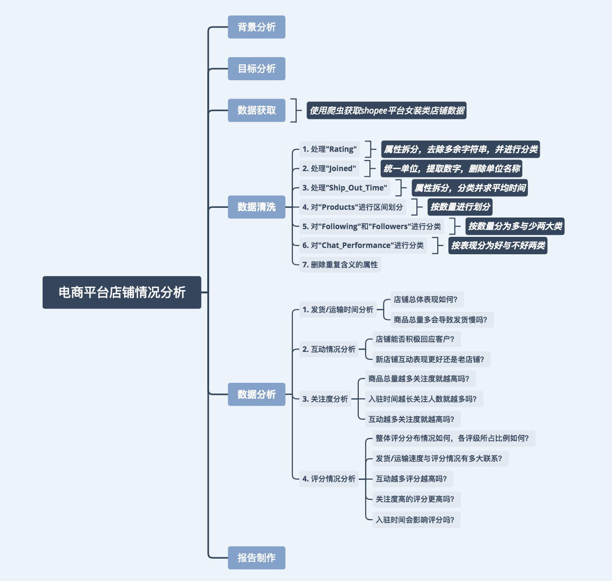
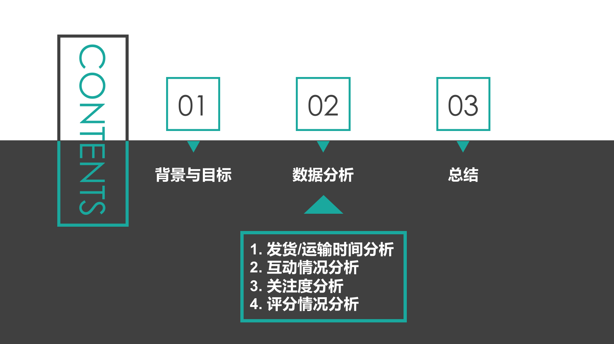
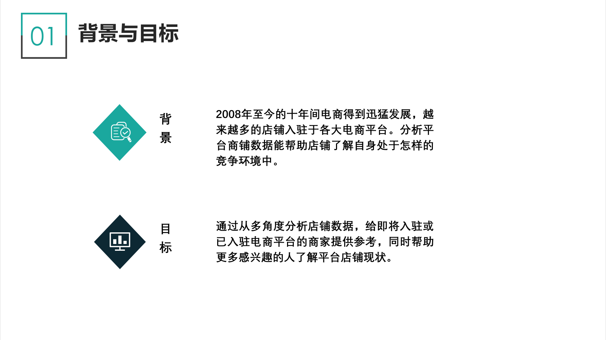
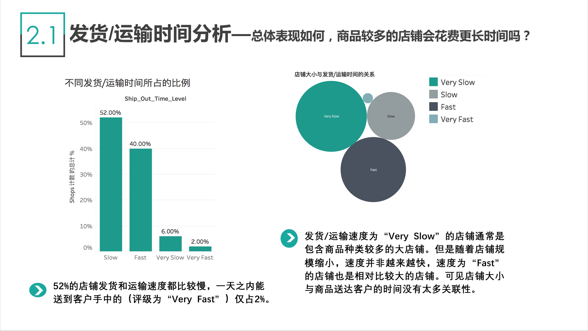
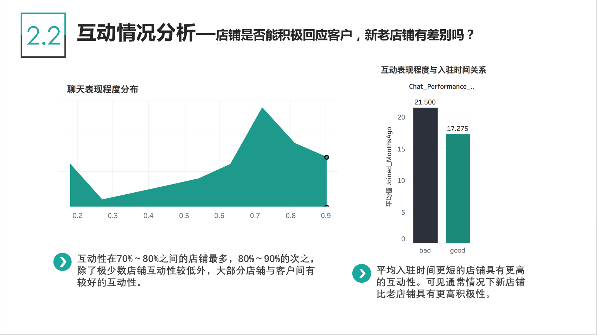
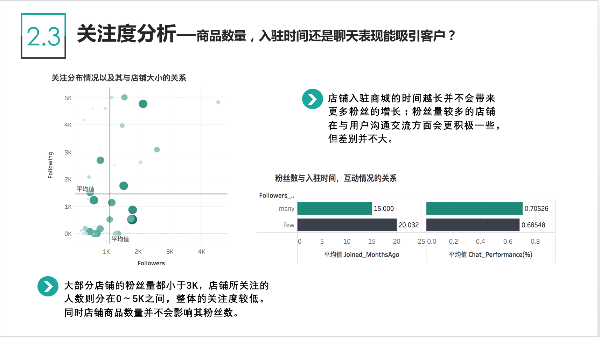
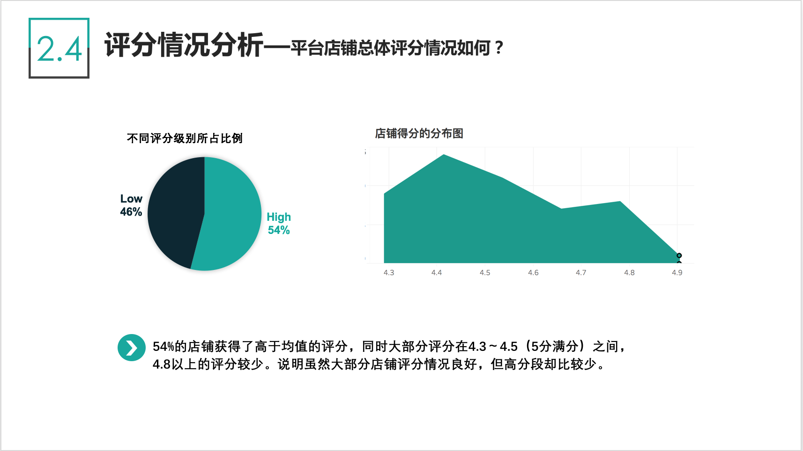
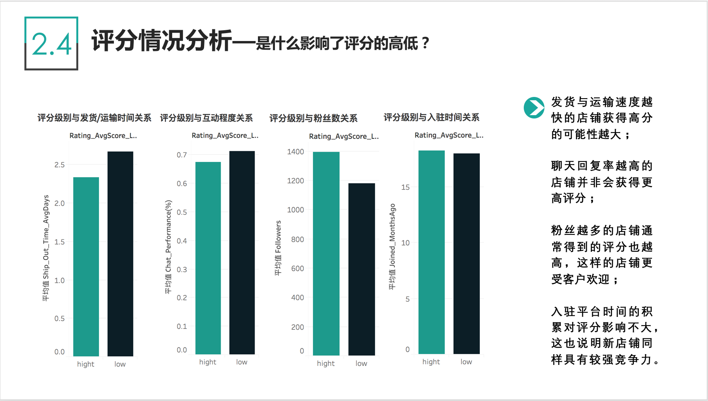
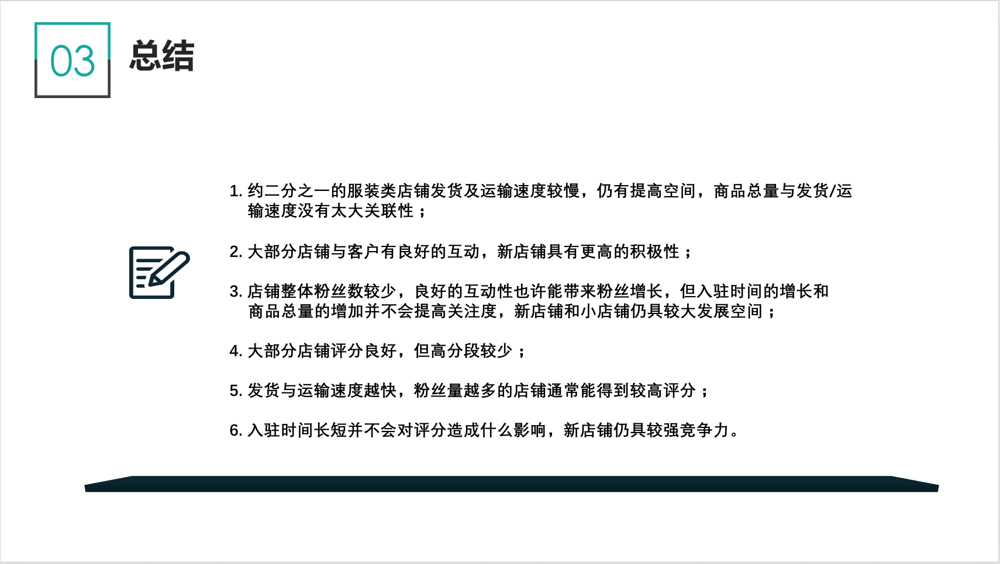

# 项目：电商平台店铺情况分析（基于shopee平台女装类店铺数据）




## 一. 背景分析

2008-2011年：电商的萌芽，由于互联网服务的普及性和计算机的使用率大大提高，导致了电子商务的产生。
2012-2014年：电商平台的大量涌现，电子商务在21世纪的发展为新电商平台的发展奠定了基础。
2015-2017年：电子商务的转折点，截至2014年底，全球电子商务（B2C）的销售额首次超过1万亿美元，各大洲均实现了两位数的增长。

为了扩大业务，增长利益，越来越多的商铺入驻各大电商平台。然而可观的利益之下也伴随着激烈的竞争。已入驻电商平台的这些店铺现在情况如何？它们受客户的关注度是否随时间而增长了？客户对这些店铺的评分如何？我们知道商品对店铺的影响起到非常重要的作用，那么除去商品，还有哪些因素会影响到一家店铺的经营情况呢？带着这诸多的疑问，开始了这个项目。

此次项目选取shopee电商平台，之所以选择了shopee平台，是因为Shopee是一家东南亚与台湾市场电商平台，它与国内的电商（如淘宝，京东等）不同，国内电商已经发展较为成熟，五年、八年老店随处可见，粉丝量也非常庞大少则几万多则几十万甚至上百万。而由于国家、地域等因素的区别，东南亚电商仍然相对较新，并且刚刚开始走向成熟。

选择其中一个分类是因为不同类目的店铺其商品数，发货速度，粉丝数都可能会不一样（如：服装类店铺可能比某个牌子的手机店铺商品种类更多；生鲜食品类店铺发货/运输速度可能要比家居类店铺快），因此这里只选取其中一类进行分析，女装是一个常见分类而且也是人们喜欢通过网上购买的商品之一。

## 二. 目标分析

通过从多角度分析店铺数据，给即将入驻或已入驻电商平台的商家提供参考，帮助了解目前竞争环境。


## 三. 数据获取

数据爬取自：https://shopee.sg/ 的“Women's Apparel”分类店铺。

数据获取于2018年10月23日。

包括Shops，Products，Following，Chat_Performance(%)，Followers，Rating，Joined，Ship_Out_Time 8个变量。


## 四. 数据清洗
[跳转到数据清洗页面](#cleanData)

## 五. 数据分析
[跳转到数据分析页面](#DataAnalysis)

## 六. 分析报告
[跳转到分析报告页面](#report)

### 此项目不足之处和可能改进的方法：

1. 样本数据较少，仅能代表一部分情况，不能以偏概全。
2. 数据仅来自shopee新加坡平台，未包括其他国家和地区，不同国家和地区的店铺情况可能不相同。
3. 还可以再获取国内电商平台数据进行比较分析，或是同一平台下不同分类店铺数据进行比较分析，这样对于商家来说可能更具参考性。


```python
import pandas as pd
```


```python
df = pd.read_excel('shops.xlsx', sheet_name='Sheet1')
df.head()
```


<div>
<style>
    .dataframe thead tr:only-child th {
        text-align: right;
    }

    .dataframe thead th {
        text-align: left;
    }

    .dataframe tbody tr th {
        vertical-align: top;
    }
</style>
<table border="1" class="dataframe">
  <thead>
    <tr style="text-align: right;">
      <th></th>
      <th>Shops</th>
      <th>Products</th>
      <th>Following</th>
      <th>Chat_Performance(%)</th>
      <th>Followers</th>
      <th>Rating</th>
      <th>Joined</th>
      <th>Ship_Out_Time</th>
    </tr>
  </thead>
  <tbody>
    <tr>
      <th>0</th>
      <td>fashionicon</td>
      <td>1550</td>
      <td>4834</td>
      <td>0.80</td>
      <td>4533</td>
      <td>4.4 (1526 Rating)</td>
      <td>20 Months Ago</td>
      <td>Slow (2-4Days)</td>
    </tr>
    <tr>
      <th>1</th>
      <td>superhappybuy</td>
      <td>3071</td>
      <td>165</td>
      <td>0.88</td>
      <td>806</td>
      <td>4.5 (2077  Rating)</td>
      <td>11 Months Ago</td>
      <td>Fast (1-2Days)</td>
    </tr>
    <tr>
      <th>2</th>
      <td>megabox</td>
      <td>5312</td>
      <td>75</td>
      <td>0.78</td>
      <td>463</td>
      <td>4.5 (1331 Rating)</td>
      <td>27 Months Ago</td>
      <td>Slow (2-4Days)</td>
    </tr>
    <tr>
      <th>3</th>
      <td>popshop</td>
      <td>2471</td>
      <td>1</td>
      <td>0.80</td>
      <td>1277</td>
      <td>4.4 (6462 Rating)</td>
      <td>13 Months Ago</td>
      <td>Fast (1-2Days)</td>
    </tr>
    <tr>
      <th>4</th>
      <td>xiaozhainv</td>
      <td>2845</td>
      <td>3216</td>
      <td>0.95</td>
      <td>10776</td>
      <td>4.7 (27889 Rating)</td>
      <td>16 Months Ago</td>
      <td>Slow (2-4Days)</td>
    </tr>
  </tbody>
</table>
</div>


<div id='cleanData'></div>
## 四.数据清洗 

由于在数据获取的过程中已经进行了去重操作，因此接下来主要是对各属性进行清洗操作。

### 1. 处理"Rating"
把Rating拆分成两列，分别包括平均分数以及评分的个数。

再对分数进行区间划分，分成高低两类。


```python
df['Rating_AvgScore']=df.Rating.str.split(' ',expand=True)[0].astype('float64')
df['Rating_Num'] = df.Rating.str.split(' ',expand=True)[1].str.strip('(').astype('int64')
df.head(2)
```


<div>
<style>
    .dataframe thead tr:only-child th {
        text-align: right;
    }

    .dataframe thead th {
        text-align: left;
    }

    .dataframe tbody tr th {
        vertical-align: top;
    }
</style>
<table border="1" class="dataframe">
  <thead>
    <tr style="text-align: right;">
      <th></th>
      <th>Shops</th>
      <th>Products</th>
      <th>Following</th>
      <th>Chat_Performance(%)</th>
      <th>Followers</th>
      <th>Rating</th>
      <th>Joined</th>
      <th>Ship_Out_Time</th>
      <th>Rating_AvgScore</th>
      <th>Rating_Num</th>
    </tr>
  </thead>
  <tbody>
    <tr>
      <th>0</th>
      <td>fashionicon</td>
      <td>1550</td>
      <td>4834</td>
      <td>0.80</td>
      <td>4533</td>
      <td>4.4 (1526 Rating)</td>
      <td>20 Months Ago</td>
      <td>Slow (2-4Days)</td>
      <td>4.4</td>
      <td>1526</td>
    </tr>
    <tr>
      <th>1</th>
      <td>superhappybuy</td>
      <td>3071</td>
      <td>165</td>
      <td>0.88</td>
      <td>806</td>
      <td>4.5 (2077  Rating)</td>
      <td>11 Months Ago</td>
      <td>Fast (1-2Days)</td>
      <td>4.5</td>
      <td>2077</td>
    </tr>
  </tbody>
</table>
</div>


```python
df['Rating_AvgScore_Level'] = df.Rating_AvgScore.map(lambda x:'hight' if x> df.Rating_AvgScore.mean() else 'low')
df.head(2)
```


<div>
<style>
    .dataframe thead tr:only-child th {
        text-align: right;
    }

    .dataframe thead th {
        text-align: left;
    }

    .dataframe tbody tr th {
        vertical-align: top;
    }
</style>
<table border="1" class="dataframe">
  <thead>
    <tr style="text-align: right;">
      <th></th>
      <th>Shops</th>
      <th>Products</th>
      <th>Following</th>
      <th>Chat_Performance(%)</th>
      <th>Followers</th>
      <th>Rating</th>
      <th>Joined</th>
      <th>Ship_Out_Time</th>
      <th>Rating_AvgScore</th>
      <th>Rating_Num</th>
      <th>Rating_AvgScore_Level</th>
    </tr>
  </thead>
  <tbody>
    <tr>
      <th>0</th>
      <td>fashionicon</td>
      <td>1550</td>
      <td>4834</td>
      <td>0.80</td>
      <td>4533</td>
      <td>4.4 (1526 Rating)</td>
      <td>20 Months Ago</td>
      <td>Slow (2-4Days)</td>
      <td>4.4</td>
      <td>1526</td>
      <td>low</td>
    </tr>
    <tr>
      <th>1</th>
      <td>superhappybuy</td>
      <td>3071</td>
      <td>165</td>
      <td>0.88</td>
      <td>806</td>
      <td>4.5 (2077  Rating)</td>
      <td>11 Months Ago</td>
      <td>Fast (1-2Days)</td>
      <td>4.5</td>
      <td>2077</td>
      <td>low</td>
    </tr>
  </tbody>
</table>
</div>


### 2. 处理"Joined"
"Joined"表示的是店铺入驻商城的时间，但这里的单位有用Months来表示的也有用Years来表示的，因此在进行数字提取的时候还需要进行统一单位。


```python
df['Joined_MonthsAgo'] = df.Joined.str.split(' ',expand=True)[0].astype('int64')
df_years = df[df['Joined'].str.contains('Years')]
df.loc[df_years.index, 'Joined_MonthsAgo'] = df.loc[df_years.index, 'Joined_MonthsAgo']*12
```

### 3. 处理"Ship_Out_Time"
Ship_Out_Time里面包含了两部分含义，一部分是对时间快慢作出的评级，另一部分则是时间范围。为了之后更好分析，这里把它拆分为两部分，一部分则是快慢评级，另一部分是平均时间，取时间范围中的均值作为平均时间。


```python
df.Ship_Out_Time.unique()
```


    array(['Slow (2-4Days)', 'Fast (1-2Days)', 'Very Slow (More Than 4 Days)',
           'Very Fast (Within 1 Day)'], dtype=object)


```python
df['Ship_Out_Time_Level'] = df.Ship_Out_Time.str.split('(',expand=True)[0].str.strip()
```


```python
def AvgDays(x):
    if 'Very Slow' in x:
        return 5# 超过4天的按5天来算
    elif 'Slow' in x:
        return 3
    elif 'Fast' in x:
        return 1.5
    else:
        return 1

df['Ship_Out_Time_AvgDays'] = df.Ship_Out_Time.map(AvgDays)
```


```python
df.head()
```


<div>
<style>
    .dataframe thead tr:only-child th {
        text-align: right;
    }

    .dataframe thead th {
        text-align: left;
    }

    .dataframe tbody tr th {
        vertical-align: top;
    }
</style>
<table border="1" class="dataframe">
  <thead>
    <tr style="text-align: right;">
      <th></th>
      <th>Shops</th>
      <th>Products</th>
      <th>Following</th>
      <th>Chat_Performance(%)</th>
      <th>Followers</th>
      <th>Rating</th>
      <th>Joined</th>
      <th>Ship_Out_Time</th>
      <th>Rating_AvgScore</th>
      <th>Rating_Num</th>
      <th>Rating_AvgScore_Level</th>
      <th>Joined_MonthsAgo</th>
      <th>Ship_Out_Time_Level</th>
      <th>Ship_Out_Time_AvgDays</th>
    </tr>
  </thead>
  <tbody>
    <tr>
      <th>0</th>
      <td>fashionicon</td>
      <td>1550</td>
      <td>4834</td>
      <td>0.80</td>
      <td>4533</td>
      <td>4.4 (1526 Rating)</td>
      <td>20 Months Ago</td>
      <td>Slow (2-4Days)</td>
      <td>4.4</td>
      <td>1526</td>
      <td>low</td>
      <td>20</td>
      <td>Slow</td>
      <td>3.0</td>
    </tr>
    <tr>
      <th>1</th>
      <td>superhappybuy</td>
      <td>3071</td>
      <td>165</td>
      <td>0.88</td>
      <td>806</td>
      <td>4.5 (2077  Rating)</td>
      <td>11 Months Ago</td>
      <td>Fast (1-2Days)</td>
      <td>4.5</td>
      <td>2077</td>
      <td>low</td>
      <td>11</td>
      <td>Fast</td>
      <td>1.5</td>
    </tr>
    <tr>
      <th>2</th>
      <td>megabox</td>
      <td>5312</td>
      <td>75</td>
      <td>0.78</td>
      <td>463</td>
      <td>4.5 (1331 Rating)</td>
      <td>27 Months Ago</td>
      <td>Slow (2-4Days)</td>
      <td>4.5</td>
      <td>1331</td>
      <td>low</td>
      <td>27</td>
      <td>Slow</td>
      <td>3.0</td>
    </tr>
    <tr>
      <th>3</th>
      <td>popshop</td>
      <td>2471</td>
      <td>1</td>
      <td>0.80</td>
      <td>1277</td>
      <td>4.4 (6462 Rating)</td>
      <td>13 Months Ago</td>
      <td>Fast (1-2Days)</td>
      <td>4.4</td>
      <td>6462</td>
      <td>low</td>
      <td>13</td>
      <td>Fast</td>
      <td>1.5</td>
    </tr>
    <tr>
      <th>4</th>
      <td>xiaozhainv</td>
      <td>2845</td>
      <td>3216</td>
      <td>0.95</td>
      <td>10776</td>
      <td>4.7 (27889 Rating)</td>
      <td>16 Months Ago</td>
      <td>Slow (2-4Days)</td>
      <td>4.7</td>
      <td>27889</td>
      <td>hight</td>
      <td>16</td>
      <td>Slow</td>
      <td>3.0</td>
    </tr>
  </tbody>
</table>
</div>


### 4. 对"Products"进行区间划分
Products代表店铺在售商品的数量，按数量的多少进行划分，以便后续分析。


```python
def Products_Class(x):
    if x <500:
        return 'less'
    elif x <1000:
        return 'less_to_medi'
    elif x <3000:
        return 'medi'
    elif x<5000:
        return 'medi_to_more'
    else:
        return 'more'
df['Products_Class'] = df.Products.map(Products_Class)
```

### 5. 对"Following"和"Followers"进行分类


```python
df['Following_Class'] = df['Following'].map(lambda x:'many' if x > df.Following.mean() else 'few')

df['Followers_Class'] = df['Following'].map(lambda x:'many' if x > df.Following.mean() else 'few')
```

### 6. 对"Chat_Performance"进行分类


```python
df['Chat_Performance_Level']=df['Chat_Performance(%)'].map(lambda x:'good' if x>0.5 else 'bad')
```

### 7. 删除重复含义的属性


```python
df = df.drop(['Rating','Joined','Ship_Out_Time'],axis=1)
```

### 把清洗好的数据进行保存


```python
df.to_csv('cleaned_shops.csv', index=False)
```


<div id="DataAnalysis"></div>
## 五. 数据分析
数据清洗好后，运用Tableau进行数据分析及可视化。

### 分析思路
主要按以下几个方向进行分析：

1. 发货/运输时间分析

店铺总体表现如何？

商品总量多会导致发货慢吗？

2. 互动情况分析

店铺能否积极回应客户？

新店铺互动表现更好还是老店铺？

3. 关注度分析

商品总量越多关注度就越高吗？

入驻时间越长关注人数就越多吗？

互动越多关注度就越高吗？

4. 评分情况分析

整体评分分布情况如何，各评级所占比例如何？

发货/运输速度与评分情况有多大联系？

互动越多评分越高吗？

关注度高的评分更高吗？

入驻时间会影响评分吗？


### 分析总结

1. 52%服装类店铺发货及运输速度较慢，店铺大小与发货速度没有太多关联性；

2. 大部分店铺与客户有良好的互动，新店铺具有更高的积极性；

3. 店铺整体粉丝数均较少，良好的互动性也许能带来粉丝增长，但入驻时间的增长和商品      
   总量的增加并不会提高关注度，新店铺和小店铺仍具较大发展空间；

4. 大部分店铺评分良好，但高分段较少；

5. 发货与运输速度越快，粉丝量越多的店铺通常能得到较高评分；

6. 入驻时间长短并不会对评分造成什么影响，新店铺仍具较强竞争力。


<div id="report"></div>
## 六.分析报告

以PPT形式制作报告。














