# 淘宝APP用户行为数据分析

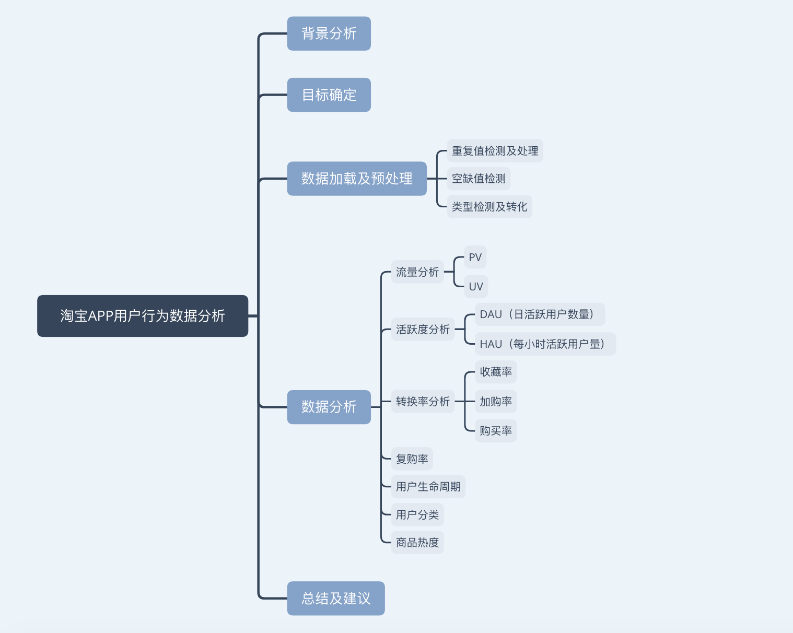

## 一.背景分析

淘宝网是中国深受欢迎的网购零售平台，是亚太地区较大的网络零售、商圈，由阿里巴巴集团在2003年5月创立。

这份数据下载自天池数据集：
https://tianchi.aliyun.com/dataset/dataDetail?dataId=46

数据为淘宝APP2014.11.18～2014.12.18的数据。2014年是阿里巴巴集团移动商务快速发展的一年。

数据主要包含用户在淘宝APP上包括点击、收藏、加购、购买的行为数据，其中各变量描述如下：

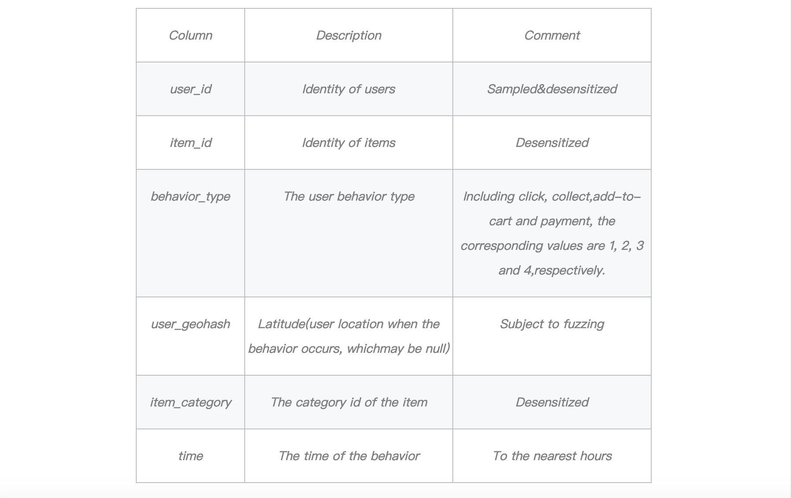


## 二.目标确定

1. 对运营情况进行监控，找出变动（上升/下降）的原因，防止异常事件发生，同时找出优化运营或产品的方法。

比如找出什么时间上新，什么时间提醒用户进行购买。

2. 精细化运营

对用户进行分类，针对不同用户采取不同营销措施。通过计算用户购买的频次，来对用户购买的活跃程度进行分类。

3. 发现用户喜欢的商品
通过对数加权的方法计算商品热度，了解用户喜好。

## 三. 数据加载及预处理


```python
import pandas as pd
import numpy as np
```


```python
users = pd.read_csv('tianchi_mobile_recommend_train_user.csv')
users.head()
```


<div>
<style>
    .dataframe thead tr:only-child th {
        text-align: right;
    }

    .dataframe thead th {
        text-align: left;
    }

    .dataframe tbody tr th {
        vertical-align: top;
    }
</style>
<table border="1" class="dataframe">
  <thead>
    <tr style="text-align: right;">
      <th></th>
      <th>user_id</th>
      <th>item_id</th>
      <th>behavior_type</th>
      <th>user_geohash</th>
      <th>item_category</th>
      <th>time</th>
    </tr>
  </thead>
  <tbody>
    <tr>
      <th>0</th>
      <td>98047837</td>
      <td>232431562</td>
      <td>1</td>
      <td>NaN</td>
      <td>4245</td>
      <td>2014-12-06 02</td>
    </tr>
    <tr>
      <th>1</th>
      <td>97726136</td>
      <td>383583590</td>
      <td>1</td>
      <td>NaN</td>
      <td>5894</td>
      <td>2014-12-09 20</td>
    </tr>
    <tr>
      <th>2</th>
      <td>98607707</td>
      <td>64749712</td>
      <td>1</td>
      <td>NaN</td>
      <td>2883</td>
      <td>2014-12-18 11</td>
    </tr>
    <tr>
      <th>3</th>
      <td>98662432</td>
      <td>320593836</td>
      <td>1</td>
      <td>96nn52n</td>
      <td>6562</td>
      <td>2014-12-06 10</td>
    </tr>
    <tr>
      <th>4</th>
      <td>98145908</td>
      <td>290208520</td>
      <td>1</td>
      <td>NaN</td>
      <td>13926</td>
      <td>2014-12-16 21</td>
    </tr>
  </tbody>
</table>
</div>


```python
users.shape
```


    (12256906, 6)


### 1. 重复值检测及处理


```python
users.duplicated().sum()
```


    4092866


```python
users.drop_duplicates(inplace=True)
```


```python
display(users.duplicated().sum())
display(users.shape)
```


    0


    (8164040, 6)


### 2. 空缺值检测


```python
def null_info(users):
    info = pd.DataFrame(users.isnull().sum()).T.rename(index={0:'null values (nb)'})
    info=info.append(pd.DataFrame(users.isnull().sum()/users.shape[0]*100).T.rename(index={0:'null values (%)'}))
    display(info)
null_info(users)
```


<div>
<style>
    .dataframe thead tr:only-child th {
        text-align: right;
    }

    .dataframe thead th {
        text-align: left;
    }

    .dataframe tbody tr th {
        vertical-align: top;
    }
</style>
<table border="1" class="dataframe">
  <thead>
    <tr style="text-align: right;">
      <th></th>
      <th>user_id</th>
      <th>item_id</th>
      <th>behavior_type</th>
      <th>user_geohash</th>
      <th>item_category</th>
      <th>time</th>
    </tr>
  </thead>
  <tbody>
    <tr>
      <th>null values (nb)</th>
      <td>0.0</td>
      <td>0.0</td>
      <td>0.0</td>
      <td>4.308015e+06</td>
      <td>0.0</td>
      <td>0.0</td>
    </tr>
    <tr>
      <th>null values (%)</th>
      <td>0.0</td>
      <td>0.0</td>
      <td>0.0</td>
      <td>5.276818e+01</td>
      <td>0.0</td>
      <td>0.0</td>
    </tr>
  </tbody>
</table>
</div>


### 3. 类型检测及转化


```python
users.info()
```

    <class 'pandas.core.frame.DataFrame'>
    Int64Index: 8164040 entries, 0 to 12256904
    Data columns (total 6 columns):
    user_id          int64
    item_id          int64
    behavior_type    int64
    user_geohash     object
    item_category    int64
    time             object
    dtypes: int64(4), object(2)
    memory usage: 436.0+ MB


```python
users.time = pd.to_datetime(users.time)
```


```python
users['hour'] = users.time.dt.hour
users.head(1)
```


<div>
<style>
    .dataframe thead tr:only-child th {
        text-align: right;
    }

    .dataframe thead th {
        text-align: left;
    }

    .dataframe tbody tr th {
        vertical-align: top;
    }
</style>
<table border="1" class="dataframe">
  <thead>
    <tr style="text-align: right;">
      <th></th>
      <th>user_id</th>
      <th>item_id</th>
      <th>behavior_type</th>
      <th>user_geohash</th>
      <th>item_category</th>
      <th>time</th>
      <th>hour</th>
    </tr>
  </thead>
  <tbody>
    <tr>
      <th>0</th>
      <td>98047837</td>
      <td>232431562</td>
      <td>1</td>
      <td>NaN</td>
      <td>4245</td>
      <td>2014-12-06 02:00:00</td>
      <td>2</td>
    </tr>
  </tbody>
</table>
</div>


```python
users['week'] = users.time.dt.week
users.head(1)
```


<div>
<style>
    .dataframe thead tr:only-child th {
        text-align: right;
    }

    .dataframe thead th {
        text-align: left;
    }

    .dataframe tbody tr th {
        vertical-align: top;
    }
</style>
<table border="1" class="dataframe">
  <thead>
    <tr style="text-align: right;">
      <th></th>
      <th>user_id</th>
      <th>item_id</th>
      <th>behavior_type</th>
      <th>user_geohash</th>
      <th>item_category</th>
      <th>time</th>
      <th>hour</th>
      <th>week</th>
    </tr>
  </thead>
  <tbody>
    <tr>
      <th>0</th>
      <td>98047837</td>
      <td>232431562</td>
      <td>1</td>
      <td>NaN</td>
      <td>4245</td>
      <td>2014-12-06 02:00:00</td>
      <td>2</td>
      <td>49</td>
    </tr>
  </tbody>
</table>
</div>


```python
users['date'] = users.time.dt.date
users.head(1)
```


<div>
<style>
    .dataframe thead tr:only-child th {
        text-align: right;
    }

    .dataframe thead th {
        text-align: left;
    }

    .dataframe tbody tr th {
        vertical-align: top;
    }
</style>
<table border="1" class="dataframe">
  <thead>
    <tr style="text-align: right;">
      <th></th>
      <th>user_id</th>
      <th>item_id</th>
      <th>behavior_type</th>
      <th>user_geohash</th>
      <th>item_category</th>
      <th>time</th>
      <th>hour</th>
      <th>week</th>
      <th>date</th>
    </tr>
  </thead>
  <tbody>
    <tr>
      <th>0</th>
      <td>98047837</td>
      <td>232431562</td>
      <td>1</td>
      <td>NaN</td>
      <td>4245</td>
      <td>2014-12-06 02:00:00</td>
      <td>2</td>
      <td>49</td>
      <td>2014-12-06</td>
    </tr>
  </tbody>
</table>
</div>


```python
users.item_category = users.item_category.astype('category')
```


```python
# 保存处理后的数据
users_c = users.to_csv('users_c.csv',index=False)
```

## 四. 数据分析
### 1. 流量分析
- PV(Page View)：页面访问量
- UV(Unique Visitor)：独立访客数

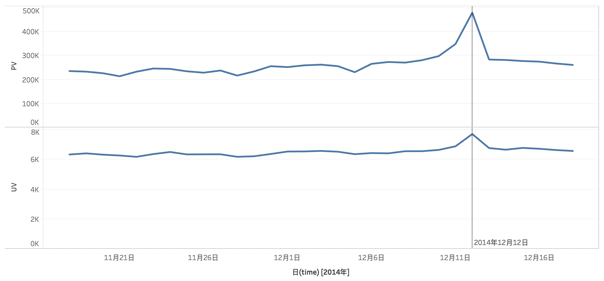

** 分析 **

通过监控每天PV和UV，可以看到平时它们的变化量都不大，但到了12月11日时出现了一个上升趋势，且12月12日达到峰值，说明“双十二”购物节的促销活动确实起到了吸引用户的作用。同时PV的增长了近50%，而相比PV，UV仅增长了约10%，可见“双十二”主要带来了老用户的大量回访。在服务器上也需要进行加强。

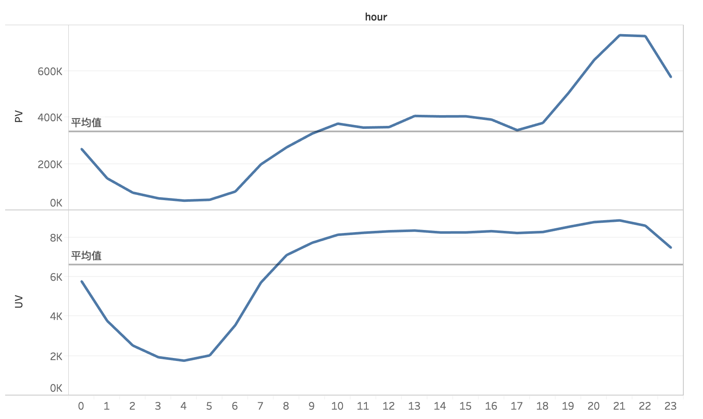

** 分析 **

通过监控每个小时PV和UV，可以发现每天的0～7点用户购买较低，其中凌晨4点达到最低值。中午和下午的独立用户访问量并不会有太大区别，18点之后PV和UV均有上升趋势，到21点左右达到峰值，因此如果在这个时候上新或者进行新活动，是最容易被用户关注到。

### 2. 活跃度分析

相比流量，活跃度更能衡量用户粘性，

这里的活跃用户定义为：进行商品收藏，商品加入购物车或者购买商品的用户。

- DAU(Daily Active User)：日活跃用户数量。
- HAU：每小时活跃用户数

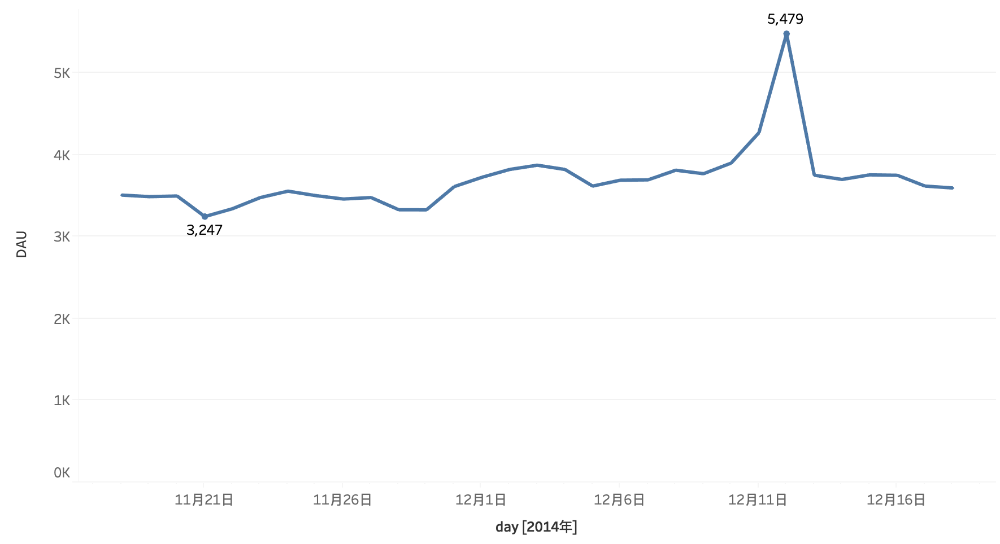

** 分析 **

这里DAU与UV类似，但DAU更能反映用户对各类营销活动所采取的行动。12月12日达到峰值，但DAU比UV的增长幅度要大，说明“双十二”不仅仅带来了大量访问，而且大多数营销措施都取得了一定效果。


#### 对比平时和双十二每小时用户的活跃情况
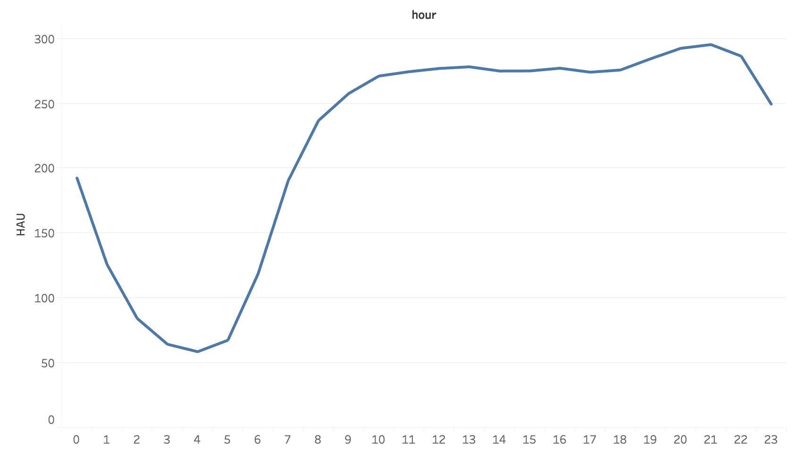

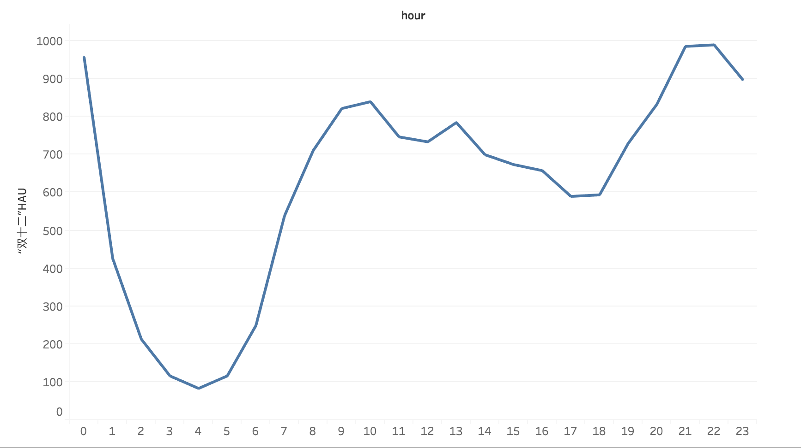

** 分析 **

对比平时和双十二每小时用户的活跃情况可以发现，平时在晚上21点左右的时候用户最活跃，但双十二这天出现了两个峰值，0点和晚上21～22点。可见，大促和限时抢购对用户确实起到了非常大的吸引力。同时，双十二这天在任何一个时间段的用户活跃数都比平时要高。

### 3. 转换率分析

#### 收藏率/加购率/购买率
使用漏斗模型进行分析

主要分析收藏，加购（即加入购物车），购买的日转化率以及小时转化率，并找出转换率最高/最低的时间点，以及导致的原因。

用户行为流程拆解：
1. 点击 -> 加入收藏夹
2. 点击（包括从普通页面点击以及从收藏夹点击） -> 加入购物车 -> 购买

计算指标确定：
1. 收藏率 = 收藏量 / 点击量
2. 加购率 = 加入购物车量 / 点击量
3. 购买率 = 购买量 / 加入购物车量

可以使用python计算，但为了使用Tableau画出更好看的图，这里使用Tableau直接计算，计算公式如下：

- 点击量：
SUM(IF [behavior_type]==1 THEN 1 
ELSEIF [behavior_type]!=1 THEN 0 END)
- 收藏量：
SUM(IF [behavior_type]==2 THEN 1 
ELSEIF [behavior_type]!=2 THEN 0 END)
- 加入购物车量:
SUM(IF [behavior_type]==3 THEN 1 
ELSEIF [behavior_type]!=3 THEN 0 END)
- 购买量:
SUM(IF [behavior_type]==4 THEN 1 
ELSEIF [behavior_type]!=4 THEN 0 END)

收藏率,加购率,购买率使用以上计算结果相除。

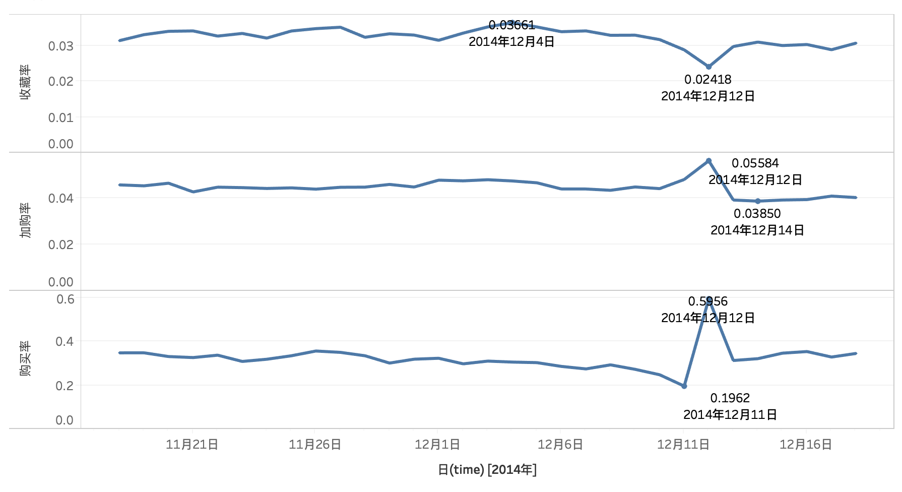

** 分析 ** 

”双十二“这天，加购率和购买率都有所提升，但收藏率却有所降低，而在平时平均收藏率要低于平均加购率，说明在这天用户购物冲动比平时要高，平时犹豫买或不买的物品，在这天购买的可能性要大于平时。12月11日的购买率最低，说明大部分用户都把商品囤起来，等到12号在支付。而到了12月13日，又恢复到平时的情况。

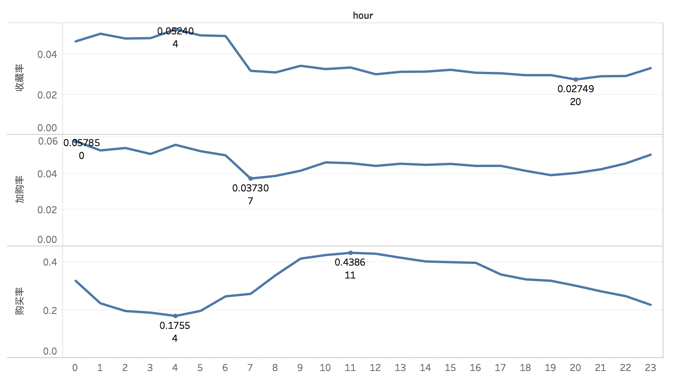

** 分析 ** 

虽然用户活跃度通常都是晚上21点左右才达到峰值，但从转换率来说从21点持续到凌晨5点，收藏率和加购率都出于高峰时段，说明虽然活跃用户少但活跃的用户中最有可能把商品进行收藏或者加入购物车；从购买率来看，晚上看中的商品用户并不会立刻进行购买，而是到了早上11点左右进行购买，因此对于收藏或加购的商品，我们可以在上午11点左右通过平台、短信、邮件进行提醒购买。


### 4. 复购率
复购率的定义是：在某时间窗口内消费两次及以上的用户在总消费用户的占比。


```python
# 加载清洗后的数据
users_c = pd.read_csv('users_c.csv')
```


```python
# 发生购买行为的用户
df_pay = users_c[users_c.behavior_type==4]
```


```python
# 计算每个用户购买的天数
df_pay_1 = df_pay.groupby(['user_id','date']).agg({'time': lambda x:x.count()})
df_pay_2 = df_pay_1.groupby('user_id').agg({'time':lambda x:x.count()}).rename(columns={'time':'pay_num'})
df_pay_2.head()
```


<div>
<style>
    .dataframe thead tr:only-child th {
        text-align: right;
    }

    .dataframe thead th {
        text-align: left;
    }

    .dataframe tbody tr th {
        vertical-align: top;
    }
</style>
<table border="1" class="dataframe">
  <thead>
    <tr style="text-align: right;">
      <th></th>
      <th>pay_num</th>
    </tr>
    <tr>
      <th>user_id</th>
      <th></th>
    </tr>
  </thead>
  <tbody>
    <tr>
      <th>4913</th>
      <td>5</td>
    </tr>
    <tr>
      <th>6118</th>
      <td>1</td>
    </tr>
    <tr>
      <th>7528</th>
      <td>6</td>
    </tr>
    <tr>
      <th>7591</th>
      <td>9</td>
    </tr>
    <tr>
      <th>12645</th>
      <td>4</td>
    </tr>
  </tbody>
</table>
</div>


```python
df_pay_2.to_csv('pay_num.csv')
```

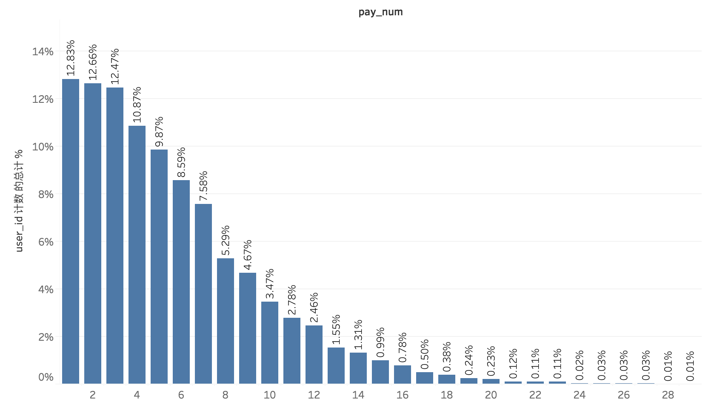

** 分析 **

上图表示在发生过购买行为的用户中，一个月内购买天数的分布。

购买天数为1的用户占比最高，为12.83%。如果以月份作为时间窗口，假设每个用户每天购买次数为1（每笔订单可包含多个商品），那么复购率为1-12.83%=87.17%。同时还可以与其他月份的复购率做对比。

### 5. 用户生命周期
用户生命周期：第一次消费到最后一次消费之间的时间间隔。

由于只有一个月的数据，因此把这个月内第一次消费时间当作第一次消费时间，这个月内的最后一次消费当作最后一次消费时间。


```python
# 计算生命周期
df_pay['date'] = pd.to_datetime(df_pay.date)

date_min = df_pay.groupby('user_id').date.min()
date_max = df_pay.groupby('user_id').date.max()
life_time = date_max - date_min
life_time.head()
```

    /Users/jia/anaconda3/lib/python3.6/site-packages/ipykernel_launcher.py:1: SettingWithCopyWarning: 
    A value is trying to be set on a copy of a slice from a DataFrame.
    Try using .loc[row_indexer,col_indexer] = value instead
    
    See the caveats in the documentation: http://pandas.pydata.org/pandas-docs/stable/indexing.html#indexing-view-versus-copy
      """Entry point for launching an IPython kernel.


    user_id
    4913    15 days
    6118     0 days
    7528    21 days
    7591    18 days
    12645   17 days
    Name: date, dtype: timedelta64[ns]


```python
df_life_time = pd.DataFrame(life_time)
df_life_time.rename(columns={'date':'life_time'},inplace=True)
df_life_time.to_csv('life_time.csv')
```

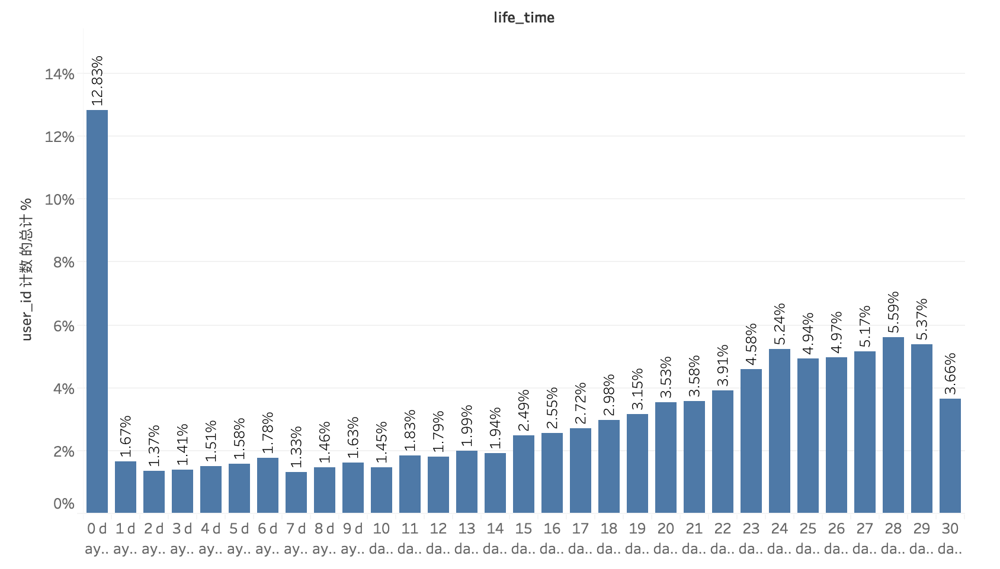

** 分析 **

上图表示在发生过购买行为的用户中,首次/末次购买时间的间隔时间。

排除只有一天有购买行为的用户（首末次购买时间间隔为0天），间隔为24、27、28、29天的用户数最多。

由于只有一个月的数据，因此这里求出的生命周期有一定局限性，如果有更长周期的数据，那么通过求出用户生命周期，我们可以知道间隔用户第一次购买的第几天采取营销措施，能延长用户的生命周期。

### 6. 用户分类
通过计算用户购买的频次，来对用户购买的活跃程度进行分类。

用数字1，2来代表用户的活跃情况：
- 1: 普通活跃用户
- 2: 非常活跃用户


```python
active = pd.read_csv('pay_num.csv')
active.describe()
```


<div>
<style>
    .dataframe thead tr:only-child th {
        text-align: right;
    }

    .dataframe thead th {
        text-align: left;
    }

    .dataframe tbody tr th {
        vertical-align: top;
    }
</style>
<table border="1" class="dataframe">
  <thead>
    <tr style="text-align: right;">
      <th></th>
      <th>user_id</th>
      <th>pay_num</th>
    </tr>
  </thead>
  <tbody>
    <tr>
      <th>count</th>
      <td>8.886000e+03</td>
      <td>8886.000000</td>
    </tr>
    <tr>
      <th>mean</th>
      <td>7.152087e+07</td>
      <td>5.536912</td>
    </tr>
    <tr>
      <th>std</th>
      <td>4.120719e+07</td>
      <td>4.021963</td>
    </tr>
    <tr>
      <th>min</th>
      <td>4.913000e+03</td>
      <td>1.000000</td>
    </tr>
    <tr>
      <th>25%</th>
      <td>3.567731e+07</td>
      <td>2.000000</td>
    </tr>
    <tr>
      <th>50%</th>
      <td>7.238800e+07</td>
      <td>5.000000</td>
    </tr>
    <tr>
      <th>75%</th>
      <td>1.071945e+08</td>
      <td>8.000000</td>
    </tr>
    <tr>
      <th>max</th>
      <td>1.424559e+08</td>
      <td>30.000000</td>
    </tr>
  </tbody>
</table>
</div>


```python
# 1: 普通活跃用户
# 2：非常活跃用户
active['group'] = active.pay_num.apply(lambda x:2 if x>5 else 1)
active.head(2)
```


<div>
<style>
    .dataframe thead tr:only-child th {
        text-align: right;
    }

    .dataframe thead th {
        text-align: left;
    }

    .dataframe tbody tr th {
        vertical-align: top;
    }
</style>
<table border="1" class="dataframe">
  <thead>
    <tr style="text-align: right;">
      <th></th>
      <th>user_id</th>
      <th>pay_num</th>
      <th>group</th>
    </tr>
  </thead>
  <tbody>
    <tr>
      <th>0</th>
      <td>4913</td>
      <td>5</td>
      <td>1</td>
    </tr>
    <tr>
      <th>1</th>
      <td>6118</td>
      <td>1</td>
      <td>1</td>
    </tr>
  </tbody>
</table>
</div>


### 7. 商品热度
通过统计用户行为数据,计算不同类别商品的热度。

使用对数加权的方法进行热度计算，click, collect, add-to-cart, payment的权重依次增大。


```python
item_heat = users_c[['item_category','behavior_type']]
# 计算每个商品被点击、收藏、加入购物车和付款的次数
cl=item_heat[item_heat.behavior_type==1].groupby(by='item_category',as_index=False).count().rename(columns={'behavior_type':'click'})
co=item_heat[item_heat.behavior_type==2].groupby(by='item_category',as_index=False).count().rename(columns={'behavior_type':'collect'})
atc=item_heat[item_heat.behavior_type==3].groupby(by='item_category',as_index=False).count().rename(columns={'behavior_type':'add-to-cart'})
pay=item_heat[item_heat.behavior_type==4].groupby(by='item_category',as_index=False).count().rename(columns={'behavior_type':'payment'})
# 合并计算结果，构建DataFrame
item_heat = pd.merge(cl,co,on='item_category',how='outer')
item_heat = pd.merge(item_heat,atc,on='item_category',how='outer')
item_heat = pd.merge(item_heat,pay,on='item_category',how='outer')
item_heat.fillna(0,inplace=True)
item_heat.head()
```


<div>
<style>
    .dataframe thead tr:only-child th {
        text-align: right;
    }

    .dataframe thead th {
        text-align: left;
    }

    .dataframe tbody tr th {
        vertical-align: top;
    }
</style>
<table border="1" class="dataframe">
  <thead>
    <tr style="text-align: right;">
      <th></th>
      <th>item_category</th>
      <th>click</th>
      <th>collect</th>
      <th>add-to-cart</th>
      <th>payment</th>
    </tr>
  </thead>
  <tbody>
    <tr>
      <th>0</th>
      <td>2</td>
      <td>1.0</td>
      <td>0.0</td>
      <td>0.0</td>
      <td>0.0</td>
    </tr>
    <tr>
      <th>1</th>
      <td>3</td>
      <td>2.0</td>
      <td>0.0</td>
      <td>0.0</td>
      <td>0.0</td>
    </tr>
    <tr>
      <th>2</th>
      <td>4</td>
      <td>1.0</td>
      <td>0.0</td>
      <td>0.0</td>
      <td>0.0</td>
    </tr>
    <tr>
      <th>3</th>
      <td>6</td>
      <td>9.0</td>
      <td>0.0</td>
      <td>0.0</td>
      <td>0.0</td>
    </tr>
    <tr>
      <th>4</th>
      <td>8</td>
      <td>833.0</td>
      <td>9.0</td>
      <td>4.0</td>
      <td>4.0</td>
    </tr>
  </tbody>
</table>
</div>


```python
# 使用对数加权的方法进行热度计算，click, collect, add-to-cart, payment的权重依次增大
item_heat['click'] = np.log(item_heat['click']+0.0001)
item_heat['collect'] = np.log(item_heat['collect']+0.0001)*2
item_heat['add-to-cart'] = np.log(item_heat['add-to-cart']+0.0001)*3
item_heat['payment'] = np.log(item_heat['payment']+0.0001)*4
item_heat['heat'] = item_heat['click']+item_heat['collect']+item_heat['add-to-cart']+item_heat['payment']
item_heat.head(10)
```


<div>
<style>
    .dataframe thead tr:only-child th {
        text-align: right;
    }

    .dataframe thead th {
        text-align: left;
    }

    .dataframe tbody tr th {
        vertical-align: top;
    }
</style>
<table border="1" class="dataframe">
  <thead>
    <tr style="text-align: right;">
      <th></th>
      <th>item_category</th>
      <th>click</th>
      <th>collect</th>
      <th>add-to-cart</th>
      <th>payment</th>
      <th>heat</th>
    </tr>
  </thead>
  <tbody>
    <tr>
      <th>0</th>
      <td>2</td>
      <td>0.000100</td>
      <td>-18.420681</td>
      <td>-27.631021</td>
      <td>-36.841361</td>
      <td>-82.892963</td>
    </tr>
    <tr>
      <th>1</th>
      <td>3</td>
      <td>0.693197</td>
      <td>-18.420681</td>
      <td>-27.631021</td>
      <td>-36.841361</td>
      <td>-82.199866</td>
    </tr>
    <tr>
      <th>2</th>
      <td>4</td>
      <td>0.000100</td>
      <td>-18.420681</td>
      <td>-27.631021</td>
      <td>-36.841361</td>
      <td>-82.892963</td>
    </tr>
    <tr>
      <th>3</th>
      <td>6</td>
      <td>2.197236</td>
      <td>-18.420681</td>
      <td>-27.631021</td>
      <td>-36.841361</td>
      <td>-80.695828</td>
    </tr>
    <tr>
      <th>4</th>
      <td>8</td>
      <td>6.725034</td>
      <td>4.394471</td>
      <td>4.158958</td>
      <td>5.545277</td>
      <td>20.823741</td>
    </tr>
    <tr>
      <th>5</th>
      <td>10</td>
      <td>5.017280</td>
      <td>2.197291</td>
      <td>6.591707</td>
      <td>5.545277</td>
      <td>19.351556</td>
    </tr>
    <tr>
      <th>6</th>
      <td>11</td>
      <td>8.632484</td>
      <td>9.043579</td>
      <td>13.070130</td>
      <td>6.437832</td>
      <td>37.184026</td>
    </tr>
    <tr>
      <th>7</th>
      <td>12</td>
      <td>4.969814</td>
      <td>4.158908</td>
      <td>7.917193</td>
      <td>5.545277</td>
      <td>22.591193</td>
    </tr>
    <tr>
      <th>8</th>
      <td>13</td>
      <td>4.110876</td>
      <td>3.583552</td>
      <td>2.079592</td>
      <td>7.167105</td>
      <td>16.941124</td>
    </tr>
    <tr>
      <th>9</th>
      <td>15</td>
      <td>6.079933</td>
      <td>7.221841</td>
      <td>4.158958</td>
      <td>5.545277</td>
      <td>23.006010</td>
    </tr>
  </tbody>
</table>
</div>


```python
item_heat.sort_values(by='heat',ascending=False)[:5]
```


<div>
<style>
    .dataframe thead tr:only-child th {
        text-align: right;
    }

    .dataframe thead th {
        text-align: left;
    }

    .dataframe tbody tr th {
        vertical-align: top;
    }
</style>
<table border="1" class="dataframe">
  <thead>
    <tr style="text-align: right;">
      <th></th>
      <th>item_category</th>
      <th>click</th>
      <th>collect</th>
      <th>add-to-cart</th>
      <th>payment</th>
      <th>heat</th>
    </tr>
  </thead>
  <tbody>
    <tr>
      <th>1135</th>
      <td>1863</td>
      <td>12.399965</td>
      <td>18.447303</td>
      <td>27.370096</td>
      <td>30.273517</td>
      <td>88.490881</td>
    </tr>
    <tr>
      <th>3707</th>
      <td>5894</td>
      <td>12.218179</td>
      <td>17.926321</td>
      <td>26.334053</td>
      <td>27.387773</td>
      <td>83.866326</td>
    </tr>
    <tr>
      <th>4093</th>
      <td>6513</td>
      <td>12.113140</td>
      <td>17.606247</td>
      <td>26.352487</td>
      <td>27.729792</td>
      <td>83.801666</td>
    </tr>
    <tr>
      <th>3393</th>
      <td>5399</td>
      <td>12.090140</td>
      <td>17.579625</td>
      <td>25.750066</td>
      <td>27.749257</td>
      <td>83.169088</td>
    </tr>
    <tr>
      <th>8367</th>
      <td>13230</td>
      <td>12.290593</td>
      <td>17.754764</td>
      <td>26.045071</td>
      <td>26.895330</td>
      <td>82.985758</td>
    </tr>
  </tbody>
</table>
</div>


热度最高的前5商品类别的编号为：1863，5894，6513，5399，13230。

## 六. 总结及建议

1. PV、UV通常在21点左右达到峰值，因此如果在这个时候上新或者进行新活动，是最容易被用户关注到。
2. 上午11点左右通过平台、短信、邮件进行提醒购买，可以达到更好的效果。
3. 这年的双十二无论从访问量，活跃度还是转换率都达到了不错的效果。
4. 在用户首次购买间隔28天的时候可以对用户采取一定的营销措施。
5. 用户可分为普通活跃和非常活跃两类用户。
6. 商品编号为1863的热度最高。
