# 珍爱网APP分析
### ——如何通过获取第三方数据对APP进行分析

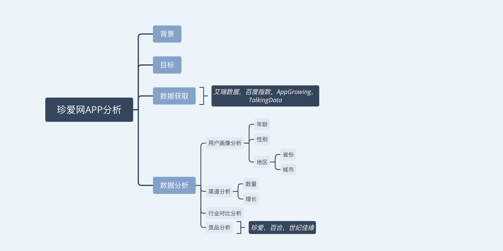

### 背景
珍爱网是一家专注于婚恋相亲的综合服务平台，截至2017年已有12年的婚恋服务经验，拥有1亿高诚意会员，并在全国37个城市，开设有64家专业的线下服务门店。

### 目标
了解珍爱网APP运营情况。

————————————————————————————————————————————————

#### 数据来源
所用数据来源于艾瑞数据，百度指数，AppGrowing，TalkingData。
主要为2018年10月数据。

——————————————————————————————————————————————————————

### 一. 用户画像分析

注：这部分数据来源于艾瑞数据，百度指数。

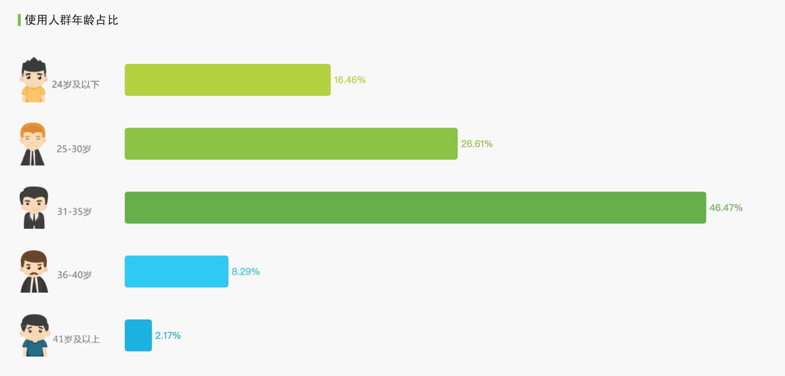

** 分析 **
（数据来源于艾瑞数据）

31-35岁的用户占比最多，接近50%，说明这部分人群对婚恋交友的服务需求最多，因此可以针对这部分群体用户的特点，举办相关的活动。对这部分用户群投入最多的资源，也许能获取最多的利益。

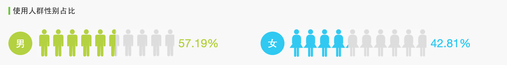

** 分析 **
（数据来源于艾瑞数据）

从使用人群性别上看，男性略高于女性，这也符合我国的性别分布占比。可以进一步挖掘不同性别的不同需求，可针对性别采取不同的营销措施。

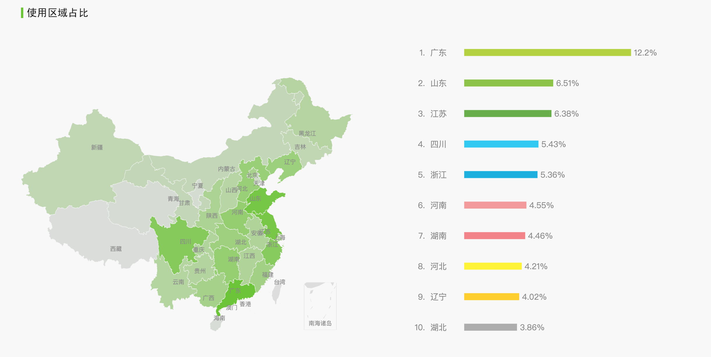

#### 30天内搜索指数
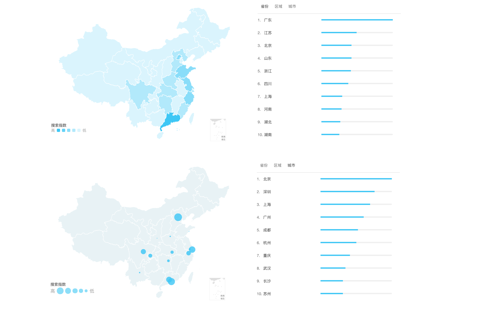

** 分析 **
（使用区域数据来源于艾瑞数据，搜索指数来源于百度指数。）

从使用人数上看，广东，山东，江苏，四川，浙江是使用人数最多的省份；从搜索指数上看，最高的省份分别是广东，江苏，北京，山东，浙江，四川。排序不同，但排名前面的省份几乎是一致的。

虽然搜索人数与使用人数并不完全一致，但搜索指数在一定程度上反映了使用者的多少。结合搜索指数最高的城市来看，北京、深圳、上海、广州、成都为使用人数较多的城市。

经济发达地区和一线城市的人群更喜欢使用这样的APP。

### 二. 渠道分析

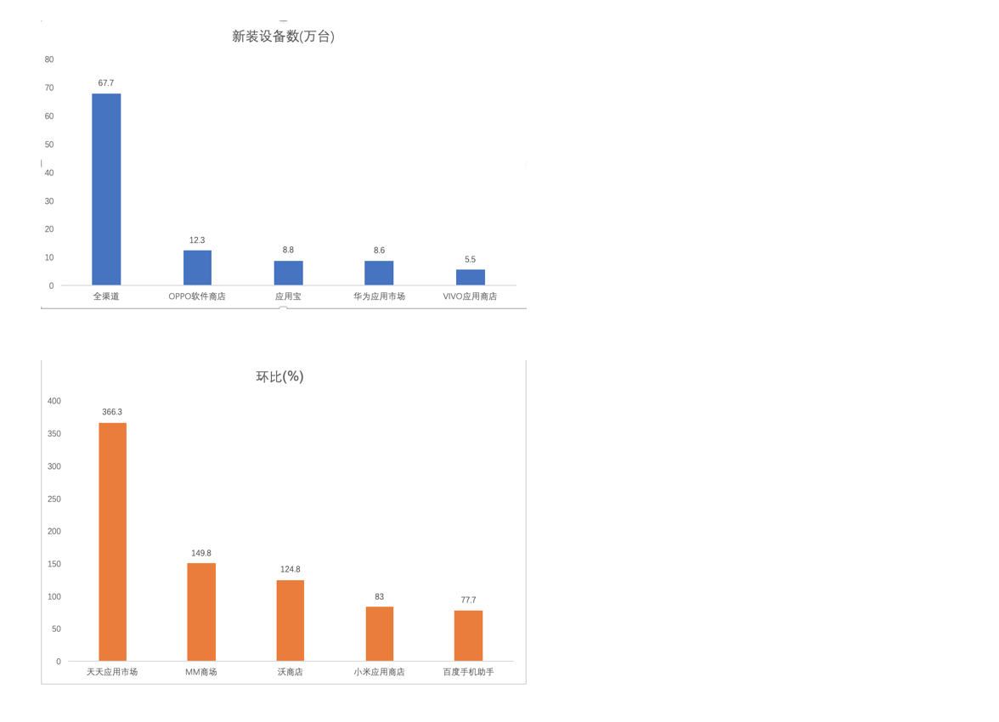

** 分析 **
（数据来源于艾瑞数据，上图是经过Excel处理筛选后得出的图表。）

新装设备数Top5来源于全渠道、OPPO软件商店、应用宝、华为应用市场、VIVO应用商店；同时环比增长最多的来源于天天应用市场。

### 三. 行业对比分析

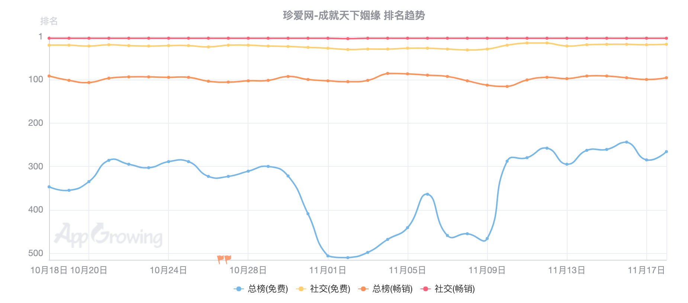

** 分析 **
（数据来源于AppGrowing。）

在社交类App中，排名较前，波动不大。

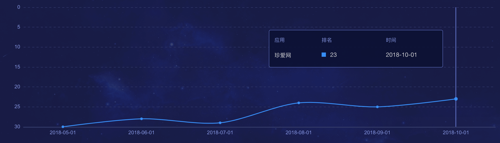
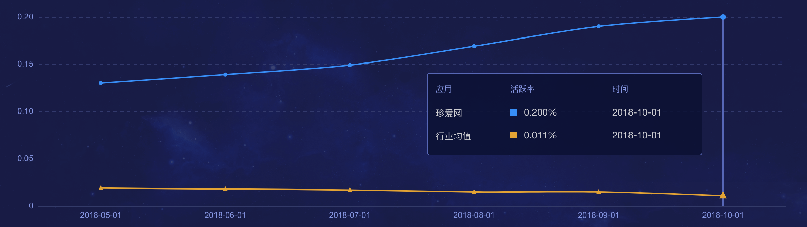

** 分析 **
（数据来源于talkingdata。）

在社交类App中，最近几个月的排名，虽有波动，但总体有上升的趋势，同时活跃率也高于行业均值。可见，目前的运营状况相对还是好的。

### 四. 竞品分析

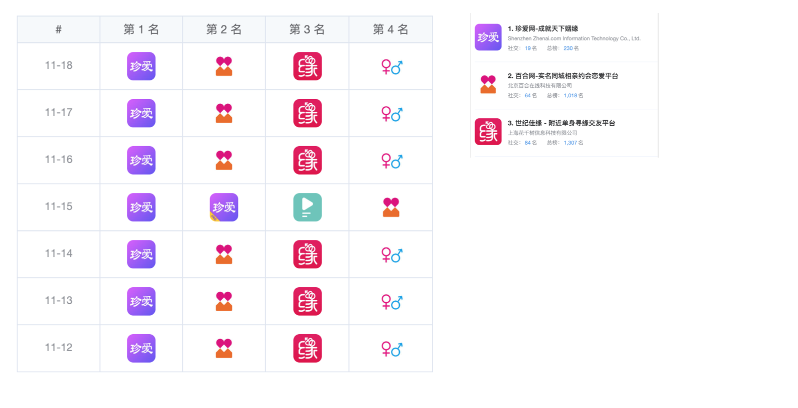

** 分析 **
（数据来源于AppGrowing。）

上图是7天内的同类App的排名，可见目前与珍爱网竞争较大的有百合网、世纪佳缘。

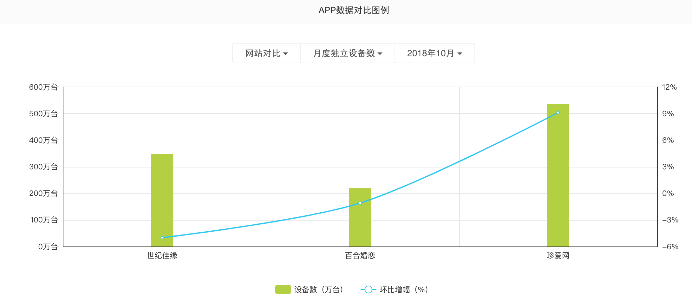

** 分析 **
（数据来源于艾瑞数据。）

在同类App中目前珍爱网使用人数最多，同时环比增幅最大；百合婚恋网环比增幅第二，但使用人数最少；世纪佳缘的使用人数虽多于百合婚恋，但环比增幅却最少。可见珍爱网目前是竞争力较大。
